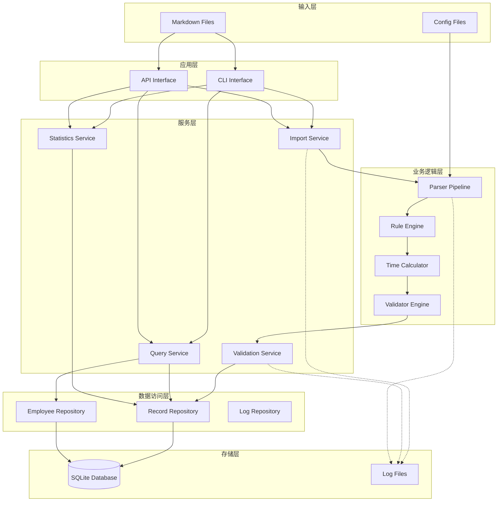
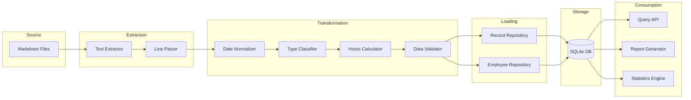
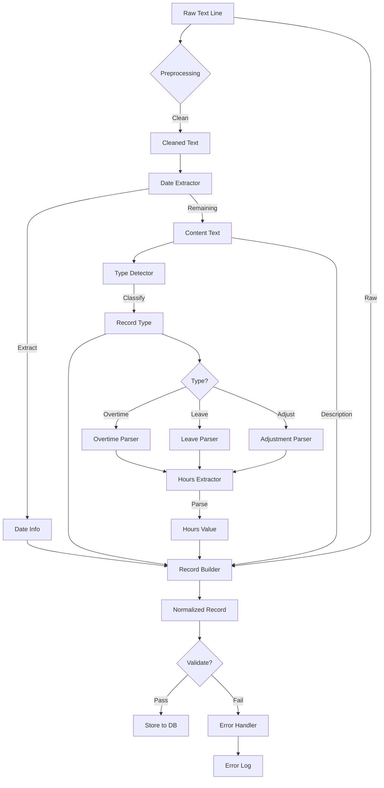
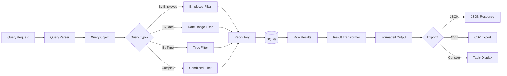
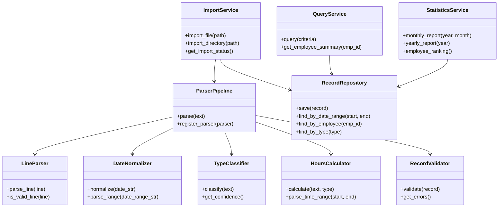
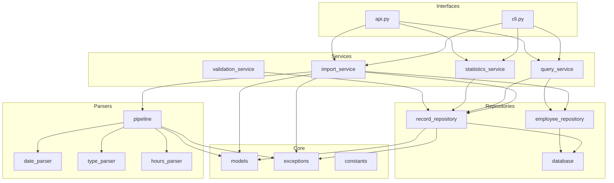
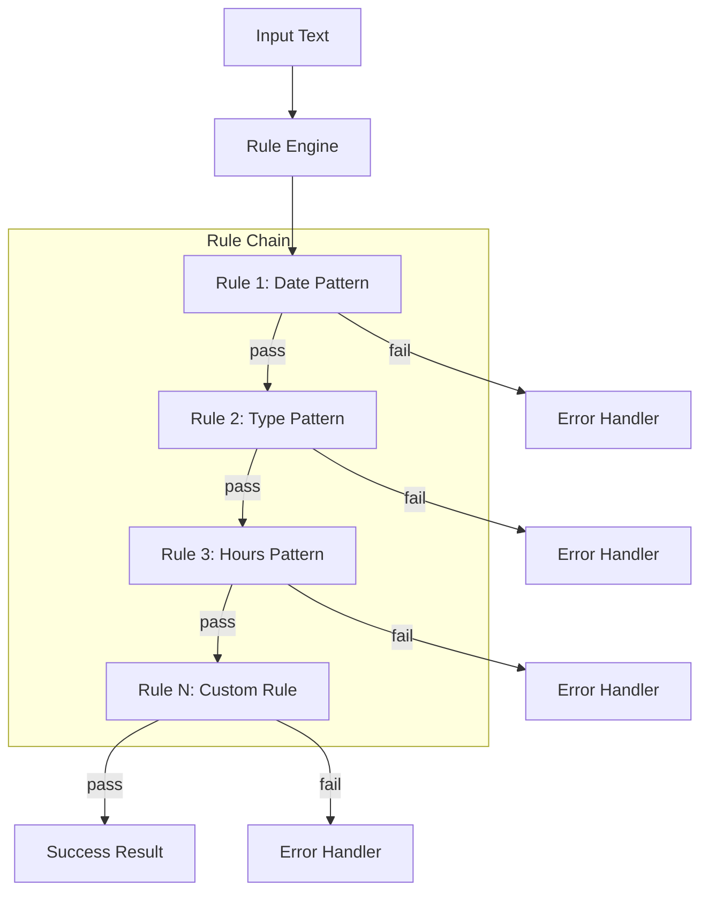
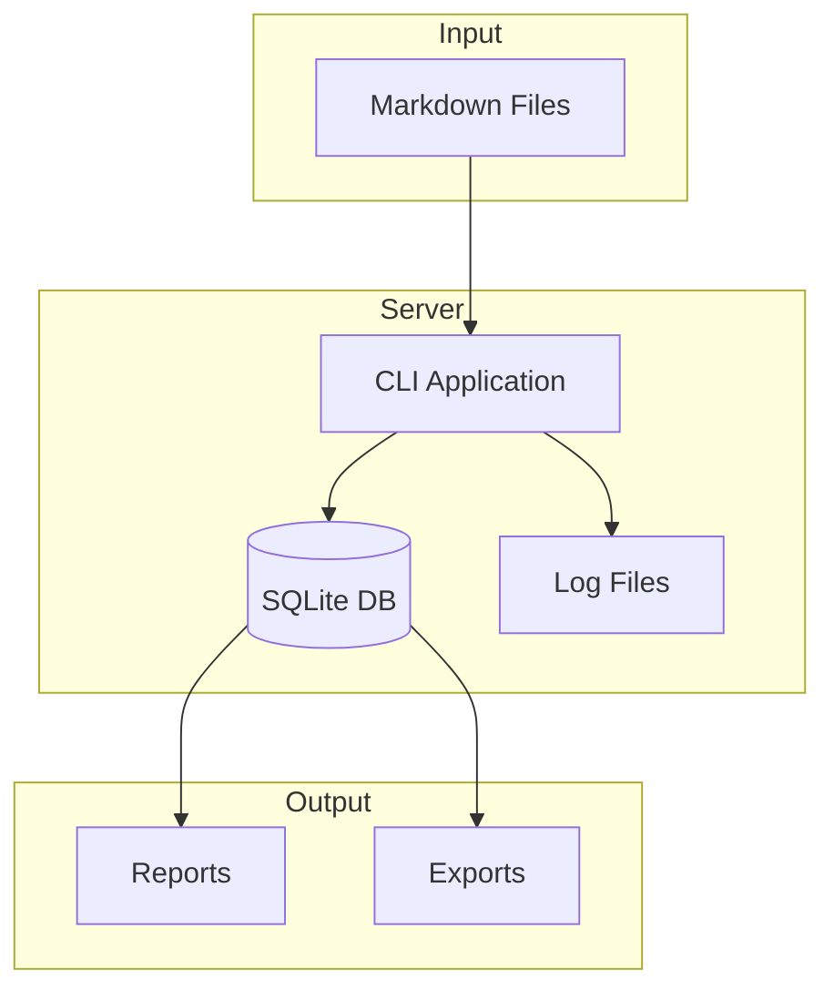
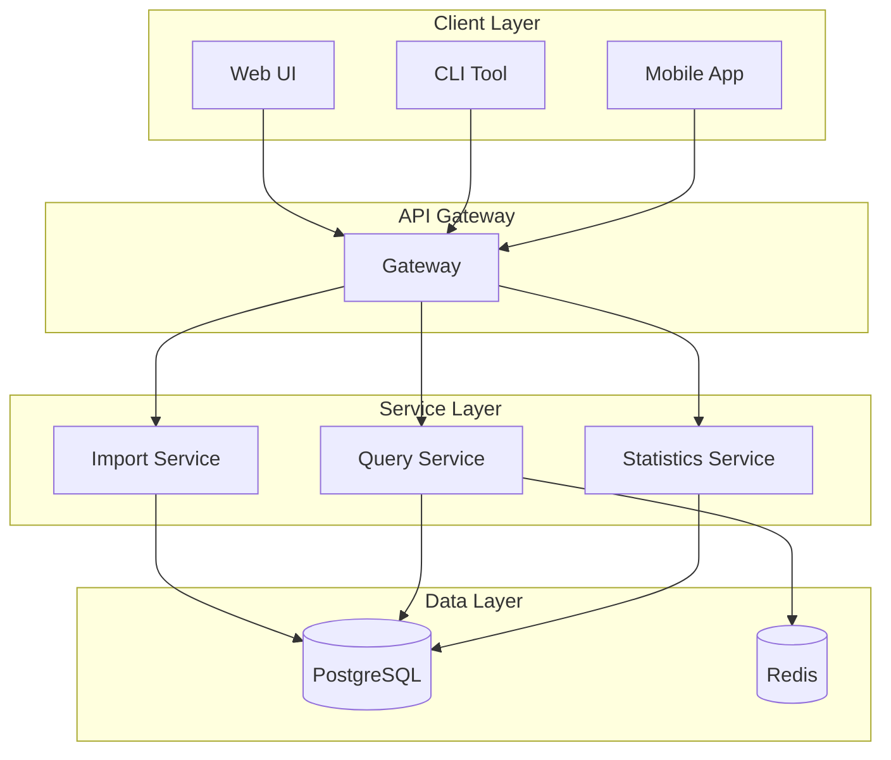

# 加班记录分析系统 - 系统架构设计文档

## 1. 文档信息

| 项目 | 内容 |
|------|------|
| 文档名称 | 系统架构设计文档 |
| 版本 | 1.0 |
| 创建日期 | 2026-04-04 |
| 状态 | 初稿 |

---

## 2. 架构概述

### 2.1 设计原则

1. **单一职责**：每个模块只负责一个明确的功能
2. **开闭原则**：对扩展开放，对修改关闭
3. **依赖倒置**：高层模块不依赖低层模块，都依赖抽象
4. **分层架构**：清晰的层次划分，便于维护和测试

### 2.2 架构风格

采用**分层架构 + 管道过滤器**混合风格：
- **分层架构**：数据访问层、业务逻辑层、应用服务层
- **管道过滤器**：数据解析采用管道模式，每个解析器是一个过滤器

---

## 3. 系统架构图



---

## 4. 数据流图

### 4.1 整体数据流



### 4.2 解析数据流详细图



### 4.3 查询数据流



---

## 5. 组件详细设计

### 5.1 核心组件列表

| 组件名称 | 职责 | 依赖组件 |
|----------|------|----------|
| TextExtractor | 从文件读取原始文本 | - |
| LineParser | 将文本分割为记录行 | TextExtractor |
| DateNormalizer | 标准化日期格式 | - |
| TypeClassifier | 识别记录类型 | - |
| HoursCalculator | 计算时长 | TypeClassifier |
| RecordValidator | 验证记录有效性 | - |
| RecordRepository | 记录数据访问 | SQLite |
| ImportService | 导入业务逻辑 | ParserPipeline, Repository |
| QueryService | 查询业务逻辑 | Repository |
| StatisticsService | 统计业务逻辑 | Repository |

### 5.2 组件交互关系



---

## 6. 模块划分

### 6.1 模块结构

```
ot_calculation/
├── core/                    # 核心模块
│   ├── __init__.py
│   ├── models.py           # 数据模型
│   ├── exceptions.py       # 自定义异常
│   └── constants.py        # 常量定义
├── parsers/                # 解析器模块
│   ├── __init__.py
│   ├── base.py            # 解析器基类
│   ├── date_parser.py     # 日期解析
│   ├── type_parser.py     # 类型识别
│   ├── hours_parser.py    # 时长解析
│   └── pipeline.py        # 解析管道
├── services/              # 服务模块
│   ├── __init__.py
│   ├── import_service.py
│   ├── query_service.py
│   ├── statistics_service.py
│   └── validation_service.py
├── repositories/          # 数据访问模块
│   ├── __init__.py
│   ├── base.py
│   ├── record_repository.py
│   ├── employee_repository.py
│   └── database.py
├── interfaces/            # 接口模块
│   ├── __init__.py
│   ├── cli.py            # 命令行接口
│   └── api.py            # API接口（预留）
├── config/               # 配置模块
│   ├── __init__.py
│   ├── settings.py
│   └── rules.yaml        # 解析规则配置
└── utils/                # 工具模块
    ├── __init__.py
    ├── logger.py
    └── helpers.py
```

### 6.2 模块依赖关系



---

## 7. 扩展性设计

### 7.1 解析器扩展机制

```mermaid
flowchart LR
    A[New Format] --> B[Create Parser]
    B --> C[Inherit BaseParser]
    C --> D[Implement parse()]
    D --> E[Register to Pipeline]
    E --> F[System Supports New Format]
```

### 7.2 规则引擎设计



---

## 8. 部署架构

### 8.1 单机部署



### 8.2 未来扩展：服务化部署



---

## 9. 技术选型

| 层次 | 技术 | 版本 | 说明 |
|------|------|------|------|
| 编程语言 | Python | 3.9+ | 主开发语言 |
| 数据库 | SQLite | 3.35+ | 嵌入式数据库 |
| ORM | SQLAlchemy | 2.0+ | 数据库访问 |
| CLI | Click | 8.0+ | 命令行接口 |
| 配置 | PyYAML | 6.0+ | 规则配置 |
| 日志 | logging | 标准库 | 日志记录 |
| 测试 | pytest | 7.0+ | 单元测试 |
| 类型检查 | mypy | 1.0+ | 静态类型检查 |

---

## 10. 架构决策记录 (ADR)

### ADR-001: 使用分层架构

**决策**：采用分层架构（数据层、业务层、服务层、接口层）

**理由**：
- 职责清晰，便于维护
- 支持单元测试
- 符合单一职责原则

**替代方案**：微服务架构（过于复杂，当前阶段不需要）

### ADR-002: 使用管道模式处理解析

**决策**：解析流程采用管道过滤器模式

**理由**：
- 每个解析步骤独立，便于测试
- 支持灵活组合和扩展
- 符合开闭原则

**替代方案**：单一复杂解析器（难以维护和扩展）

### ADR-003: 使用 SQLite 作为数据库

**决策**：第一阶段使用 SQLite 作为数据存储

**理由**：
- 零配置，便于部署
- 单文件，便于备份和迁移
- 性能足够当前需求

**替代方案**：PostgreSQL（需要额外部署和运维）

### ADR-004: 使用配置文件管理解析规则

**决策**：将解析规则外置到 YAML 配置文件

**理由**：
- 无需修改代码即可适应新格式
- 业务人员可参与规则调整
- 便于版本管理

**替代方案**：硬编码规则（缺乏灵活性）
