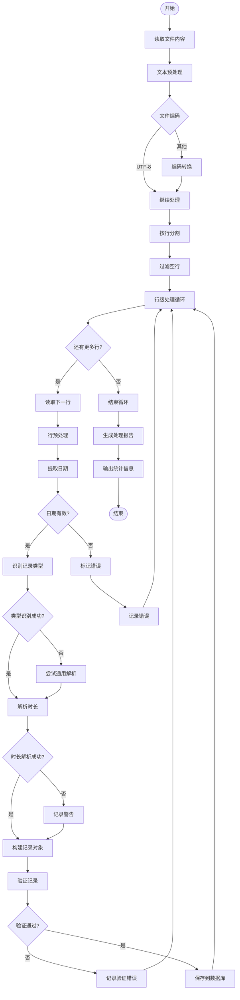
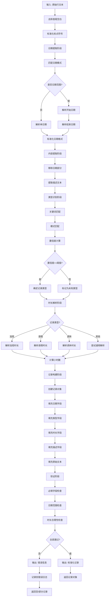
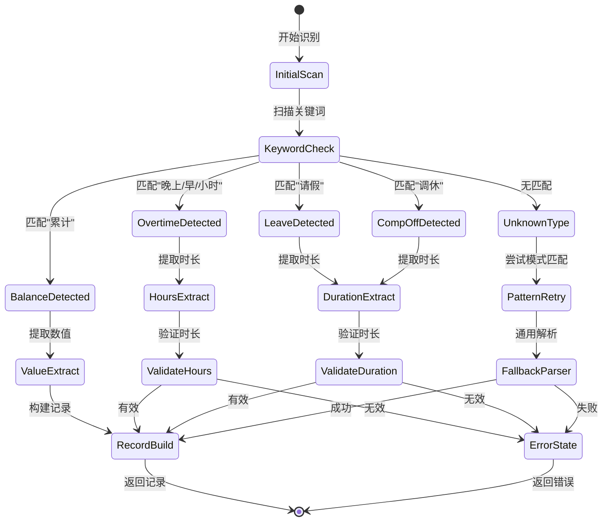
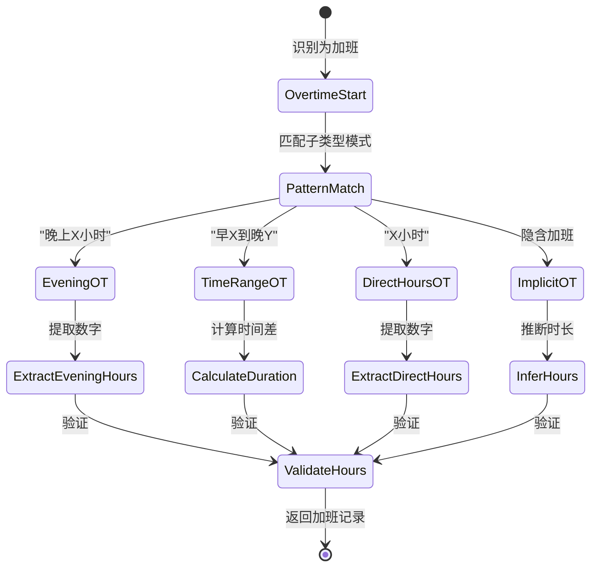
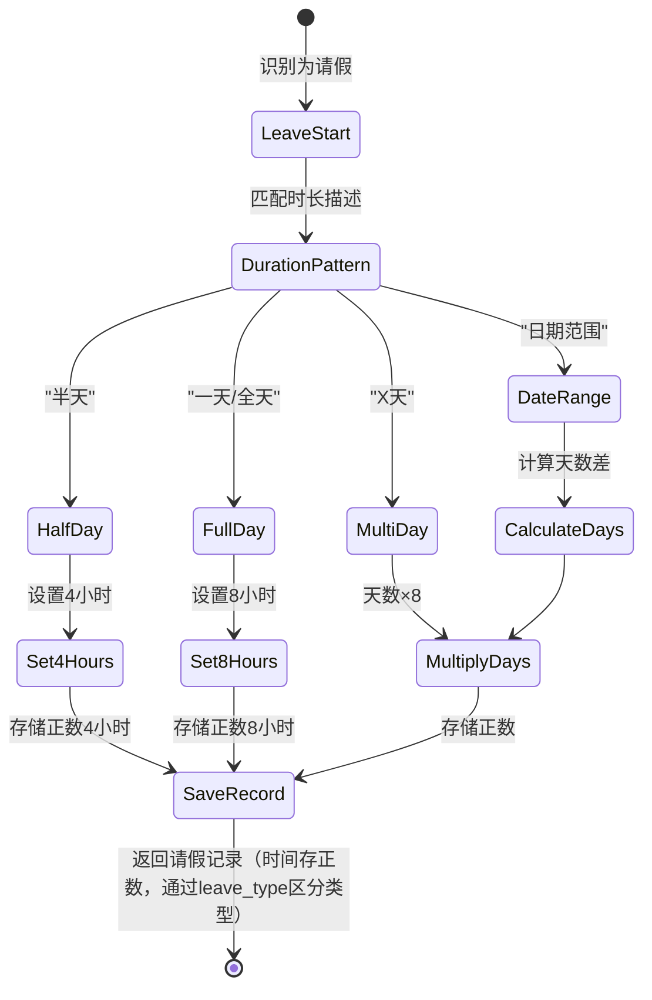
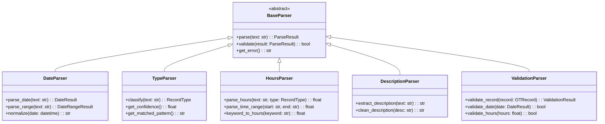
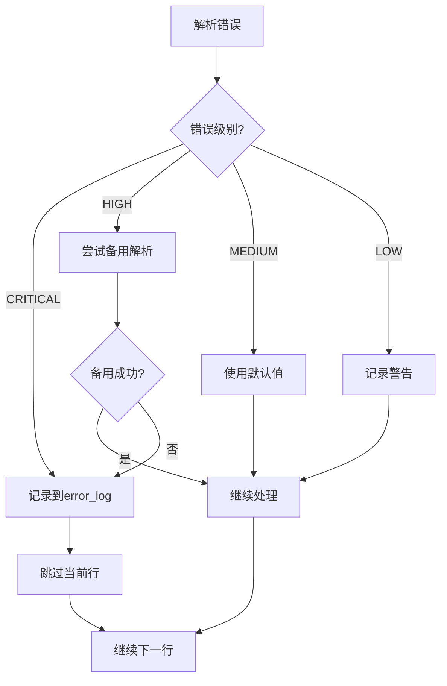
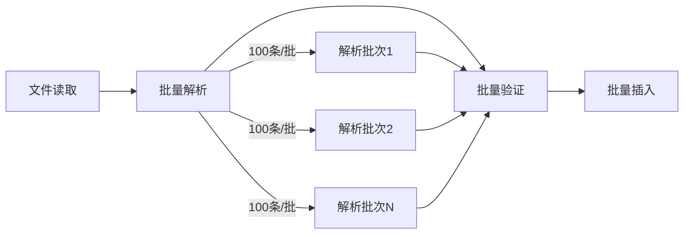
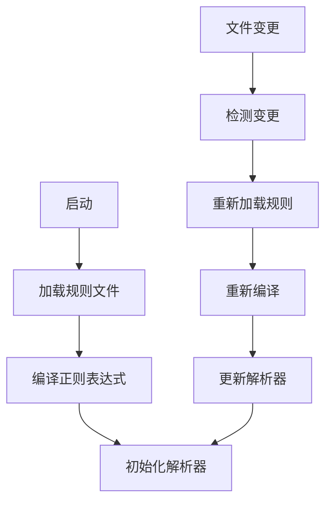

# 加班记录分析系统 - 数据解析策略文档

## 1. 文档信息

| 项目 | 内容 |
|------|------|
| 文档名称 | 数据解析策略文档 |
| 版本 | 1.0 |
| 创建日期 | 2026-04-04 |
| 状态 | 初稿 |

---

## 2. 解析策略概述

### 2.1 解析目标

将半结构化的 Markdown 加班记录转换为标准化的数据记录，支持：
- 多种日期格式识别
- 多种记录类型分类
- 多种时长描述解析
- 数据验证和清洗

### 2.2 解析原则

1. **渐进式解析**：从粗到细，逐步提取信息
2. **容错处理**：对无法解析的记录保留原始信息
3. **可配置性**：解析规则支持外部配置
4. **可追溯性**：保留原始文本用于审计

---

## 3. 解析流程图

### 3.1 整体解析流程



### 3.2 单行解析详细流程



---

## 4. 记录类型识别状态机

### 4.1 类型识别主状态机



### 4.2 加班类型子状态机



### 4.3 请假类型子状态机



---

## 5. 解析规则设计

### 5.1 日期解析规则

```yaml
# 日期解析规则配置
date_rules:
  # 单日期模式
  single_date:
    - pattern: '(\d{4})[.\-/](\d{1,2})[.\-/](\d{1,2})'
      format: 'yyyy.m.d'
      example: '2025.08.15, 2025.9.18'
    
    - pattern: '(\d{4})年(\d{1,2})月(\d{1,2})日'
      format: 'yyyy年m月d日'
      example: '2025年8月15日'
  
  # 日期范围模式
  date_range:
    - pattern: '(\d{4})[.\-/](\d{1,2})[.\-/](\d{1,2})\s*[-~至]\s*(\d{1,2})'
      format: 'yyyy.m.d-d'
      example: '2025.10.27-29'
      note: '同月日期范围'
    
    - pattern: '(\d{4})[.\-/](\d{1,2})[.\-/](\d{1,2})\s*[-~至]\s*(\d{1,2})[.\-/](\d{1,2})'
      format: 'yyyy.m.d-m.d'
      example: '2025.10.27-11.3'
      note: '跨月日期范围'
```

### 5.2 类型识别规则

```yaml
# 记录类型识别规则
type_rules:
  overtime:
    keywords:
      - '晚上'
      - '早'
      - '小时'
      - '加班'
    patterns:
      - '晚上\s*\d+\.?\d*\s*小时'
      - '早\s*\d+\s*到晚\s*\d+'
      - '\d+\.?\d*\s*小时'
    confidence: 0.8
  
  leave:
    keywords:
      - '请假'
      - '休假'
      - '事假'
      - '病假'
    patterns:
      - '请假\s*(半天|一天|全天|\d+\s*天)'
    confidence: 0.9
  
  comp_off:
    keywords:
      - '调休'
      - '补休'
    patterns:
      - '调休\s*(半天|一天|全天|\d+\s*天)'
    confidence: 0.9
  
  balance:
    keywords:
      - '累计'
      - '余额'
      - '剩余'
    patterns:
      - '累计\s*\d+\.?\d*\s*小时'
    confidence: 0.7
    note: '⚠️ 仅提取用于参考展示，**不用于系统计算**。系统独立按《劳动法》规则计算各类加班余额。'
```

### 5.3 时长解析规则

#### 工作时间定义

```yaml
work_schedule:
  workdays: [1, 2, 3, 4, 5]  # 周一到周五
  morning:
    start: '08:30'
    end: '12:00'
    hours: 3.5
  lunch_break:
    start: '12:00'
    end: '13:00'
    is_work_time: false
  afternoon:
    start: '13:00'
    end: '17:30'
    hours: 4.5
  standard_daily_hours: 8.0
```

#### 工作日延时加班时段分解

对于包含多个时段的描述，需要分解为独立的加班记录：

```yaml
overtime_periods:
  weekday_morning:
    condition: 'end_time <= 08:30'
    description: '早晨加班'
    examples:
      - '早7点到岗' -> 08:30 - 07:00 = 1.5小时
      - '早晨1.5小时' -> 1.5小时
  
  weekday_lunch:
    condition: '12:00 <= start_time < 13:00'
    description: '午休加班'
    examples:
      - '中午12:30-13:00加班' -> 0.5小时
      - '午休1小时' -> 1.0小时
  
  weekday_evening:
    condition: 'start_time >= 17:30'
    description: '晚间加班'
    examples:
      - '晚上加班到20:00' -> 20:00 - 17:30 = 2.5小时
      - '晚17:30-22:00' -> 4.5小时

multi_period_parsing:
  # 同一条记录包含多个时段的处理
  example: '2025.10.24，早晨1.5小时，晚上5.5小时'
  result:
    - period: weekday_morning, hours: 1.5
    - period: weekday_evening, hours: 5.5
  total_overtime: 7.0小时
```

#### 时长解析规则配置

```yaml
# 时长解析规则
hours_rules:
  # 直接时长
  direct_hours:
    pattern: '(\d+\.?\d*)\s*小时'
    action: 'extract_number'
  
  # 时间段计算（需根据工作时间判断是否跨时段）
  time_range:
    pattern: '早\s*(\d{1,2})\s*到\s*晚\s*(\d{1,2})'
    action: 'calculate_overtime_range'
    formula: |
      # 计算实际加班时长，扣除标准工作时间
      total_duration = end - start
      if crosses_work_hours(start, end):
        # 跨工作时间，只计算08:30前和17:30后的部分
        overtime = calculate_outside_work_hours(start, end)
      else:
        # 全部在标准工作时间外
        overtime = total_duration
  
  # 半天/全天
  duration_keywords:
    '半天': 4
    '一天': 8
    '全天': 8
  
  # 天数转换
  days_to_hours:
    pattern: '(\d+)\s*天'
    multiplier: 8
    action: 'multiply'
  
  # 调整关键词
  adjustment_keywords:
    '减': -1
    '加': 1
    '增加': 1
    '减少': -1
```

---

## 6. 解析器组件设计

### 6.1 解析器类层次



### 6.2 解析管道设计


---

## 7. 错误处理策略

### 7.1 错误分类

| 错误级别 | 说明 | 处理方式 |
|----------|------|----------|
| CRITICAL | 日期解析失败 | 跳过该行，记录错误 |
| HIGH | 类型识别失败 | 标记为未知类型，尝试通用解析 |
| MEDIUM | 时长解析失败 | 保留记录，时长设为NULL |
| LOW | 描述提取不完整 | 记录警告，继续处理 |

### 7.2 错误处理流程



---

## 8. 性能优化策略

### 8.1 正则表达式优化

1. **预编译**：所有正则表达式在初始化时预编译
2. **顺序优化**：按匹配频率排序，常用模式优先
3. **锚点使用**：使用 `^` 和 `$` 减少回溯

### 8.2 批处理策略



---

## 9. 配置管理

### 9.1 配置文件结构

```yaml
# config/parsing_rules.yaml
version: "1.0"

parsing:
  # 通用设置
  general:
    encoding: "utf-8"
    line_separator: "\n"
    skip_empty_lines: true
    confidence_threshold: 0.7
  
  # 日期解析
  date_parsing:
    default_year: null  # null表示从数据中提取
    date_formats:
      - "%Y.%m.%d"
      - "%Y-%m-%d"
      - "%Y/%m/%d"
      - "%Y年%m月%d日"
  
  # 类型识别
  type_classification:
    overtime:
      weight: 1.0
      keywords: ["晚上", "早", "小时", "加班"]
    leave:
      weight: 1.0
      keywords: ["请假", "休假", "事假", "病假"]
    comp_off:
      weight: 1.0
      keywords: ["调休", "补休"]
  
  # 时长计算
  hours_calculation:
    work_hours_per_day: 8
    half_day_hours: 4
    time_range_format: "24h"
```

### 9.2 规则热更新



---

## 10. 测试策略

### 10.1 解析器测试矩阵

| 测试类型 | 测试内容 | 预期结果 |
|----------|----------|----------|
| 日期解析 | 2025.08.15 | 2025-08-15 |
| 日期解析 | 2025.9.18 | 2025-09-18 |
| 日期范围 | 2025.10.27-29 | 2025-10-27 至 2025-10-29 |
| 加班识别 | 晚上3.5小时 | 类型=overtime, 时长=3.5 |
| 请假识别 | 请假半天 | 类型=leave, 时长=-4 |
| 调休识别 | 调休三天 | 类型=comp_off, 时长=-24 |
| 时间范围 | 早7到晚10 | 时长=15 |

### 10.2 模糊测试用例

```python
# 边界情况测试用例
edge_cases = [
    "2025.02.29",  # 无效日期
    "2025.13.01",  # 无效月份
    "晚上-3小时",  # 负时长
    "请假0天",     # 零时长
    "",            # 空行
    "累计小时",    # 缺少数字
    "2025.08.15",  # 只有日期无内容
]
```
