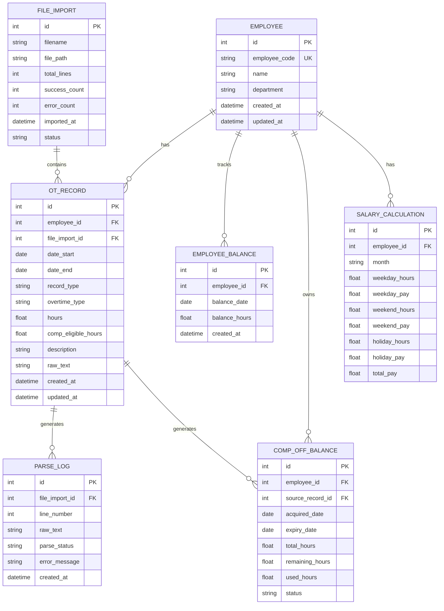
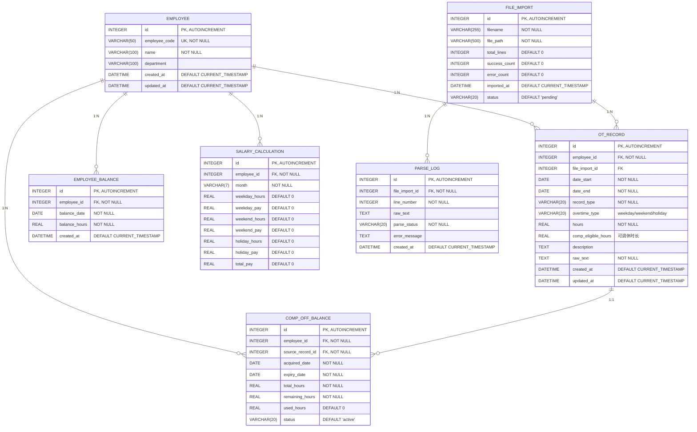

# 加班记录分析系统 - 数据库设计文档

## 1. 文档信息

| 项目 | 内容 |
|------|------|
| 文档名称 | 数据库设计文档 |
| 版本 | 1.0 |
| 创建日期 | 2026-04-04 |
| 状态 | 初稿 |

---

## 2. 数据库概述

### 2.1 数据库选型

- **数据库类型**: SQLite
- **版本要求**: 3.35+
- **选择理由**:
  - 零配置，便于部署
  - 单文件存储，易于备份和迁移
  - 支持事务，保证数据一致性
  - 性能满足当前需求（< 100万条记录）

### 2.2 设计原则

1. **第三范式 (3NF)**: 消除冗余，确保数据一致性
2. **适当反规范化**: 为查询性能考虑，适度冗余
3. **完整性约束**: 使用外键、检查约束保证数据质量
4. **审计追踪**: 记录创建和修改时间

---

## 3. ER 图（实体关系图）

### 3.1 概念 ER 图



### 3.2 物理 ER 图（包含字段详情）



---

## 4. 表结构设计

### 4.1 employees 表

员工信息表，存储员工基本信息。

```sql
CREATE TABLE employees (
    id INTEGER PRIMARY KEY AUTOINCREMENT,
    employee_code VARCHAR(50) NOT NULL UNIQUE,
    name VARCHAR(100) NOT NULL,
    department VARCHAR(100),
    created_at DATETIME DEFAULT CURRENT_TIMESTAMP,
    updated_at DATETIME DEFAULT CURRENT_TIMESTAMP,
    
    -- 约束
    CONSTRAINT chk_employee_code CHECK (LENGTH(employee_code) > 0),
    CONSTRAINT chk_name CHECK (LENGTH(name) > 0)
);

-- 索引
CREATE INDEX idx_employees_department ON employees(department);
CREATE INDEX idx_employees_name ON employees(name);
```

**字段说明**:

| 字段名 | 类型 | 约束 | 说明 |
|--------|------|------|------|
| id | INTEGER | PK | 主键，自增 |
| employee_code | VARCHAR(50) | UK, NOT NULL | 员工编号，唯一标识 |
| name | VARCHAR(100) | NOT NULL | 员工姓名 |
| department | VARCHAR(100) | - | 所属部门 |
| created_at | DATETIME | DEFAULT | 创建时间 |
| updated_at | DATETIME | DEFAULT | 更新时间 |

### 4.2 ot_records 表

---

## 数据存储架构（表分离设计）

根据业务要求，系统采用**表分离**设计，各类时间数据分别存储在独立的表中：

| 表名 | 存储内容 | 时间值 | 计算方式 |
|------|----------|--------|----------|
| `overtime_records` | 加班记录 | 正数（小时+分钟） | 业务逻辑累计 |
| `leave_records` | 请假记录 | 正数（小时+分钟） | 业务逻辑累计 |
| `comp_off_records` | 调休使用记录 | 正数（小时+分钟） | 业务逻辑累计 |
| `comp_off_balances` | 调休余额明细 | 正数（小时+分钟） | 业务逻辑计算 |

> **重要原则**: 所有时间字段均存储**正数**，不直接使用数据库字段进行加减运算。累计结果通过业务逻辑代码计算。

---

### 4.2 加班记录表 (overtime_records)

存储所有加班记录，时间字段只存正数。

```sql
CREATE TABLE overtime_records (
    id INTEGER PRIMARY KEY AUTOINCREMENT,
    employee_id INTEGER NOT NULL,
    file_import_id INTEGER,
    date_start DATE NOT NULL,
    date_end DATE NOT NULL,
    overtime_type VARCHAR(20) NOT NULL,  -- weekday_morning/lunch/evening/weekend/holiday
    -- 时间存储（支持小时和分钟）
    duration_hours INTEGER NOT NULL,      -- 完整小时数（正数）
    duration_minutes INTEGER NOT NULL,    -- 分钟数 0-59（正数）
    total_minutes INTEGER NOT NULL,       -- 总分钟数 = hours*60 + minutes（正数，便于计算）
    -- 调休相关信息（仅weekend类型有效）
    comp_eligible_hours INTEGER DEFAULT 0,     -- 可调休完整小时
    comp_eligible_minutes INTEGER DEFAULT 0,   -- 可调休分钟
    description TEXT,
    raw_text TEXT NOT NULL,
    created_at DATETIME DEFAULT CURRENT_TIMESTAMP,
    updated_at DATETIME DEFAULT CURRENT_TIMESTAMP,

    -- 外键约束
    FOREIGN KEY (employee_id) REFERENCES employees(id) ON DELETE CASCADE,
    FOREIGN KEY (file_import_id) REFERENCES file_imports(id) ON DELETE SET NULL,

    -- 检查约束：所有时间字段必须为正数
    CONSTRAINT chk_ot_hours_positive CHECK (duration_hours >= 0),
    CONSTRAINT chk_ot_minutes_range CHECK (duration_minutes >= 0 AND duration_minutes < 60),
    CONSTRAINT chk_ot_total_positive CHECK (total_minutes > 0),
    CONSTRAINT chk_ot_date_range CHECK (date_end >= date_start),
    CONSTRAINT chk_ot_type CHECK (overtime_type IN ('weekday_morning', 'weekday_lunch', 'weekday_evening', 'weekend', 'holiday'))
);

-- 索引
CREATE INDEX idx_ot_records_employee_id ON overtime_records(employee_id);
CREATE INDEX idx_ot_records_date_start ON overtime_records(date_start);
CREATE INDEX idx_ot_records_date_range ON overtime_records(date_start, date_end);
CREATE INDEX idx_ot_records_type ON overtime_records(overtime_type);
```

**字段说明**:

| 字段名 | 类型 | 约束 | 说明 |
|--------|------|------|------|
| id | INTEGER | PK | 主键，自增 |
| employee_id | INTEGER | FK, NOT NULL | 员工ID |
| file_import_id | INTEGER | FK | 来源文件ID |
| date_start | DATE | NOT NULL | 开始日期 |
| date_end | DATE | NOT NULL | 结束日期 |
| overtime_type | VARCHAR(20) | NOT NULL | 加班类型 |
| duration_hours | INTEGER | NOT NULL | 时长-完整小时（正数） |
| duration_minutes | INTEGER | NOT NULL | 时长-分钟（0-59，正数） |
| total_minutes | INTEGER | NOT NULL | 总分钟数（正数，便于业务计算） |
| comp_eligible_hours | INTEGER | DEFAULT 0 | 可调休小时（仅weekend） |
| comp_eligible_minutes | INTEGER | DEFAULT 0 | 可调休分钟（仅weekend） |
| description | TEXT | - | 描述信息 |
| raw_text | TEXT | NOT NULL | 原始文本 |
| created_at | DATETIME | DEFAULT | 创建时间 |
| updated_at | DATETIME | DEFAULT | 更新时间 |

**时间存储示例**:
- 3小时30分钟加班: `duration_hours=3, duration_minutes=30, total_minutes=210`
- 1.5小时加班: `duration_hours=1, duration_minutes=30, total_minutes=90`
- 45分钟加班: `duration_hours=0, duration_minutes=45, total_minutes=45`

**加班类型枚举**:
- `weekday_morning`: 工作日早晨加班（08:30前，1.5倍工资，不可调休）
- `weekday_lunch`: 工作日午休加班（12:00-13:00，1.5倍工资，不可调休）
- `weekday_evening`: 工作日晚间加班（17:30后，1.5倍工资，不可调休）
- `weekend`: 周末加班（2倍工资或调休）
- `holiday`: 法定节假日加班（3倍工资，不可调休）

---

### 4.2.2 请假记录表 (leave_records)

存储所有请假记录，时间字段只存正数。

```sql
CREATE TABLE leave_records (
    id INTEGER PRIMARY KEY AUTOINCREMENT,
    employee_id INTEGER NOT NULL,
    file_import_id INTEGER,
    date_start DATE NOT NULL,
    date_end DATE NOT NULL,
    leave_type VARCHAR(20) NOT NULL,  -- annual/sick/personal/other
    -- 时间存储（支持小时和分钟）
    duration_hours INTEGER NOT NULL,      -- 完整小时数（正数）
    duration_minutes INTEGER NOT NULL,    -- 分钟数 0-59（正数）
    total_minutes INTEGER NOT NULL,       -- 总分钟数 = hours*60 + minutes（正数）
    description TEXT,
    raw_text TEXT NOT NULL,
    created_at DATETIME DEFAULT CURRENT_TIMESTAMP,
    updated_at DATETIME DEFAULT CURRENT_TIMESTAMP,

    -- 外键约束
    FOREIGN KEY (employee_id) REFERENCES employees(id) ON DELETE CASCADE,
    FOREIGN KEY (file_import_id) REFERENCES file_imports(id) ON DELETE SET NULL,

    -- 检查约束：所有时间字段必须为正数
    CONSTRAINT chk_leave_hours_positive CHECK (duration_hours >= 0),
    CONSTRAINT chk_leave_minutes_range CHECK (duration_minutes >= 0 AND duration_minutes < 60),
    CONSTRAINT chk_leave_total_positive CHECK (total_minutes > 0),
    CONSTRAINT chk_leave_date_range CHECK (date_end >= date_start),
    CONSTRAINT chk_leave_type CHECK (leave_type IN ('annual', 'sick', 'personal', 'other'))
);

-- 索引
CREATE INDEX idx_leave_records_employee_id ON leave_records(employee_id);
CREATE INDEX idx_leave_records_date_start ON leave_records(date_start);
CREATE INDEX idx_leave_records_type ON leave_records(leave_type);
```

**字段说明**:

| 字段名 | 类型 | 约束 | 说明 |
|--------|------|------|------|
| id | INTEGER | PK | 主键，自增 |
| employee_id | INTEGER | FK, NOT NULL | 员工ID |
| file_import_id | INTEGER | FK | 来源文件ID |
| date_start | DATE | NOT NULL | 开始日期 |
| date_end | DATE | NOT NULL | 结束日期 |
| leave_type | VARCHAR(20) | NOT NULL | 请假类型 |
| duration_hours | INTEGER | NOT NULL | 时长-完整小时（正数） |
| duration_minutes | INTEGER | NOT NULL | 时长-分钟（0-59，正数） |
| total_minutes | INTEGER | NOT NULL | 总分钟数（正数） |
| description | TEXT | - | 描述信息 |
| raw_text | TEXT | NOT NULL | 原始文本 |

**请假类型枚举**:
- `annual`: 年假
- `sick`: 病假
- `personal`: 事假
- `other`: 其他

---

### 4.2.3 调休使用记录表 (comp_off_usage_records)

存储调休使用记录，时间字段只存正数。

```sql
CREATE TABLE comp_off_usage_records (
    id INTEGER PRIMARY KEY AUTOINCREMENT,
    employee_id INTEGER NOT NULL,
    file_import_id INTEGER,
    usage_date DATE NOT NULL,
    -- 时间存储（支持小时和分钟）
    duration_hours INTEGER NOT NULL,      -- 完整小时数（正数）
    duration_minutes INTEGER NOT NULL,    -- 分钟数 0-59（正数）
    total_minutes INTEGER NOT NULL,       -- 总分钟数（正数）
    -- 抵扣来源（关联到 comp_off_balances）
    deducted_from_balance_ids TEXT,       -- JSON数组，记录抵扣了哪些余额条目
    description TEXT,
    raw_text TEXT NOT NULL,
    created_at DATETIME DEFAULT CURRENT_TIMESTAMP,
    updated_at DATETIME DEFAULT CURRENT_TIMESTAMP,

    -- 外键约束
    FOREIGN KEY (employee_id) REFERENCES employees(id) ON DELETE CASCADE,
    FOREIGN KEY (file_import_id) REFERENCES file_imports(id) ON DELETE SET NULL,

    -- 检查约束：所有时间字段必须为正数
    CONSTRAINT chk_comp_usage_hours_positive CHECK (duration_hours >= 0),
    CONSTRAINT chk_comp_usage_minutes_range CHECK (duration_minutes >= 0 AND duration_minutes < 60),
    CONSTRAINT chk_comp_usage_total_positive CHECK (total_minutes > 0)
);

-- 索引
CREATE INDEX idx_comp_usage_employee_id ON comp_off_usage_records(employee_id);
CREATE INDEX idx_comp_usage_date ON comp_off_usage_records(usage_date);
```

**字段说明**:

| 字段名 | 类型 | 约束 | 说明 |
|--------|------|------|------|
| id | INTEGER | PK | 主键，自增 |
| employee_id | INTEGER | FK, NOT NULL | 员工ID |
| file_import_id | INTEGER | FK | 来源文件ID |
| usage_date | DATE | NOT NULL | 调休使用日期 |
| duration_hours | INTEGER | NOT NULL | 时长-完整小时（正数） |
| duration_minutes | INTEGER | NOT NULL | 时长-分钟（0-59，正数） |
| total_minutes | INTEGER | NOT NULL | 总分钟数（正数） |
| deducted_from_balance_ids | TEXT | - | 抵扣来源余额ID列表（JSON） |
| description | TEXT | - | 描述信息 |
| raw_text | TEXT | NOT NULL | 原始文本 |

---

## 数据存储架构说明

### 表职责分离

根据业务要求，系统采用**表分离**设计：

| 表名 | 存储内容 | 时间值 | 计算方式 |
|------|----------|--------|----------|
| `overtime_records` | 加班记录 | 正数（小时+分钟） | 业务逻辑累计 |
| `leave_records` | 请假记录 | 正数（小时+分钟） | 业务逻辑累计 |
| `comp_off_usage_records` | 调休使用记录 | 正数（小时+分钟） | 业务逻辑累计 |
| `comp_off_balances` | 调休余额明细 | 正数（小时+分钟） | 业务逻辑计算 |

### 时间存储规则

1. **所有时间字段存储正数**：不区分"增加"或"减少"
2. **支持小时和分钟**：使用 `duration_hours` + `duration_minutes` + `total_minutes` 三个字段
3. **业务逻辑计算累计**：不直接使用 SQL SUM 计算结余

### 统计计算逻辑（业务层实现）

**加班统计**：通过代码逻辑从 `overtime_records` 表查询并累计
```python
# 业务逻辑示例（伪代码）
def calculate_overtime_summary(employee_id, month):
    records = query("""
        SELECT overtime_type, duration_hours, duration_minutes, total_minutes
        FROM overtime_records
        WHERE employee_id = ? AND strftime('%Y-%m', date_start) = ?
    """, [employee_id, month])
    
    summary = {
        'weekday_morning': {'hours': 0, 'minutes': 0, 'total_minutes': 0},
        'weekday_lunch': {'hours': 0, 'minutes': 0, 'total_minutes': 0},
        'weekday_evening': {'hours': 0, 'minutes': 0, 'total_minutes': 0},
        'weekend': {'hours': 0, 'minutes': 0, 'total_minutes': 0},
        'holiday': {'hours': 0, 'minutes': 0, 'total_minutes': 0}
    }
    
    for record in records:
        ot_type = record['overtime_type']
        summary[ot_type]['hours'] += record['duration_hours']
        summary[ot_type]['minutes'] += record['duration_minutes']
        summary[ot_type]['total_minutes'] += record['total_minutes']
    
    # 处理分钟进位
    for ot_type in summary:
        extra_hours = summary[ot_type]['minutes'] // 60
        summary[ot_type]['hours'] += extra_hours
        summary[ot_type]['minutes'] %= 60
    
    return summary
```

**调休统计**：通过代码逻辑从 `comp_off_balances` 表查询并计算可用余额
```python
# 业务逻辑示例（伪代码）
def calculate_available_comp_off(employee_id):
    balances = query("""
        SELECT total_hours, total_minutes, used_hours, used_minutes
        FROM comp_off_balances
        WHERE employee_id = ? AND status = 'active' AND expiry_date >= DATE('now')
        ORDER BY acquired_date ASC
    """, [employee_id])
    
    total_available_minutes = 0
    for balance in balances:
        total_minutes = balance['total_hours'] * 60 + balance['total_minutes']
        used_minutes = balance['used_hours'] * 60 + balance['used_minutes']
        total_available_minutes += (total_minutes - used_minutes)
    
    return {
        'hours': total_available_minutes // 60,
        'minutes': total_available_minutes % 60,
        'total_minutes': total_available_minutes
    }
```

### 4.3 employee_balances 表

员工余额表，存储系统按《劳动法》规则计算的合规余额快照。

> **重要说明**：本表存储的是**系统独立计算**的合规余额，不是员工记录文件中声明的"累计"值。
> 因员工记录未区分加班类型（工作日/周末/法定假日），其累加方式不符合合规要求，系统不参考该值。

```sql
CREATE TABLE employee_balances (
    id INTEGER PRIMARY KEY AUTOINCREMENT,
    employee_id INTEGER NOT NULL,
    balance_date DATE NOT NULL,
    balance_hours REAL NOT NULL,
    created_at DATETIME DEFAULT CURRENT_TIMESTAMP,
    
    -- 外键约束
    FOREIGN KEY (employee_id) REFERENCES employees(id) ON DELETE CASCADE,
    
    -- 检查约束
    CONSTRAINT chk_balance_hours CHECK (balance_hours >= 0)
);

-- 索引
CREATE INDEX idx_employee_balances_employee_id ON employee_balances(employee_id);
CREATE INDEX idx_employee_balances_date ON employee_balances(balance_date);
CREATE UNIQUE INDEX idx_employee_balances_unique ON employee_balances(employee_id, balance_date);
```

**字段说明**:

| 字段名 | 类型 | 约束 | 说明 |
|--------|------|------|------|
| id | INTEGER | PK | 主键，自增 |
| employee_id | INTEGER | FK, NOT NULL | 员工ID |
| balance_date | DATE | NOT NULL | 余额日期 |
| balance_hours | REAL | NOT NULL | 系统计算的合规余额（小时） |
| created_at | DATETIME | DEFAULT | 创建时间 |

### 4.4 file_imports 表

文件导入记录表，追踪每次导入操作。

```sql
CREATE TABLE file_imports (
    id INTEGER PRIMARY KEY AUTOINCREMENT,
    filename VARCHAR(255) NOT NULL,
    file_path VARCHAR(500) NOT NULL,
    total_lines INTEGER DEFAULT 0,
    success_count INTEGER DEFAULT 0,
    error_count INTEGER DEFAULT 0,
    imported_at DATETIME DEFAULT CURRENT_TIMESTAMP,
    status VARCHAR(20) DEFAULT 'pending',
    
    -- 检查约束
    CONSTRAINT chk_status CHECK (status IN ('pending', 'processing', 'completed', 'failed', 'partial')),
    CONSTRAINT chk_line_counts CHECK (total_lines >= 0 AND success_count >= 0 AND error_count >= 0)
);

-- 索引
CREATE INDEX idx_file_imports_status ON file_imports(status);
CREATE INDEX idx_file_imports_imported_at ON file_imports(imported_at);
```

**字段说明**:

| 字段名 | 类型 | 约束 | 说明 |
|--------|------|------|------|
| id | INTEGER | PK | 主键，自增 |
| filename | VARCHAR(255) | NOT NULL | 文件名 |
| file_path | VARCHAR(500) | NOT NULL | 文件路径 |
| total_lines | INTEGER | DEFAULT 0 | 总行数 |
| success_count | INTEGER | DEFAULT 0 | 成功解析数 |
| error_count | INTEGER | DEFAULT 0 | 错误数 |
| imported_at | DATETIME | DEFAULT | 导入时间 |
| status | VARCHAR(20) | DEFAULT | 导入状态 |

**状态枚举**:
- `pending`: 待处理
- `processing`: 处理中
- `completed`: 完成
- `failed`: 失败
- `partial`: 部分成功

### 4.5 comp_off_balances 表

调休余额明细表，记录每次周末加班产生的可调休时长及使用情况。

> **时间存储规则**: 所有时间字段存储正数，支持小时和分钟，通过业务逻辑计算剩余量。

```sql
CREATE TABLE comp_off_balances (
    id INTEGER PRIMARY KEY AUTOINCREMENT,
    employee_id INTEGER NOT NULL,
    source_record_id INTEGER NOT NULL,  -- 关联到 overtime_records.id
    acquired_date DATE NOT NULL,
    expiry_date DATE NOT NULL,
    
    -- 总调休时长（正数）
    total_hours INTEGER NOT NULL,         -- 完整小时
    total_minutes INTEGER NOT NULL,       -- 分钟 0-59
    total_minutes_calculated INTEGER NOT NULL,  -- 总分钟数 = hours*60 + minutes
    
    -- 已使用时长（正数）
    used_hours INTEGER DEFAULT 0,         -- 已使用完整小时
    used_minutes INTEGER DEFAULT 0,       -- 已使用分钟
    used_minutes_calculated INTEGER DEFAULT 0,  -- 已使用总分钟
    
    status VARCHAR(20) DEFAULT 'active',
    created_at DATETIME DEFAULT CURRENT_TIMESTAMP,
    updated_at DATETIME DEFAULT CURRENT_TIMESTAMP,

    -- 外键约束
    FOREIGN KEY (employee_id) REFERENCES employees(id) ON DELETE CASCADE,
    FOREIGN KEY (source_record_id) REFERENCES overtime_records(id) ON DELETE CASCADE,

    -- 检查约束：所有时间字段必须为正数
    CONSTRAINT chk_comp_status CHECK (status IN ('active', 'expired', 'used')),
    CONSTRAINT chk_comp_total_hours_positive CHECK (total_hours >= 0),
    CONSTRAINT chk_comp_total_minutes_range CHECK (total_minutes >= 0 AND total_minutes < 60),
    CONSTRAINT chk_comp_used_hours_positive CHECK (used_hours >= 0),
    CONSTRAINT chk_comp_used_minutes_range CHECK (used_minutes >= 0 AND used_minutes < 60),
    -- 注意：不在这里检查 remaining，而是通过业务逻辑计算
    CONSTRAINT chk_comp_total_positive CHECK (total_minutes_calculated > 0)
);

-- 索引
CREATE INDEX idx_comp_off_employee_id ON comp_off_balances(employee_id);
CREATE INDEX idx_comp_off_expiry ON comp_off_balances(expiry_date);
CREATE INDEX idx_comp_off_status ON comp_off_balances(status);
```

**字段说明**:

| 字段名 | 类型 | 约束 | 说明 |
|--------|------|------|------|
| id | INTEGER | PK | 主键，自增 |
| employee_id | INTEGER | FK, NOT NULL | 员工ID |
| source_record_id | INTEGER | FK, NOT NULL | 来源加班记录ID |
| acquired_date | DATE | NOT NULL | 获得日期 |
| expiry_date | DATE | NOT NULL | 到期日期（默认6个月后） |
| total_hours | INTEGER | NOT NULL | 总调休时长-完整小时（正数） |
| total_minutes | INTEGER | NOT NULL | 总调休时长-分钟（0-59） |
| total_minutes_calculated | INTEGER | NOT NULL | 总调休时长-总分钟数 |
| used_hours | INTEGER | DEFAULT 0 | 已使用时长-完整小时（正数） |
| used_minutes | INTEGER | DEFAULT 0 | 已使用时长-分钟（0-59） |
| used_minutes_calculated | INTEGER | DEFAULT 0 | 已使用时长-总分钟数 |
| status | VARCHAR(20) | DEFAULT | 状态：active/expired/used |
| created_at | DATETIME | DEFAULT | 创建时间 |
| updated_at | DATETIME | DEFAULT | 更新时间 |

**剩余时长计算（业务逻辑实现）**:
```python
# 不存储 remaining，而是通过业务逻辑实时计算
def calculate_remaining(balance_record):
    total_minutes = balance_record['total_minutes_calculated']
    used_minutes = balance_record['used_minutes_calculated']
    remaining_minutes = total_minutes - used_minutes
    
    return {
        'hours': remaining_minutes // 60,
        'minutes': remaining_minutes % 60,
        'total_minutes': remaining_minutes
    }
```

### 4.6 salary_calculations 表

工资计算记录表，按月记录每位员工的加班工资计算详情。

```sql
CREATE TABLE salary_calculations (
    id INTEGER PRIMARY KEY AUTOINCREMENT,
    employee_id INTEGER NOT NULL,
    month VARCHAR(7) NOT NULL,
    weekday_hours REAL DEFAULT 0,
    weekday_pay REAL DEFAULT 0,
    weekend_hours REAL DEFAULT 0,
    weekend_pay REAL DEFAULT 0,
    holiday_hours REAL DEFAULT 0,
    holiday_pay REAL DEFAULT 0,
    total_pay REAL DEFAULT 0,
    base_salary_hourly REAL,
    calculation_notes TEXT,
    created_at DATETIME DEFAULT CURRENT_TIMESTAMP,
    updated_at DATETIME DEFAULT CURRENT_TIMESTAMP,

    -- 外键约束
    FOREIGN KEY (employee_id) REFERENCES employees(id) ON DELETE CASCADE,

    -- 检查约束
    CONSTRAINT chk_month_format CHECK (month LIKE '____-__'),
    CONSTRAINT chk_salary_hours CHECK (weekday_hours >= 0 AND weekend_hours >= 0 AND holiday_hours >= 0),
    CONSTRAINT chk_salary_pay CHECK (weekday_pay >= 0 AND weekend_pay >= 0 AND holiday_pay >= 0)
);

-- 索引
CREATE INDEX idx_salary_employee_month ON salary_calculations(employee_id, month);
CREATE INDEX idx_salary_month ON salary_calculations(month);
CREATE UNIQUE INDEX idx_salary_unique ON salary_calculations(employee_id, month);
```

**字段说明**:

| 字段名 | 类型 | 约束 | 说明 |
|--------|------|------|------|
| id | INTEGER | PK | 主键，自增 |
| employee_id | INTEGER | FK, NOT NULL | 员工ID |
| month | VARCHAR(7) | NOT NULL | 月份（格式：YYYY-MM） |
| weekday_hours | REAL | DEFAULT 0 | 工作日延时加班时长 |
| weekday_pay | REAL | DEFAULT 0 | 工作日延时加班工资（1.5倍） |
| weekend_hours | REAL | DEFAULT 0 | 周末加班时长 |
| weekend_pay | REAL | DEFAULT 0 | 周末加班未调休部分工资（2倍） |
| holiday_hours | REAL | DEFAULT 0 | 法定节假日加班时长 |
| holiday_pay | REAL | DEFAULT 0 | 法定节假日加班工资（3倍） |
| total_pay | REAL | DEFAULT 0 | 总加班工资 |
| base_salary_hourly | REAL | - | 计算时使用的时薪基数 |
| calculation_notes | TEXT | - | 计算说明/备注 |
| created_at | DATETIME | DEFAULT | 创建时间 |
| updated_at | DATETIME | DEFAULT | 更新时间 |

### 4.8 parse_logs 表

解析日志表，记录每行文本的解析结果。

```sql
CREATE TABLE parse_logs (
    id INTEGER PRIMARY KEY AUTOINCREMENT,
    file_import_id INTEGER NOT NULL,
    line_number INTEGER NOT NULL,
    raw_text TEXT,
    parse_status VARCHAR(20) NOT NULL,
    error_message TEXT,
    created_at DATETIME DEFAULT CURRENT_TIMESTAMP,
    
    -- 外键约束
    FOREIGN KEY (file_import_id) REFERENCES file_imports(id) ON DELETE CASCADE,
    
    -- 检查约束
    CONSTRAINT chk_parse_status CHECK (parse_status IN ('success', 'warning', 'error', 'skipped')),
    CONSTRAINT chk_line_number CHECK (line_number > 0)
);

-- 索引
CREATE INDEX idx_parse_logs_file_import_id ON parse_logs(file_import_id);
CREATE INDEX idx_parse_logs_status ON parse_logs(parse_status);
```

**字段说明**:

| 字段名 | 类型 | 约束 | 说明 |
|--------|------|------|------|
| id | INTEGER | PK | 主键，自增 |
| file_import_id | INTEGER | FK, NOT NULL | 导入文件ID |
| line_number | INTEGER | NOT NULL | 行号 |
| raw_text | TEXT | - | 原始文本 |
| parse_status | VARCHAR(20) | NOT NULL | 解析状态 |
| error_message | TEXT | - | 错误信息 |
| created_at | DATETIME | DEFAULT | 创建时间 |

**解析状态枚举**:
- `success`: 成功
- `warning`: 警告（有非致命问题）
- `error`: 错误
- `skipped`: 跳过（空行或注释）

---

## 5. 索引设计

### 5.1 索引汇总表

| 表名 | 索引名 | 类型 | 字段 | 用途 |
|------|--------|------|------|------|
| employees | idx_employees_department | 普通 | department | 按部门查询 |
| employees | idx_employees_name | 普通 | name | 按姓名查询 |
| overtime_records | idx_ot_records_employee_id | 普通 | employee_id | 按员工查询记录 |
| overtime_records | idx_ot_records_date_start | 普通 | date_start | 按日期查询 |
| overtime_records | idx_ot_records_date_range | 普通 | date_start, date_end | 按日期范围查询 |
| overtime_records | idx_ot_records_type | 普通 | overtime_type | 按加班类型查询 |
| overtime_records | idx_ot_records_file_import | 普通 | file_import_id | 按文件查询 |
| leave_records | idx_leave_records_employee_id | 普通 | employee_id | 按员工查询请假 |
| comp_off_usage_records | idx_comp_usage_employee_id | 普通 | employee_id | 按员工查询调休使用 |
| comp_off_balance | idx_comp_off_employee_id | 普通 | employee_id | 按员工查询调休余额 |
| comp_off_balance | idx_comp_off_expiry | 普通 | expiry_date | 按到期日查询 |
| salary_calculation | idx_salary_employee_month | 普通 | employee_id, month | 按月查询工资计算 |
| employee_balances | idx_employee_balances_employee_id | 普通 | employee_id | 按员工查询余额 |
| employee_balances | idx_employee_balances_date | 普通 | balance_date | 按日期查询余额 |
| employee_balances | idx_employee_balances_unique | 唯一 | employee_id, balance_date | 防止重复余额记录 |
| file_imports | idx_file_imports_status | 普通 | status | 按状态查询 |
| file_imports | idx_file_imports_imported_at | 普通 | imported_at | 按时间查询 |
| parse_logs | idx_parse_logs_file_import_id | 普通 | file_import_id | 按文件查询日志 |
| parse_logs | idx_parse_logs_status | 普通 | parse_status | 按状态查询日志 |

### 5.2 索引策略说明

1. **主键索引**: 所有表使用自增 INTEGER 主键
2. **唯一索引**: 用于业务唯一性约束（如员工编号、记录唯一性）
3. **复合索引**: 针对常见查询组合（如日期范围查询）
4. **覆盖索引**: 考虑查询字段，避免回表查询

---

## 6. 视图设计

### 6.1 员工加班统计视图

> **注意**: 本视图仅做展示用途，实际统计应通过业务逻辑代码计算。
> 所有时间字段已为正数，无需使用 ABS()。

```sql
CREATE VIEW v_employee_ot_summary AS
SELECT 
    e.id AS employee_id,
    e.employee_code,
    e.name,
    e.department,
    -- 加班统计
    COUNT(o.id) AS overtime_count,
    SUM(o.duration_hours) AS ot_total_hours,
    SUM(o.duration_minutes) AS ot_total_minutes,
    SUM(o.total_minutes) AS ot_total_minutes_calculated,
    -- 请假统计
    COUNT(l.id) AS leave_count,
    SUM(l.duration_hours) AS leave_total_hours,
    SUM(l.duration_minutes) AS leave_total_minutes,
    SUM(l.total_minutes) AS leave_total_minutes_calculated,
    -- 调休使用统计
    COUNT(cu.id) AS comp_off_usage_count,
    SUM(cu.duration_hours) AS comp_usage_total_hours,
    SUM(cu.duration_minutes) AS comp_usage_total_minutes,
    SUM(cu.total_minutes) AS comp_usage_total_minutes_calculated,
    MIN(COALESCE(o.date_start, l.date_start, cu.usage_date)) AS first_record_date,
    MAX(COALESCE(o.date_start, l.date_start, cu.usage_date)) AS last_record_date
FROM employees e
LEFT JOIN overtime_records o ON e.id = o.employee_id
LEFT JOIN leave_records l ON e.id = l.employee_id
LEFT JOIN comp_off_usage_records cu ON e.id = cu.employee_id
GROUP BY e.id, e.employee_code, e.name, e.department;
```

### 6.2 月度统计视图

```sql
CREATE VIEW v_monthly_ot_stats AS
SELECT 
    strftime('%Y-%m', o.date_start) AS month,
    e.department,
    COUNT(*) AS overtime_records,
    SUM(o.duration_hours) AS overtime_hours,
    SUM(o.duration_minutes) AS overtime_minutes,
    SUM(o.total_minutes) AS overtime_total_minutes,
    -- 按加班类型分组统计
    SUM(CASE WHEN o.overtime_type = 'weekday_morning' THEN o.total_minutes ELSE 0 END) AS weekday_morning_minutes,
    SUM(CASE WHEN o.overtime_type = 'weekday_lunch' THEN o.total_minutes ELSE 0 END) AS weekday_lunch_minutes,
    SUM(CASE WHEN o.overtime_type = 'weekday_evening' THEN o.total_minutes ELSE 0 END) AS weekday_evening_minutes,
    SUM(CASE WHEN o.overtime_type = 'weekend' THEN o.total_minutes ELSE 0 END) AS weekend_minutes,
    SUM(CASE WHEN o.overtime_type = 'holiday' THEN o.total_minutes ELSE 0 END) AS holiday_minutes
FROM overtime_records o
JOIN employees e ON o.employee_id = e.id
GROUP BY strftime('%Y-%m', o.date_start), e.department;
```

### 6.3 员工系统计算余额视图

> **说明**：本视图显示的是**系统按《劳动法》规则独立计算**的合规余额，不是员工记录文件中声明的"累计"值。

```sql
CREATE VIEW v_employee_current_balance AS
SELECT 
    e.id AS employee_id,
    e.employee_code,
    e.name,
    COALESCE(
        (SELECT balance_hours 
         FROM employee_balances 
         WHERE employee_id = e.id 
         ORDER BY balance_date DESC 
         LIMIT 1),
        0
    ) AS current_balance,
    (SELECT balance_date 
     FROM employee_balances 
     WHERE employee_id = e.id 
     ORDER BY balance_date DESC 
     LIMIT 1) AS balance_as_of,
    -- 注意：以下统计仅供参考，实际累计应通过业务逻辑代码计算
    -- 加班记录总数（分钟）
    COALESCE(
        (SELECT SUM(total_minutes) 
         FROM overtime_records 
         WHERE employee_id = e.id), 
        0
    ) AS overtime_total_minutes,
    -- 请假记录总数（分钟）
    COALESCE(
        (SELECT SUM(total_minutes) 
         FROM leave_records 
         WHERE employee_id = e.id),
        0
    ) AS leave_total_minutes,
    -- 调休使用总数（分钟）
    COALESCE(
        (SELECT SUM(total_minutes) 
         FROM comp_off_usage_records 
         WHERE employee_id = e.id),
        0
    ) AS comp_off_usage_total_minutes
FROM employees e;
```

### 6.4 员工可调休余额视图（合规）

```sql
CREATE VIEW v_employee_comp_off_balance AS
SELECT 
    e.id AS employee_id,
    e.employee_code,
    e.name,
    e.department,
    COALESCE(SUM(
        CASE 
            WHEN c.status = 'active' AND c.expiry_date >= DATE('now') 
            THEN c.remaining_hours 
            ELSE 0 
        END
    ), 0) AS available_comp_off_hours,
    COALESCE(SUM(
        CASE 
            WHEN c.status = 'active' AND c.expiry_date < DATE('now') 
            THEN c.remaining_hours 
            ELSE 0 
        END
    ), 0) AS expired_comp_off_hours,
    COALESCE(SUM(c.total_hours), 0) AS total_comp_off_earned,
    COALESCE(SUM(c.used_hours), 0) AS total_comp_off_used,
    (SELECT MIN(expiry_date) 
     FROM comp_off_balances 
     WHERE employee_id = e.id 
     AND status = 'active' 
     AND remaining_hours > 0) AS earliest_expiry_date
FROM employees e
LEFT JOIN comp_off_balances c ON e.id = c.employee_id
GROUP BY e.id, e.employee_code, e.name, e.department;
```

### 6.5 合规加班统计视图

```sql
CREATE VIEW v_compliance_overtime_summary AS
-- 注意：本视图仅展示原始数据，工资计算应通过业务逻辑实现
-- 所有时间以分钟存储，需转换为小时进行计算
SELECT 
    e.id AS employee_id,
    e.employee_code,
    e.name,
    strftime('%Y-%m', o.date_start) AS month,
    -- 各类型加班分钟数（需业务层转换为小时）
    SUM(CASE WHEN o.overtime_type IN ('weekday_morning', 'weekday_lunch', 'weekday_evening') THEN o.total_minutes ELSE 0 END) AS weekday_total_minutes,
    SUM(CASE WHEN o.overtime_type = 'weekend' THEN o.total_minutes ELSE 0 END) AS weekend_total_minutes,
    SUM(CASE WHEN o.overtime_type = 'holiday' THEN o.total_minutes ELSE 0 END) AS holiday_total_minutes,
    -- 可调休时长分钟数（仅周末加班）
    SUM(CASE WHEN o.overtime_type = 'weekend' THEN (o.comp_eligible_hours * 60 + o.comp_eligible_minutes) ELSE 0 END) AS comp_eligible_minutes
FROM employees e
LEFT JOIN overtime_records o ON e.id = o.employee_id
GROUP BY e.id, e.employee_code, e.name, strftime('%Y-%m', o.date_start);
```

### 6.6 工资计算明细视图

```sql
CREATE VIEW v_salary_calculation_detail AS
SELECT 
    sc.*,
    e.employee_code,
    e.name,
    e.department,
    -- 计算验证
    CASE 
        WHEN sc.base_salary_hourly IS NOT NULL THEN
            ROUND(sc.weekday_hours * sc.base_salary_hourly * 1.5, 2)
        ELSE NULL
    END AS expected_weekday_pay,
    CASE 
        WHEN sc.base_salary_hourly IS NOT NULL THEN
            ROUND(sc.weekend_hours * sc.base_salary_hourly * 2, 2)
        ELSE NULL
    END AS expected_weekend_pay,
    CASE 
        WHEN sc.base_salary_hourly IS NOT NULL THEN
            ROUND(sc.holiday_hours * sc.base_salary_hourly * 3, 2)
        ELSE NULL
    END AS expected_holiday_pay
FROM salary_calculations sc
JOIN employees e ON sc.employee_id = e.id;
```

---

## 7. 存储过程和触发器

### 7.1 更新触发器（自动更新 updated_at）

```sql
-- employees 表更新触发器
CREATE TRIGGER trg_employees_updated_at
AFTER UPDATE ON employees
BEGIN
    UPDATE employees 
    SET updated_at = CURRENT_TIMESTAMP
    WHERE id = NEW.id;
END;

-- overtime_records 表更新触发器
CREATE TRIGGER trg_overtime_records_updated_at
AFTER UPDATE ON overtime_records
BEGIN
    UPDATE overtime_records 
    SET updated_at = CURRENT_TIMESTAMP
    WHERE id = NEW.id;
END;

-- leave_records 表更新触发器
CREATE TRIGGER trg_leave_records_updated_at
AFTER UPDATE ON leave_records
BEGIN
    UPDATE leave_records 
    SET updated_at = CURRENT_TIMESTAMP
    WHERE id = NEW.id;
END;

-- comp_off_usage_records 表更新触发器
CREATE TRIGGER trg_comp_off_usage_records_updated_at
AFTER UPDATE ON comp_off_usage_records
BEGIN
    UPDATE comp_off_usage_records 
    SET updated_at = CURRENT_TIMESTAMP
    WHERE id = NEW.id;
END;
```

### 7.2 导入统计更新触发器

```sql
-- 插入 ot_records 后更新 file_imports 统计
CREATE TRIGGER trg_update_import_stats_after_insert
AFTER INSERT ON ot_records
WHEN NEW.file_import_id IS NOT NULL
BEGIN
    UPDATE file_imports 
    SET success_count = success_count + 1
    WHERE id = NEW.file_import_id;
END;

-- 插入 parse_logs 错误记录后更新统计
CREATE TRIGGER trg_update_import_stats_on_error
AFTER INSERT ON parse_logs
WHEN NEW.parse_status = 'error'
BEGIN
    UPDATE file_imports 
    SET error_count = error_count + 1
    WHERE id = NEW.file_import_id;
END;
```

---

## 8. 数据迁移策略

### 8.1 初始数据导入

```sql
-- 初始化员工数据（示例）
INSERT INTO employees (employee_code, name, department) VALUES
('E001', '张三', '技术部'),
('E002', '李四', '技术部'),
('E003', '王五', '产品部');
```

### 8.2 数据备份策略

```bash
# SQLite 备份命令
sqlite3 ot_database.db ".backup '/backup/ot_database_$(date +%Y%m%d).db'"

# 导出为 SQL
sqlite3 ot_database.db ".dump" > /backup/ot_database_$(date +%Y%m%d).sql
```

---

## 9. 性能优化

### 9.1 查询优化建议

1. **日期范围查询**: 使用 `idx_ot_records_date_range` 索引
2. **员工记录查询**: 使用 `idx_ot_records_employee_id` 索引
3. **分页查询**: 使用 `LIMIT` 和 `OFFSET`，配合排序索引

### 9.2 批量插入优化

```python
# 使用事务批量插入
import sqlite3

conn = sqlite3.connect('ot_database.db')
cursor = conn.cursor()

# 开始事务
conn.execute('BEGIN TRANSACTION')

try:
    # 批量插入
    cursor.executemany('''
        INSERT INTO ot_records 
        (employee_id, date_start, date_end, record_type, hours, description, raw_text)
        VALUES (?, ?, ?, ?, ?, ?, ?)
    ''', records_batch)
    
    conn.commit()
except Exception as e:
    conn.rollback()
    raise
```

### 9.3 数据库维护

```sql
-- 分析表（更新统计信息）
ANALYZE;

-- 清理已删除数据占用的空间
VACUUM;

-- 重新索引
REINDEX;
```

---

## 10. 安全设计

### 10.1 数据完整性

- 使用外键约束保证引用完整性
- 使用检查约束保证数据有效性
- 使用唯一约束防止重复数据

### 10.2 访问控制

SQLite 文件级访问控制：
- 设置文件权限为 640
- 使用专用用户运行应用
- 定期备份到安全位置

### 10.3 审计日志

所有表包含 `created_at` 和 `updated_at` 字段，用于审计追踪。

---

## 11. 附录

### 11.1 完整建表脚本

```sql
-- 完整的数据库初始化脚本
-- 执行顺序：先创建表，再创建索引，最后创建视图和触发器

-- 1. 创建表
.read create_tables.sql

-- 2. 创建索引
.read create_indexes.sql

-- 3. 创建视图
.read create_views.sql

-- 4. 创建触发器
.read create_triggers.sql

-- 5. 初始化数据（可选）
.read init_data.sql
```

### 11.2 数据库版本管理

```sql
-- 版本控制表
CREATE TABLE db_version (
    version INTEGER PRIMARY KEY,
    applied_at DATETIME DEFAULT CURRENT_TIMESTAMP,
    description TEXT
);

-- 记录当前版本
INSERT INTO db_version (version, description) VALUES (1, 'Initial schema');
```
