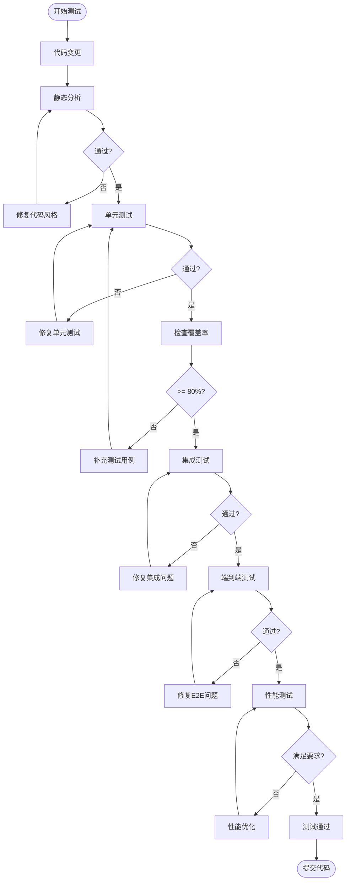
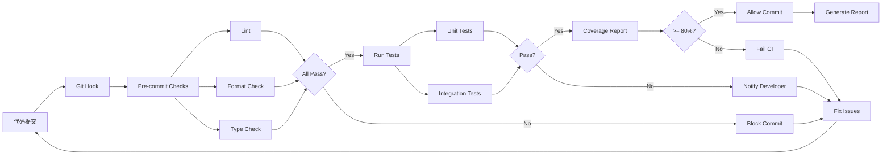
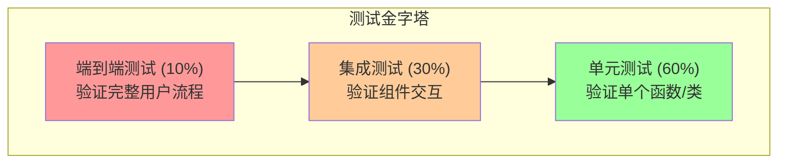

# 加班记录分析系统 - 测试与验证策略文档

## 1. 文档信息

| 项目 | 内容 |
|------|------|
| 文档名称 | 测试与验证策略文档 |
| 版本 | 1.0 |
| 创建日期 | 2026-04-04 |
| 状态 | 初稿 |

---

## 2. 测试策略概述

### 2.1 测试目标

1. **功能正确性**：确保解析逻辑准确处理各种输入格式
2. **数据完整性**：确保数据存储和检索的一致性
3. **错误处理**：确保系统优雅处理异常情况
4. **性能达标**：确保系统满足性能需求
5. **可维护性**：确保代码易于维护和扩展

### 2.2 测试原则

1. **测试驱动开发 (TDD)**：先写测试，再写实现
2. **自动化优先**：所有测试自动化执行
3. **覆盖率要求**：核心代码覆盖率 >= 80%
4. **分层测试**：单元测试、集成测试、端到端测试分层进行

---

## 3. 测试流程图

### 3.1 整体测试流程



### 3.2 持续集成测试流程



---

## 4. 测试金字塔



---

## 5. 单元测试策略

### 5.1 单元测试覆盖范围

| 模块 | 测试重点 | 目标覆盖率 |
|------|----------|-----------|
| parsers/date_parser.py | 日期格式识别、日期范围解析 | 90% |
| parsers/type_parser.py | 记录类型识别、置信度计算 | 90% |
| parsers/hours_parser.py | 时长提取、时间范围计算 | 90% |
| parsers/validator.py | 数据验证逻辑 | 85% |
| services/import_service.py | 导入流程、错误处理 | 80% |
| repositories/* | CRUD操作、查询逻辑 | 85% |

### 5.2 单元测试示例

```python
# tests/unit/test_parsers/test_date_parser.py

import pytest
from datetime import date
from ot_calculation.parsers.date_parser import DateParser, DateParseResult


class TestDateParser:
    """日期解析器测试"""
    
    @pytest.fixture
    def parser(self):
        return DateParser()
    
    @pytest.mark.parametrize("input_text,expected_date", [
        ("2025.08.15，晚上加班", date(2025, 8, 15)),
        ("2025.8.18，请假半天", date(2025, 8, 18)),
        ("2025-09-10，加班3小时", date(2025, 9, 10)),
        ("2025/10/25，调休一天", date(2025, 10, 25)),
    ])
    def test_parse_single_date(self, parser, input_text, expected_date):
        """测试单日期解析"""
        result = parser.parse(input_text)
        
        assert result.success is True
        assert result.data["start"] == expected_date
        assert result.data["end"] == expected_date
    
    @pytest.mark.parametrize("input_text,expected_start,expected_end", [
        ("2025.10.27-29，请假三天", date(2025, 10, 27), date(2025, 10, 29)),
        ("2025.12.29-31，调休三天", date(2025, 12, 29), date(2025, 12, 31)),
    ])
    def test_parse_date_range(self, parser, input_text, expected_start, expected_end):
        """测试日期范围解析"""
        result = parser.parse(input_text)
        
        assert result.success is True
        assert result.data["start"] == expected_start
        assert result.data["end"] == expected_end
    
    @pytest.mark.parametrize("input_text", [
        "无效日期格式",
        "2025.13.01，无效月份",
        "2025.02.30，无效日期",
        "",
    ])
    def test_parse_invalid_date(self, parser, input_text):
        """测试无效日期处理"""
        result = parser.parse(input_text)
        
        assert result.success is False
        assert result.error_message is not None
```

```python
# tests/unit/test_parsers/test_type_parser.py

import pytest
from ot_calculation.parsers.type_parser import TypeParser
from ot_calculation.core.enums import RecordType


class TestTypeParser:
    """类型识别器测试"""
    
    @pytest.fixture
    def parser(self):
        return TypeParser()
    
    @pytest.mark.parametrize("input_text,expected_type", [
        ("晚上3.5小时", RecordType.OVERTIME),
        ("早7到晚10共15小时", RecordType.OVERTIME),
        ("加班2小时", RecordType.OVERTIME),
        ("请假半天", RecordType.LEAVE),
        ("请假三天", RecordType.LEAVE),
        ("事假一天", RecordType.LEAVE),
        ("调休三天", RecordType.COMP_OFF),
        ("补休半天", RecordType.COMP_OFF),
    ])
    def test_classify_type(self, parser, input_text, expected_type):
        """测试类型识别"""
        result = parser.parse(input_text)
        
        assert result.success is True
        assert result.data == expected_type
        assert result.confidence >= 0.7
    
    def test_unknown_type(self, parser):
        """测试未知类型处理"""
        result = parser.parse("一些无关的文本")
        
        assert result.data == RecordType.UNKNOWN
        assert result.confidence < 0.7
```

```python
# tests/unit/test_parsers/test_hours_parser.py

import pytest
from ot_calculation.parsers.hours_parser import HoursParser
from ot_calculation.core.enums import RecordType


class TestHoursParser:
    """时长解析器测试"""
    
    @pytest.fixture
    def parser(self):
        return HoursParser()
    
    @pytest.mark.parametrize("input_text,expected_hours", [
        ("晚上3.5小时", 3.5),
        ("晚上4.5小时", 4.5),
        ("共15小时", 15.0),
        ("2.5小时", 2.5),
    ])
    def test_parse_overtime_hours(self, parser, input_text, expected_hours):
        """测试加班时长解析"""
        result = parser.parse(input_text, RecordType.OVERTIME)
        
        assert result.success is True
        assert result.data == expected_hours
    
    @pytest.mark.parametrize("input_text,expected_hours", [
        ("请假半天", -4.0),
        ("请假一天", -8.0),
        ("请假三天", -24.0),
        ("事假半天", -4.0),
    ])
    def test_parse_leave_hours(self, parser, input_text, expected_hours):
        """测试请假时长解析"""
        result = parser.parse(input_text, RecordType.LEAVE)
        
        assert result.success is True
        assert result.data == expected_hours
    
    def test_parse_time_range(self, parser):
        """测试时间范围计算"""
        result = parser.parse("早7到晚10共15小时", RecordType.OVERTIME)
        
        assert result.success is True
        assert result.data == 15.0
```

### 5.3 测试固件 (Fixtures)

```python
# tests/conftest.py

import pytest
from sqlalchemy import create_engine
from sqlalchemy.orm import sessionmaker, Session
from ot_calculation.core.models import Base, Employee, OTRecord


@pytest.fixture(scope="session")
def engine():
    """创建测试数据库引擎"""
    engine = create_engine("sqlite:///:memory:")
    Base.metadata.create_all(engine)
    yield engine
    engine.dispose()


@pytest.fixture
def db_session(engine) -> Session:
    """创建测试数据库会话"""
    connection = engine.connect()
    transaction = connection.begin()
    session = sessionmaker(bind=connection)()
    
    yield session
    
    session.close()
    transaction.rollback()
    connection.close()


@pytest.fixture
def sample_employee(db_session):
    """创建测试员工"""
    employee = Employee(
        employee_code="E001",
        name="张三",
        department="技术部"
    )
    db_session.add(employee)
    db_session.commit()
    return employee


@pytest.fixture
def sample_records(db_session, sample_employee):
    """创建测试记录"""
    records = [
        OTRecord(
            employee_id=sample_employee.id,
            date_start=date(2025, 9, 10),
            date_end=date(2025, 9, 10),
            record_type="overtime",
            hours=3.5,
            description="晚上加班",
            raw_text="2025.09.10，晚上3.5小时"
        ),
        OTRecord(
            employee_id=sample_employee.id,
            date_start=date(2025, 9, 18),
            date_end=date(2025, 9, 18),
            record_type="overtime",
            hours=4.5,
            description="晚上加班",
            raw_text="2025.9.18，晚上4.5小时"
        ),
    ]
    db_session.add_all(records)
    db_session.commit()
    return records
```

---

## 6. 集成测试策略

### 6.1 集成测试范围

| 测试场景 | 测试内容 | 测试数据 |
|----------|----------|----------|
| 完整导入流程 | 文件读取 -> 解析 -> 存储 | 真实Markdown文件 |
| 批量导入 | 多文件处理、事务一致性 | 目录包含多个文件 |
| 查询功能 | 各种查询条件的组合 | 预置测试数据 |
| 统计功能 | 统计计算准确性 | 大量测试数据 |

### 6.2 集成测试示例

```python
# tests/integration/test_import_flow.py

import pytest
from pathlib import Path
from datetime import date

from ot_calculation.services.import_service import ImportService
from ot_calculation.repositories.record_repository import RecordRepository


class TestImportFlow:
    """导入流程集成测试"""
    
    @pytest.fixture
    def sample_md_file(self, tmp_path):
        """创建测试Markdown文件"""
        file_path = tmp_path / "test_records.md"
        content = """# 测试数据（注意：不包含"累计X小时"，因为该值不参与系统计算）
2025.09.10，晚上3.5小时
2025.9.18，晚上4.5小时
2025.10.25，早7到晚10共15小时
2025.10.27-29，请假三天，减24小时
"""
        # ⚠️ 注意：测试数据不包含"累计X小时"，因为该值不参与系统计算
        # 系统按《劳动法》规则独立计算各类加班余额
        file_path.write_text(content, encoding="utf-8")
        return file_path
    
    def test_import_single_file(self, db_session, sample_employee, sample_md_file):
        """测试单文件导入"""
        service = ImportService(db_session)
        
        result = service.import_file(sample_md_file, sample_employee.id)
        
        assert result.success_count == 4
        assert result.error_count == 0
        
        # 验证数据库记录
        repo = RecordRepository(db_session)
        records = repo.find_by_employee(sample_employee.id)
        
        assert len(records) == 4
        
        # 验证具体记录
        overtime_records = [r for r in records if r.record_type == "overtime"]
        assert len(overtime_records) == 3
        
        leave_records = [r for r in records if r.record_type == "leave"]
        assert len(leave_records) == 1
        assert leave_records[0].hours == -24.0
    
    def test_import_with_invalid_lines(self, db_session, sample_employee, tmp_path):
        """测试包含无效行的文件导入"""
        file_path = tmp_path / "mixed_records.md"
        content = """2025.09.10，晚上3.5小时
无效的行格式
2025.09.11，请假半天
"""
        file_path.write_text(content, encoding="utf-8")
        
        service = ImportService(db_session)
        result = service.import_file(file_path, sample_employee.id)
        
        assert result.success_count == 2
        assert result.error_count == 1
```

---

## 7. 端到端测试策略

### 7.1 E2E测试场景

| 场景 | 描述 | 预期结果 |
|------|------|----------|
| CLI导入命令 | 执行导入命令并验证输出 | 显示正确统计信息 |
| CLI查询命令 | 执行查询命令并验证输出 | 显示正确查询结果 |
| 完整工作流 | 导入 -> 查询 -> 统计 | 数据一致性 |

### 7.2 E2E测试示例

```python
# tests/e2e/test_cli_commands.py

import subprocess
import pytest
from pathlib import Path


class TestCLICommands:
    """CLI命令端到端测试"""
    
    @pytest.fixture
    def sample_file(self, tmp_path):
        """创建测试文件"""
        file_path = tmp_path / "records.md"
        file_path.write_text("2025.09.10，晚上3.5小时\n")
        return file_path
    
    def test_import_command(self, sample_file):
        """测试导入命令"""
        result = subprocess.run(
            ["otcalc", "import", "file", "--file", str(sample_file), "--employee", "E001"],
            capture_output=True,
            text=True
        )
        
        assert result.returncode == 0
        assert "成功" in result.stdout
    
    def test_query_command(self):
        """测试查询命令"""
        result = subprocess.run(
            ["otcalc", "query", "--employee", "E001"],
            capture_output=True,
            text=True
        )
        
        assert result.returncode == 0
```

---

## 8. 测试用例矩阵

### 8.1 日期解析测试矩阵

| 用例ID | 输入 | 预期结果 | 优先级 |
|--------|------|----------|--------|
| DATE-001 | 2025.08.15 | 2025-08-15 | P0 |
| DATE-002 | 2025.8.18 | 2025-08-18 | P0 |
| DATE-003 | 2025-09-10 | 2025-09-10 | P0 |
| DATE-004 | 2025/10/25 | 2025-10-25 | P1 |
| DATE-005 | 2025年8月15日 | 2025-08-15 | P1 |
| DATE-006 | 2025.10.27-29 | 2025-10-27 至 2025-10-29 | P0 |
| DATE-007 | 2025.12.29-31 | 2025-12-29 至 2025-12-31 | P0 |
| DATE-008 | 2025.13.01 | 错误：无效月份 | P1 |
| DATE-009 | 2025.02.30 | 错误：无效日期 | P1 |
| DATE-010 | 无效文本 | 错误：无法解析 | P1 |

### 8.2 类型识别测试矩阵

| 用例ID | 输入 | 预期类型 | 置信度 | 优先级 |
|--------|------|----------|--------|--------|
| TYPE-001 | 晚上3.5小时 | OVERTIME | >=0.8 | P0 |
| TYPE-002 | 早7到晚10共15小时 | OVERTIME | >=0.8 | P0 |
| TYPE-003 | 加班2小时 | OVERTIME | >=0.9 | P0 |
| TYPE-004 | 请假半天 | LEAVE | >=0.9 | P0 |
| TYPE-005 | 请假三天 | LEAVE | >=0.9 | P0 |
| TYPE-006 | 事假一天 | LEAVE | >=0.8 | P0 |
| TYPE-007 | 调休三天 | COMP_OFF | >=0.9 | P0 |
| TYPE-008 | 补休半天 | COMP_OFF | >=0.9 | P0 |
| TYPE-009 | ~~累计48.5小时~~ ➜ **已废弃** | ~~BALANCE~~ | ~~>=0.7~~ | ~~P1~~ |
| TYPE-010 | 无关文本 | UNKNOWN | <0.7 | P1 |

> **重要说明**：TYPE-009 已废弃。系统中"累计X小时"仅作为文本提取展示，不进行类型识别，也不参与任何计算。系统按《劳动法》规则独立计算各类加班余额。

### 8.3 时长解析测试矩阵

| 用例ID | 输入 | 类型 | 预期时长 | 优先级 |
|--------|------|------|----------|--------|
| HOUR-001 | 晚上3.5小时 | OVERTIME | 3.5 | P0 |
| HOUR-002 | 晚上4.5小时 | OVERTIME | 4.5 | P0 |
| HOUR-003 | 早7到晚10共15小时 | OVERTIME | 15.0 | P0 |
| HOUR-004 | 共15小时 | OVERTIME | 15.0 | P0 |
| HOUR-005 | 请假半天 | LEAVE | -4.0 | P0 |
| HOUR-006 | 请假一天 | LEAVE | -8.0 | P0 |
| HOUR-007 | 请假三天 | LEAVE | -24.0 | P0 |
| HOUR-008 | 调休三天 | COMP_OFF | -24.0 | P0 |
| HOUR-009 | 减24小时 | ADJUSTMENT | -24.0 | P0 |
| HOUR-010 | 加8小时 | ADJUSTMENT | 8.0 | P0 |

### 8.4 完整记录测试矩阵

| 用例ID | 原始文本 | 预期日期 | 预期类型 | 预期时长 | 优先级 |
|--------|----------|----------|----------|----------|--------|
| REC-001 | 2025.08.15，下午请假回老家，请假半天。 | 2025-08-15 | LEAVE | -4.0 | P0 |
| REC-002 | 2025.09.10，晚上3.5小时 | 2025-09-10 | OVERTIME | 3.5 | P0 |
| REC-003 | 2025.9.18，晚上4.5小时 | 2025-09-18 | OVERTIME | 4.5 | P0 |
| REC-004 | 2025.10.25，早7到晚10共15小时 | 2025-10-25 | OVERTIME | 15.0 | P0 |
| REC-005 | 2025.10.27-29，请假三天，减24小时 | 2025-10-27 至 2025-10-29 | LEAVE | -24.0 | P0 |
| REC-006 | 2025.12.29-31，调休三天 | 2025-12-29 至 2025-12-31 | COMP_OFF | -24.0 | P0 |

> **注意**：测试用例中的"累计X小时"文本已移除，因为该值不参与系统计算。系统按《劳动法》规则独立计算余额。

---

## 9. 性能测试策略

### 9.1 性能测试目标

| 指标 | 目标值 | 测试方法 |
|------|--------|----------|
| 单文件解析 | < 1秒/1000行 | pytest-benchmark |
| 批量导入 | > 100条/秒 | 计时测试 |
| 查询响应 | < 500ms | 压力测试 |
| 数据库写入 | > 1000条/秒 | 批量插入测试 |

### 9.2 性能测试示例

```python
# tests/performance/test_parsing_performance.py

import pytest
from ot_calculation.parsers.pipeline import ParserPipeline


class TestParsingPerformance:
    """解析性能测试"""
    
    @pytest.fixture
    def parser(self):
        return ParserPipeline()
    
    @pytest.fixture
    def sample_lines(self):
        """生成测试数据"""
        return [
            f"2025.{month:02d}.{day:02d}，晚上{hours}小时"
            for month in range(1, 13)
            for day in range(1, 29)
            for hours in [2.5, 3.0, 3.5, 4.0]
        ]
    
    def test_parse_1000_lines(self, benchmark, parser, sample_lines):
        """测试1000行解析性能"""
        lines = sample_lines[:1000]
        
        def parse_all():
            for line in lines:
                parser.parse_line(line)
        
        result = benchmark(parse_all)
        
        # 断言：平均每条记录解析时间 < 1ms
        assert result.stats.mean < 1.0
```

---

## 10. 测试数据管理

### 10.1 测试数据目录结构

```
tests/
├── fixtures/
│   ├── sample_records.md       # 示例记录文件
│   ├── invalid_records.md      # 无效记录文件（用于错误处理测试）
│   ├── edge_cases.md           # 边界情况测试数据
│   └── large_file.md           # 大文件性能测试数据
└── data/
    └── init_data.sql           # 数据库初始化数据
```

### 10.2 示例测试数据文件

```markdown
<!-- tests/fixtures/sample_records.md -->
# 测试加班记录
# 注意：系统中不包含"累计X小时"的校验，因为员工记录未区分加班类型
# 系统按《劳动法》规则独立计算各类加班余额

2025.08.15，下午请假回老家，请假半天。
2025.09.10，晚上3.5小时
2025.9.18，晚上4.5小时
2025.10.25，早7到晚10共15小时
2025.10.27-29，请假三天，减24小时
2025.12.29-31，调休三天
```

---

## 11. 测试报告

### 11.1 覆盖率报告

```bash
# 生成HTML覆盖率报告
pytest --cov=src --cov-report=html

# 生成XML覆盖率报告（用于CI集成）
pytest --cov=src --cov-report=xml
```

### 11.2 测试报告内容

| 报告项 | 说明 |
|--------|------|
| 测试总数 | 执行的测试用例总数 |
| 通过数 | 通过的测试数 |
| 失败数 | 失败的测试数 |
| 跳过数 | 跳过的测试数 |
| 代码覆盖率 | 行覆盖率、分支覆盖率 |
| 执行时间 | 总执行时间、平均每条测试时间 |

---

## 12. 持续集成配置

### 12.1 GitHub Actions 配置

```yaml
# .github/workflows/test.yml

name: Tests

on:
  push:
    branches: [main, develop]
  pull_request:
    branches: [main]

jobs:
  test:
    runs-on: ubuntu-latest
    strategy:
      matrix:
        python-version: ["3.9", "3.10", "3.11"]

    steps:
      - uses: actions/checkout@v3

      - name: Set up Python
        uses: actions/setup-python@v4
        with:
          python-version: ${{ matrix.python-version }}

      - name: Install dependencies
        run: |
          pip install -e ".[dev]"

      - name: Run linting
        run: |
          ruff check src tests
          mypy src

      - name: Run tests
        run: |
          pytest --cov=src --cov-report=xml

      - name: Upload coverage
        uses: codecov/codecov-action@v3
        with:
          file: ./coverage.xml
          fail_ci_if_error: true
```

---

## 13. 测试检查清单

### 13.1 提交前检查清单

- [ ] 所有单元测试通过
- [ ] 代码覆盖率 >= 80%
- [ ] 静态分析无错误
- [ ] 类型检查通过
- [ ] 集成测试通过
- [ ] 文档已更新

### 13.2 发布前检查清单

- [ ] 所有测试通过
- [ ] 性能测试达标
- [ ] 端到端测试通过
- [ ] 测试报告已生成
- [ ] 已知问题已记录
