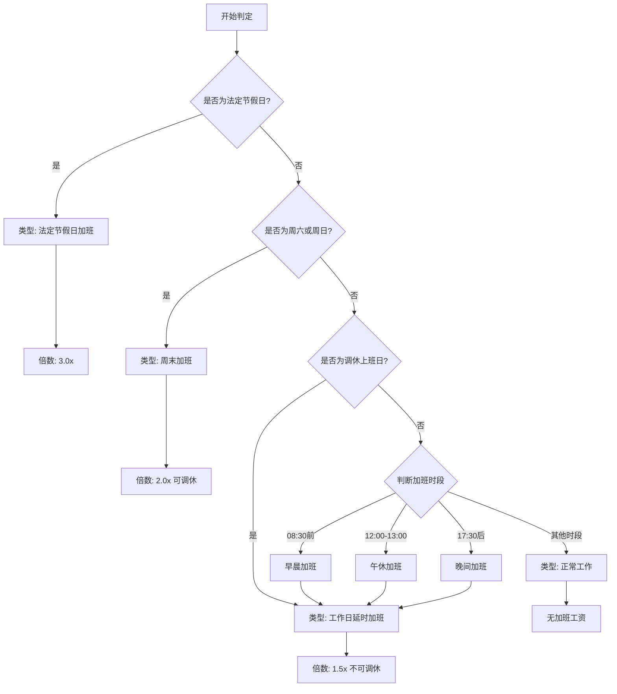
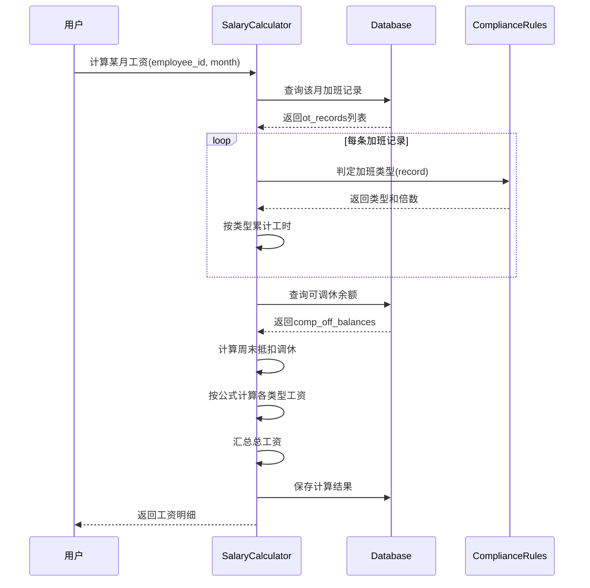
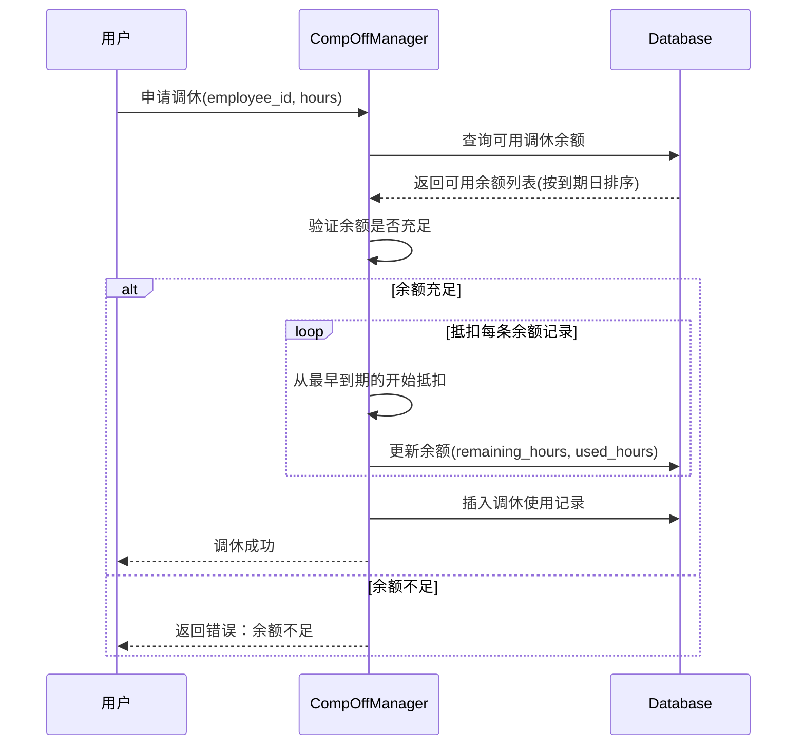

# 劳动法合规规则文档

## 1. 文档信息

| 项目 | 内容 |
|------|------|
| 文档名称 | 劳动法合规规则文档 |
| 版本 | 1.0 |
| 创建日期 | 2026-04-04 |
| 状态 | 初稿 |
| 适用范围 | 中国境内企业加班管理 |

---

## 2. 法律法规依据

### 2.1 核心法律条文

#### 《中华人民共和国劳动法》第四十四条

有下列情形之一的，用人单位应当按照下列标准支付高于劳动者正常工作时间工资的工资报酬：

| 情形 | 倍数 | 调休替代 |
|------|------|----------|
| 安排劳动者延长工作时间的 | 不低于工资的 **150%** | ❌ **不可**调休 |
| 休息日安排劳动者工作又不能安排补休的 | 不低于工资的 **200%** | ✅ **可以**调休 |
| 法定休假日安排劳动者工作的 | 不低于工资的 **300%** | ❌ **不可**调休 |

#### 《工资支付暂行规定》第十三条

用人单位在劳动者完成劳动定额或规定的工作任务后，根据实际需要安排劳动者在法定标准工作时间以外工作的，应按以下标准支付工资：

1. **工作日延时**：按照不低于劳动合同规定的劳动者本人小时工资标准的 **150%** 支付
2. **休息日**：按照不低于劳动合同规定的劳动者本人日或小时工资标准的 **200%** 支付
3. **法定节假日**：按照不低于劳动合同规定的劳动者本人日或小时工资标准的 **300%** 支付

---

## 3. 加班类型判定规则

### 3.1 类型判定流程图



### 3.2 日期类型判定规则

#### 3.2.1 法定节假日

**定义**：由国家统一规定的全体公民放假的节日

| 节日 | 放假天数 | 备注 |
|------|----------|------|
| 元旦 | 1天 | 1月1日 |
| 春节 | 3天 | 农历正月初一、初二、初三 |
| 清明节 | 1天 | 农历清明当日 |
| 劳动节 | 1天 | 5月1日 |
| 端午节 | 1天 | 农历端午当日 |
| 中秋节 | 1天 | 农历中秋当日 |
| 国庆节 | 3天 | 10月1日、2日、3日 |

**判定规则**：
```
IF date IN national_holidays_list:
    overtime_type = 'holiday'
    multiplier = 3.0
    can_comp_off = FALSE
```

#### 3.2.2 周末（休息日）

**定义**：每周的周六和周日

**判定规则**：
```
IF date.weekday() IN [5, 6] AND date NOT IN national_holidays_list:
    overtime_type = 'weekend'
    multiplier = 2.0
    can_comp_off = TRUE
    comp_eligible_hours = actual_hours
```

#### 3.2.3 工作日延时

**工作时间定义**：
- 工作日：周一到周五
- 上午：08:30 - 12:00（3.5小时）
- 下午：13:00 - 17:30（4.5小时）
- 标准工作时长：8小时/天

**工作日延时加班定义**：
以下时段的工作属于工作日延时加班：
1. **早晨加班**：08:30 之前
2. **午休加班**：12:00 - 13:00
3. **晚间加班**：17:30 之后

**判定规则**：
```
IF date.weekday() IN [0, 1, 2, 3, 4] 
   AND date NOT IN national_holidays_list
   AND date NOT IN adjusted_workdays:
    
    # 判断加班时段
    IF overtime_end_time <= 08:30:
        # 早晨加班（如早7点开始）
        overtime_type = 'weekday_morning'
        hours = 08:30 - overtime_start_time
    
    ELSE IF 12:00 <= overtime_start_time <= 13:00:
        # 午休加班
        overtime_type = 'weekday_lunch'
        hours = MIN(overtime_end_time, 13:00) - overtime_start_time
    
    ELSE IF overtime_start_time >= 17:30:
        # 晚间加班
        overtime_type = 'weekday_evening'
        hours = overtime_end_time - MAX(overtime_start_time, 17:30)
    
    multiplier = 1.5
    can_comp_off = FALSE
    comp_eligible_hours = 0
```

**示例**：
| 描述 | 解析 | 加班时长计算 |
|------|------|--------------|
| 早7点到岗 | 早晨加班 | 08:30 - 07:00 = 1.5小时 |
| 中午12:30-13:00加班 | 午休加班 | 0.5小时 |
| 晚17:30-20:00加班 | 晚间加班 | 2.5小时 |
| 早7到晚20点 | 分段计算 | 早晨1.5h + 晚间2.5h = 4小时 |

#### 3.2.4 调休上班日

**定义**：因节假日调休安排，原本为周末但被安排为工作的日期

**特殊处理**：
- 调休上班日虽然为周六/周日，但按**工作日延时**规则处理
- 工作时间仍按 08:30-12:00, 13:00-17:30 计算
- 需要单独维护调休上班日列表

**判定规则**：
```
IF date IN adjusted_workdays:
    # 按工作日处理，使用相同的工作时间定义
    IF overtime_end_time <= 08:30:
        overtime_type = 'weekday_morning'
        hours = 08:30 - overtime_start_time
    ELSE IF 12:00 <= overtime_start_time <= 13:00:
        overtime_type = 'weekday_lunch'
        hours = MIN(overtime_end_time, 13:00) - overtime_start_time
    ELSE IF overtime_start_time >= 17:30:
        overtime_type = 'weekday_evening'
        hours = overtime_end_time - MAX(overtime_start_time, 17:30)
    
    multiplier = 1.5
    can_comp_off = FALSE
```

---

## 4. 工资计算规则

### 4.1 时薪基数计算

#### 4.1.1 标准工时制

```
月计薪天数 = 21.75天
日工资 = 月工资收入 ÷ 21.75
小时工资 = 日工资 ÷ 8
```

#### 4.1.2 时薪基数配置

```sql
-- 员工时薪配置表
CREATE TABLE employee_salary_config (
    employee_id INTEGER PRIMARY KEY,
    monthly_salary REAL NOT NULL,      -- 月基本工资
    hourly_rate REAL GENERATED ALWAYS AS (monthly_salary / 21.75 / 8) STORED,
    effective_date DATE NOT NULL,
    created_at DATETIME DEFAULT CURRENT_TIMESTAMP
);
```

### 4.2 加班工资计算公式

#### 4.2.1 工作日延时加班

```
工作日延时工资 = 小时工资 × 1.5 × 加班小时数
```

#### 4.2.2 周末加班

```
周末加班工资 = 小时工资 × 2.0 × (周末加班小时数 - 已调休小时数)
```

#### 4.2.3 法定节假日加班

```
法定节假日工资 = 小时工资 × 3.0 × 加班小时数
```

#### 4.2.4 月度工资汇总

```
月度加班总工资 = 工作日延时工资 + 周末加班工资 + 法定节假日工资
```

### 4.3 工资计算流程图



---

## 5. 调休管理规则

### 5.1 调休获取规则

**只有周末加班可以产生调休时长**：

```
IF overtime_type == 'weekend':
    comp_off_hours = actual_overtime_hours
    expiry_date = acquired_date + 6个月
```

**工作日延时和法定节假日加班不产生调休**：

```
IF overtime_type IN ['weekday', 'holiday']:
    comp_off_hours = 0
```

### 5.2 调休使用规则

#### 5.2.1 抵扣顺序

采用 **FIFO（先进先出）** 原则：

```python
def deduct_comp_off(employee_id, deduct_hours):
    """
    抵扣调休时长，优先使用最早到期的
    """
    balances = query("""
        SELECT id, remaining_hours, expiry_date
        FROM comp_off_balances
        WHERE employee_id = ?
          AND status = 'active'
          AND remaining_hours > 0
          AND expiry_date >= DATE('now')
        ORDER BY acquired_date ASC, expiry_date ASC
    """, [employee_id])
    
    remaining_to_deduct = deduct_hours
    
    for balance in balances:
        if remaining_to_deduct <= 0:
            break
            
        deduct_from_this = min(balance.remaining_hours, remaining_to_deduct)
        balance.remaining_hours -= deduct_from_this
        balance.used_hours += deduct_from_this
        remaining_to_deduct -= deduct_from_this
        
        if balance.remaining_hours == 0:
            balance.status = 'used'
    
    if remaining_to_deduct > 0:
        raise InsufficientCompOffError(f"调休余额不足，还缺 {remaining_to_deduct} 小时")
```

#### 5.2.2 调休使用时序图



### 5.3 调休有效期管理

#### 5.3.1 到期处理

```sql
-- 每天检查并标记过期调休
UPDATE comp_off_balances
SET status = 'expired'
WHERE status = 'active'
  AND expiry_date < DATE('now')
  AND remaining_hours > 0;
```

#### 5.3.2 到期提醒

```sql
-- 查询即将过期的调休（30天内到期）
SELECT 
    employee_id,
    SUM(remaining_hours) as expiring_hours,
    MIN(expiry_date) as earliest_expiry
FROM comp_off_balances
WHERE status = 'active'
  AND expiry_date BETWEEN DATE('now') AND DATE('now', '+30 days')
GROUP BY employee_id;
```

---

## 6. 合规检查清单

### 6.1 系统实现检查项

| 检查项 | 要求 | 实现方式 |
|--------|------|----------|
| 加班类型准确判定 | 必须正确识别工作日/周末/法定节假日 | 日期类型查询 + 法定节假日表 |
| 工资倍数正确 | 1.5x/2.0x/3.0x | 配置化倍数表 |
| 调休来源限制 | 仅周末加班可转调休 | 入库时判断overtime_type |
| 调休抵扣顺序 | FIFO原则 | 查询时按acquired_date排序 |
| 调休有效期 | 6个月有效期 | 自动计算expiry_date |
| 到期自动失效 | 过期调休自动标记 | 定时任务或触发器 |
| 计算过程可追溯 | 保留计算日志 | 详细的calculation_notes |

### 6.2 数据一致性检查

```sql
-- 检查1：周末加班的comp_eligible_hours应等于hours
SELECT *
FROM ot_records
WHERE overtime_type = 'weekend'
  AND comp_eligible_hours != hours;

-- 检查2：工作日和法定节假日不应有可调休时长
SELECT *
FROM ot_records
WHERE overtime_type IN ('weekday', 'holiday')
  AND comp_eligible_hours > 0;

-- 检查3：调休余额总和应等于各条记录剩余之和
SELECT 
    e.id,
    e.name,
    v.available_comp_off_hours as view_balance,
    COALESCE(SUM(c.remaining_hours), 0) as actual_balance
FROM employees e
LEFT JOIN v_employee_comp_off_balance v ON e.id = v.employee_id
LEFT JOIN comp_off_balances c ON e.id = c.employee_id AND c.status = 'active'
GROUP BY e.id, e.name, v.available_comp_off_balance
HAVING view_balance != actual_balance;
```

---

## 7. 配置管理

### 7.1 法定节假日配置表

```sql
CREATE TABLE national_holidays (
    id INTEGER PRIMARY KEY AUTOINCREMENT,
    holiday_date DATE NOT NULL UNIQUE,
    holiday_name VARCHAR(50) NOT NULL,
    year INTEGER NOT NULL,
    is_workday_adjusted BOOLEAN DEFAULT FALSE,
    created_at DATETIME DEFAULT CURRENT_TIMESTAMP
);

-- 示例数据
INSERT INTO national_holidays (holiday_date, holiday_name, year) VALUES
('2025-01-01', '元旦', 2025),
('2025-01-29', '春节', 2025),
('2025-01-30', '春节', 2025),
('2025-01-31', '春节', 2025),
('2025-04-04', '清明节', 2025),
('2025-05-01', '劳动节', 2025),
('2025-05-31', '端午节', 2025),
('2025-10-01', '国庆节', 2025),
('2025-10-02', '国庆节', 2025),
('2025-10-03', '国庆节', 2025);
```

> **数据维护方式**: 上述数据可通过系统的"法定节假日管理"功能从国务院通知文本自动导入。
> 详见 [法定节假日管理功能设计](../docs/12-holiday-management.md)。

### 7.2 调休上班日配置表

```sql
CREATE TABLE adjusted_workdays (
    id INTEGER PRIMARY KEY AUTOINCREMENT,
    work_date DATE NOT NULL UNIQUE,
    original_weekday INTEGER NOT NULL,  -- 原本是周几（5=周六，6=周日）
    adjusted_for VARCHAR(50),           -- 为哪个节日调休
    year INTEGER NOT NULL,
    created_at DATETIME DEFAULT CURRENT_TIMESTAMP
);

-- 示例数据
INSERT INTO adjusted_workdays (work_date, original_weekday, adjusted_for, year) VALUES
('2025-01-26', 6, '春节', 2025),  -- 周日调休上班
('2025-02-08', 5, '春节', 2025),  -- 周六调休上班
('2025-04-27', 6, '劳动节', 2025);
```

### 7.3 系统配置表

```sql
CREATE TABLE system_config (
    config_key VARCHAR(50) PRIMARY KEY,
    config_value TEXT NOT NULL,
    description TEXT,
    updated_at DATETIME DEFAULT CURRENT_TIMESTAMP
);

-- 合规相关配置
INSERT INTO system_config (config_key, config_value, description) VALUES
-- 调休管理配置
('comp_off_validity_months', '6', '调休有效期（月）'),
('comp_off_reminder_days', '30', '调休到期提前提醒天数'),

-- 工作时间配置（本公司：8:30-12:00, 13:00-17:30）
('workday_morning_start', '08:30', '工作日上午开始时间'),
('workday_morning_end', '12:00', '工作日上午结束时间'),
('workday_afternoon_start', '13:00', '工作日下午开始时间'),
('workday_afternoon_end', '17:30', '工作日下午结束时间'),
('standard_work_hours', '8', '标准日工作时长（小时）'),
('lunch_break_start', '12:00', '午休开始时间'),
('lunch_break_end', '13:00', '午休结束时间'),

-- 加班工资倍数配置
('weekend_multiplier', '2.0', '周末加班工资倍数'),
('weekday_multiplier', '1.5', '工作日延时工资倍数'),
('holiday_multiplier', '3.0', '法定节假日工资倍数');
```

---

## 8. 报表与查询

### 8.1 合规统计报表

```sql
-- 月度合规统计报表
CREATE VIEW v_monthly_compliance_report AS
SELECT 
    sc.month,
    COUNT(DISTINCT sc.employee_id) as employee_count,
    SUM(sc.weekday_hours) as total_weekday_hours,
    SUM(sc.weekday_pay) as total_weekday_pay,
    SUM(sc.weekend_hours) as total_weekend_hours,
    SUM(sc.weekend_pay) as total_weekend_pay,
    SUM(sc.holiday_hours) as total_holiday_hours,
    SUM(sc.holiday_pay) as total_holiday_pay,
    SUM(sc.total_pay) as total_overtime_pay,
    -- 调休统计
    SUM(CASE WHEN cob.status = 'active' THEN cob.remaining_hours ELSE 0 END) as total_available_comp_off
FROM salary_calculations sc
LEFT JOIN comp_off_balances cob ON sc.employee_id = cob.employee_id
GROUP BY sc.month;
```

### 8.2 个人合规明细查询

```sql
-- 查询某员工某月的合规明细
SELECT 
    r.date_start,
    r.overtime_type,
    r.hours,
    r.comp_eligible_hours,
    CASE r.overtime_type
        WHEN 'weekday' THEN r.hours * 1.5 * s.hourly_rate
        WHEN 'weekend' THEN r.hours * 2.0 * s.hourly_rate
        WHEN 'holiday' THEN r.hours * 3.0 * s.hourly_rate
    END as estimated_pay,
    CASE r.overtime_type
        WHEN 'weekend' THEN '可调休'
        ELSE '不可调休，应支付工资'
    END as compliance_note
FROM ot_records r
JOIN employees e ON r.employee_id = e.id
LEFT JOIN employee_salary_config s ON e.id = s.employee_id
WHERE e.employee_code = 'E001'
  AND strftime('%Y-%m', r.date_start) = '2025-10'
  AND r.record_type = 'overtime'
ORDER BY r.date_start;
```

---

## 9. 附录

### 9.1 术语表

| 术语 | 英文 | 定义 |
|------|------|------|
| 标准工时 | Standard Working Hours | 每日8小时，每周40小时 |
| 延时加班 | Extended Work | 工作日超过8小时或18:00后的工作 |
| 休息日 | Rest Day | 周六、周日 |
| 法定节假日 | Statutory Holiday | 国家规定的全民放假节日 |
| 调休 | Compensatory Leave | 用加班时长抵扣休假 |
| 调休上班日 | Adjusted Workday | 原本为周末但安排上班的日期 |
| 计薪天数 | Payable Days | 21.75天/月 |

### 9.2 参考法规

1. 《中华人民共和国劳动法》（2018修正）
2. 《工资支付暂行规定》（劳部发〔1994〕489号）
3. 《国务院关于职工工作时间的规定》（国务院令第174号）
4. 《全国年节及纪念日放假办法》（国务院令第644号）

### 9.3 年度节假日安排数据源

- 国务院每年底发布的次年节假日安排通知
- 建议每年12月导入次年节假日数据
