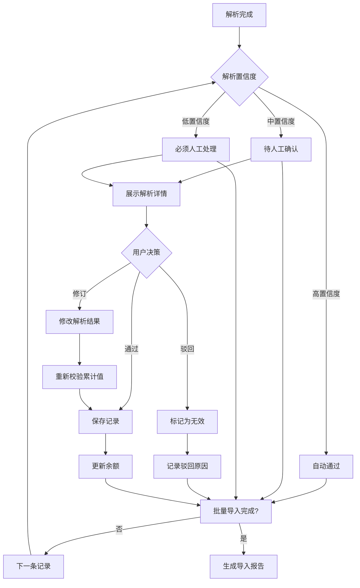

# MD记录解析例外情况分析报告

## 分析样本

- **xuchen.md**: 37条有效记录
- **lijunjie.md**: 35条有效记录  
- **mashuo.md**: 40条有效记录

---

## 一、日期格式例外

### 1.1 日期格式不一致

| 格式类型 | 示例 | 出现次数 | 处理策略 |
|----------|------|----------|----------|
| 完整格式 | 2025.08.15, 2025.9.18 | 80% | 标准解析 |
| 缺少年份 | 9.10, 1.21 | 5% | 继承上一条记录年份 |
| 范围日期 | 2025.10.27-29, 2026.2.13-14 | 10% | 展开为多条记录或标记为范围 |
| 年份错误 | 2025.2.24-26（应为2026） | 1% | 智能推断，基于上下文日期合理性 |

### 1.2 具体案例

```
# lijunjie.md 第1-2行 - 缺少年份
9.10，上午请假        → 应推断为 2025.9.10
9.10，晚上加班        → 同一天多条记录

# xuchen.md 第57行 - 年份错误
2025.2.24-26，调休3天  → 累计从20.5→-3.5，应为 2026.2.24-26

# mashuo.md 第61行 - 缺少年份
1.21，加班到19：30    → 上下文推断为 2026.1.21
```

---

## 二、时长描述例外

### 2.1 时长表达方式多样

| 类型 | 示例 | 提取难度 | 备注 |
|------|------|----------|------|
| 直接数字 | 晚上3.5小时 | ⭐ 简单 | 标准格式 |
| 半天/全天 | 请假半天、调休一天 | ⭐ 简单 | 半天=4h，全天=8h |
| 时间段 | 早7到晚10共15小时 | ⭐⭐ 中等 | 需计算时间差 |
| 时间段(无总数) | 加班到19:30 | ⭐⭐ 中等 | 需根据上班时间推算 |
| 隐含抵消 | 抵消了 | ⭐⭐⭐ 困难 | 需结合上下文 |
| 无时长 | 到岗 | ⭐⭐⭐ 困难 | 标记为特殊记录 |
| 多时段汇总 | 中午+晚上，5小时 | ⭐⭐ 中等 | 需解析加法表达式 |
| 简写时段 | 晚22白天，3小时 | ⭐⭐⭐ 困难 | 需理解简写规则 |

### 2.2 具体案例

```
# mashuo.md 第1行 - 只有结束时间
2025.06.05，到晚上11:45，累计4小时
→ 推断：18:00到23:45 = 5.75小时？但累计只加4小时
→ 可能扣除晚餐时间，需要人工确认

# mashuo.md 第61行 - 模糊描述
2026.1.21，加班到19：30，累计19小时
→ 18:00到19:30 = 1.5小时
→ 但累计从17→19，增加了2小时
→ 存在不一致

# lijunjie.md 第33行 - 无时长描述
2026.2.24，到岗
→ 无时长信息，可能仅为状态记录
→ 需要标记为"待确认"

# mashuo.md 第49行 - 简写格式
2025.12.21晚22白天，3小时
→ 解析：12月21日，晚上22点到白天？（不合理）
→ 可能是：晚22点加班到白天？
→ 或：晚上和白天共？
→ 标记为"需人工澄清"

# xuchen.md 第33行 - 日期范围请假
2025.10.27-29，请假三天，减24小时
→ 10月27日、28日、29日（周一到周三）
→ 工作日请假应扣减调休余额或年假
→ 系统判定：工作日请假，不可抵加班工资
```

---

## 三、记录类型例外

### 3.1 类型边界模糊

| 描述 | 表面类型 | 实际类型 | 合规处理 |
|------|----------|----------|----------|
| 午餐会1小时 | 加班? | 非工作性质 | 不计入加班（可能为福利/团建） |
| 海军中学晚上半天 | 加班? | 外派工作? | 需确认是否为公司业务 |
| 胶州加班3小时 | 加班 | 出差加班 | 同普通加班处理 |
| 学习奖励16小时 | 加班? | 奖励 | 非加班，不可调休 |
| 抵消了 | 抵消 | 调休使用 | 需关联前文 |

### 3.2 类型判定歧义案例

```
# xuchen.md & lijunjie.md & mashuo.md 都有
2025.08.21，海军中学晚上半天
→ 三人同一天同地点同描述
→ 可能是集体外出活动
→ 建议：标记为"集体活动"，不计入加班统计

# mashuo.md 第53行
2026.03.23，学习奖励16小时
→ 明显不是加班
→ 应分类为"奖励/补贴"
→ 不可用于调休抵扣

# xuchen.md 第23行, lijunjie.md 第21行, mashuo.md 第29行
2025.10.22，午餐会1小时
→ 三人在同一天都有1小时午餐会
→ 可能是公司组织的活动
→ 建议：不计入加班，或标记为"公司活动"
```

---

## 四、调休/抵消逻辑例外

### 4.1 调休描述多样

| 描述 | 类型 | 小时数 | 合规性 |
|------|------|--------|--------|
| 调休一天 | 调休使用 | -8h | 抵扣周末加班余额 |
| 调休半天 | 调休使用 | -4h | 抵扣周末加班余额 |
| 调休2小时 | 调休使用 | -2h | 抵扣周末加班余额 |
| 休息一天 | 调休使用?请假? | -8h | 需人工确认类型 |
| 请假三天 | 请假 | -24h | 可能扣年假或事假 |
| 抵消了 | 调休使用 | 变量 | 需匹配前文加班 |

### 4.2 调休逻辑复杂案例

```
# lijunjie.md 第1-5行 - 跨行抵消关系
9.10，上午请假                        [A: 请假4小时]
9.10，晚上加班                        [B: 晚上X小时]
抵消了                                [C: 抵消A和B?]

→ 可能的解读：
  方案1: 9.10上午请假4小时，晚上加班4小时，两者抵消
  方案2: 9.10晚上加班，用于抵消其他日期的请假
→ 建议：展示两种解读方案，由人工选择

# mashuo.md 第17-19行 - 同一天两条相反记录
2025.9.29，休息一天，累计15小时。   [减8小时]
2025.9.29，晚上3小时，累计18小时。   [加3小时]
→ 实际净变化: -5小时
→ 逻辑：白天休息（调休），晚上回来加班
→ 合规：周末调休抵扣 + 工作日延时加班

# xuchen.md 第57行 - 调休导致负余额
2025.2.24-26，调休3天共24小时，累计-3.5小时
→ 调休超过可用余额
→ 系统应：标记为"超调"，需要补扣或说明
```

---

## 五、关于"累计"声明值的重要说明

### 5.1 累计声明值的性质

⚠️ **重要声明**：员工记录文件中的"累计X小时"文本**仅供参考展示**，**不用于系统计算**。

**原因**：
1. 员工记录未区分加班类型（工作日延时/周末/法定假日），混为一谈进行累加
2. 不符合《劳动法》对不同加班类型差异化计算的规定
3. 可能包含非加班性质的记录（如"午餐会"、"学习奖励"等）

### 5.2 系统的处理方式

```
员工记录中的"累计"值：
├─ 提取并保存为"stated_balance"字段
├─ 仅用于参考展示
└─ ❌ 不参与任何系统计算

系统的独立计算逻辑：
├─ 根据日期自动判定加班类型（工作日/周末/法定假日）
├─ 按《劳动法》规则分别计算
│   ├─ 工作日延时加班 → 1.5倍工资，不可调休
│   ├─ 周末加班 → 2.0倍工资，可调休
│   └─ 法定假日加班 → 3.0倍工资，不可调休
└─ 调休余额仅从周末加班产生
```

### 5.3 原有累计值校验逻辑的废弃

~~原设计中考虑使用累计值进行校验的功能已全部废弃~~：
- ~~用累计值校验当前记录的小时数~~ ❌
- ~~用累计值发现年份错误~~ ❌
- ~~用累计值发现漏记或重复记录~~ ❌

**替代方案**：
- 日期错误通过上下文智能推断
- 记录完整性通过系统独立计算验证
- 重复检测基于日期+员工+类型唯一性约束

---

## 六、系统处理策略

### 6.1 逐行处理展示界面

```
┌─────────────────────────────────────────────────────────────────┐
│ 员工: xuchen.md                    行号: 33/61                   │
├─────────────────────────────────────────────────────────────────┤
│ 【原始文本】                                                      │
│ 2025.10.27-29，请假三天，减24小时，累计39.5小时                   │
├─────────────────────────────────────────────────────────────────┤
│ 【系统解析结果】                                                  │
│ ├─ 日期: 2025-10-27 至 2025-10-29                                │
│ ├─ 日期类型: 周一、周二、周三（工作日）                           │
│ ├─ 是否节假日: 否                                                │
│ ├─ 记录类型: 请假                                                │
│ ├─ 时长: -24小时（3天 × 8小时）                                  │
│ ├─ 累计校验: 63.5 - 24 = 39.5 ✓ 匹配                            │
│ ├─ 合规判定: 工作日请假，应从年假/事假扣除                        │
│ └─ ⚠️ 警告: 若使用调休抵扣，则违反劳动法                          │
├─────────────────────────────────────────────────────────────────┤
│ 【处理方案选择】                                                  │
│ ○ 通过 - 确认为工作日请假，不计入加班统计                        │
│ ○ 驳回 - 标记为待修正                                           │
│ ● 修订 - 修改为：调休三天（周末调休抵扣）                         │
│   └─ 修订后时长: -24小时（从周末调休余额扣除）                    │
├─────────────────────────────────────────────────────────────────┤
│ [上一条]  [保存并通过]  [保存并修订]  [驳回]  [下一条]            │
└─────────────────────────────────────────────────────────────────┘
```

### 6.2 审批状态流转



### 6.3 置信度评分规则

```python
confidence_score = 100

# 日期格式扣分
date_formats = {
    "YYYY.MM.DD": 0,      # 标准格式
    "M.DD": -10,          # 缺少年份
    "YYYY.M.DD": -5,      # 月份无前导零
    "范围日期": -15        # 需要展开处理
}

# 时长提取扣分
duration_confidence = {
    "明确数字": 0,        # "3.5小时"
    "半天/全天": -5,      # 需转换
    "时间段": -10,        # 需计算
    "模糊描述": -20,      # "抵消了"
    "无时长": -30         # "到岗"
}

# 累计校验扣分
if calculated != stated:
    confidence_score -= abs(calculated - stated) * 10

# 最终结果
def get_status(score):
    if score >= 90: return "AUTO_APPROVE"
    if score >= 70: return "REVIEW_SUGGESTED"
    return "MANUAL_REQUIRED"
```

---

## 七、特殊场景处理建议

### 7.1 必须人工确认的场景

1. **累计值不匹配且无法自动修正**
2. **日期解析歧义**（如2025.2.24应为2026）
3. **描述过于模糊**（如"晚22白天"）
4. **类型边界模糊**（如"午餐会"、"学习奖励"）
5. **负余额调休**（调休超过可用余额）

### 7.2 可自动处理但需标记的场景

1. **缺少年份** - 继承上一条年份
2. **日期范围** - 自动展开为多条
3. **标准调休** - 自动抵扣周末加班余额
4. **标准加班** - 自动判定类型（需法定节假日表）

---

## 八、待确认问题清单

针对这三份记录，以下情况需要与用户确认：

1. **海军中学活动**（3人同一天）是否为加班？
2. **午餐会**（3人同一天）是否计入加班？
3. **"抵消了"** 在lijunjie.md第5行的具体含义？
4. **"到岗"** 在lijunjie.md第51行是否有加班时长？
5. **"学习奖励"** 在lijunjie.md第53行如何处理？
6. **"晚22白天"** 在mashuo.md第49行的准确含义？
7. **2025.2.24** 是否应为2026.2.24？
8. **负余额**（-3.5小时）如何处理？
