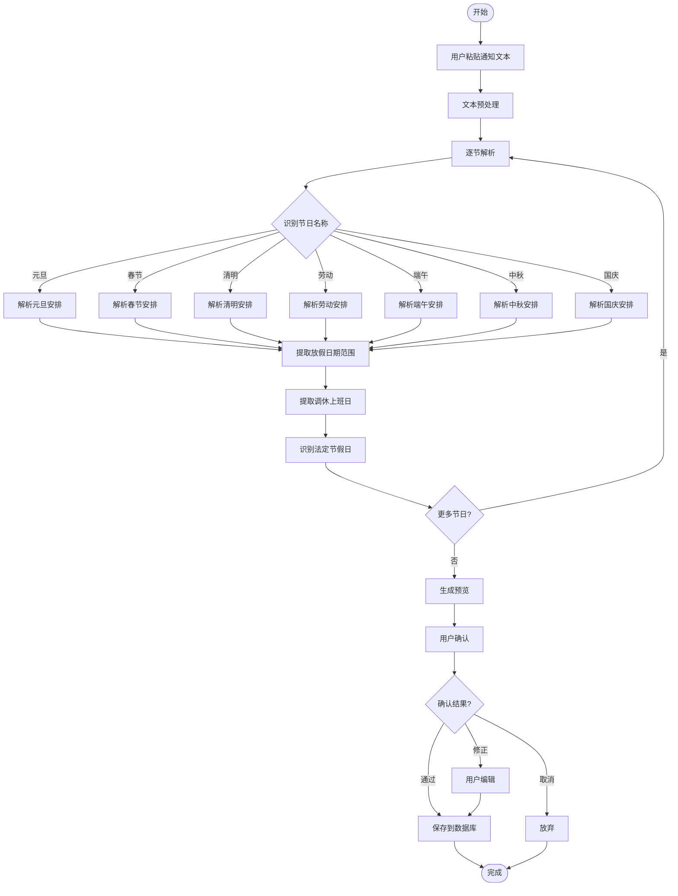
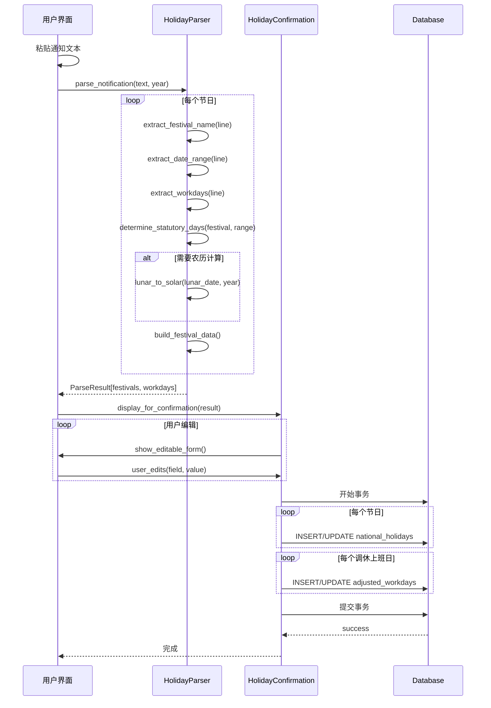

# 法定节假日管理功能设计文档

> 本文档描述如何通过复制粘贴国务院节假日通知来维护年度法定节假日数据。

---

## 文档信息

| 项目 | 内容 |
|------|------|
| 文档名称 | 法定节假日管理功能设计 |
| 版本 | 1.0 |
| 创建日期 | 2026-04-06 |
| 功能类型 | 数据维护功能 |

---

## 1. 功能概述

### 1.1 功能目标

提供一个用户友好的界面，允许管理员通过复制粘贴国务院发布的节假日通知文本，快速创建和更新年度法定节假日数据。

### 1.2 使用场景

1. **每年底导入下年节假日**（每年11-12月）
2. **临时调整**（国务院发布调休通知时）
3. **数据修正**（发现现有节假日数据错误时）

### 1.3 输入输出

| 项目 | 说明 |
|------|------|
| **输入** | 国务院节假日通知的纯文本 |
| **输出** | 解析后的节假日数据，存入 `national_holidays` 和 `adjusted_workdays` 表 |
| **中间产物** | 解析预览，供用户确认后保存 |

---

## 2. 界面设计

### 2.1 主界面布局

```
═══════════════════════════════════════════════════════════════════════════════
                         法定节假日管理
═══════════════════════════════════════════════════════════════════════════════

┌─────────────────────────────────────────────────────────────────────────────┐
│ 当前年度: [2026 ▼]                                                          │
│                                                                             │
│ 已配置节假日:                                                               │
│ ┌─────────────────────────────────────────────────────────────────────────┐ │
│ │ 节日名称        放假日期                  调休上班日                     │ │
│ ├─────────────────────────────────────────────────────────────────────────┤ │
│ │ 元旦            2026-01-01 ~ 2026-01-03   2026-01-04 (周日)             │ │
│ │ 春节            2026-02-15 ~ 2026-02-23   2026-02-14 (周六)             │ │
│ │                                     2026-02-28 (周六)                   │ │
│ │ 清明节          2026-04-04 ~ 2026-04-06   无                            │ │
│ │ ...                                                                     │ │
│ └─────────────────────────────────────────────────────────────────────────┘ │
│                                                                             │
│ [从文本导入]  [手动添加]  [删除选中]  [导出数据]                            │
└─────────────────────────────────────────────────────────────────────────────┘

═══════════════════════════════════════════════════════════════════════════════
```

### 2.2 文本导入界面

```
═══════════════════════════════════════════════════════════════════════════════
                      从文本导入节假日安排
═══════════════════════════════════════════════════════════════════════════════

【步骤1】复制国务院通知文本并粘贴到下方：

┌─────────────────────────────────────────────────────────────────────────────┐
│                                                                             │
│  国务院办公厅关于2026年部分节假日安排的通知发布：                          │
│  一、元旦：1月1日（周四）至3日（周六）放假调休，共3天。1月4日（周日）上班。│
│  二、春节：2月15日（农历腊月二十八、周日）至23日（农历正月初七、周一）放假 │
│  调休，共9天。2月14日（周六）、2月28日（周六）上班。                       │
│  三、清明节：4月4日（周六）至6日（周一）放假，共3天。                      │
│  ...                                                                       │
│                                                                             │
└─────────────────────────────────────────────────────────────────────────────┘

                              [ 开始解析 ]

═══════════════════════════════════════════════════════════════════════════════
```

### 2.3 解析确认界面

```
═══════════════════════════════════════════════════════════════════════════════
                      解析结果确认
═══════════════════════════════════════════════════════════════════════════════

【步骤2】请确认解析结果，修正错误或补充缺失信息：

┌─────────────────────────────────────────────────────────────────────────────┐
│ 一、元旦                                                                    │
│ ├─ 放假日期: 2026-01-01 至 2026-01-03 (共3天) ✓                            │
│ ├─ 法定节假日: 2026-01-01 ✓ (仅首日)                                        │
│ └─ 调休上班: 2026-01-04 (周日) ✓                                            │
├─────────────────────────────────────────────────────────────────────────────┤
│ 二、春节                                                                    │
│ ├─ 放假日期: 2026-02-15 至 2026-02-23 (共9天) ✓                            │
│ ├─ 法定节假日: 2026-02-17 至 2026-02-19 ✓ (农历除夕至初二)                 │
│   ⚠️ 注意: 系统已自动识别春节法定假日为农历除夕、初一、初二                │
│ └─ 调休上班:                                                               │
│     ├─ 2026-02-14 (周六) ✓                                                 │
│     └─ 2026-02-28 (周六) ✓                                                 │
├─────────────────────────────────────────────────────────────────────────────┤
│ 三、清明节                                                                  │
│ ├─ 放假日期: 2026-04-04 至 2026-04-06 (共3天) ✓                            │
│ ├─ 法定节假日: 2026-04-04 ✓ (清明当日)                                      │
│ └─ 调休上班: 无                                                            │
├─────────────────────────────────────────────────────────────────────────────┤
│ ...                                                                         │
└─────────────────────────────────────────────────────────────────────────────┘

                    [ 上一步 ]    [ 保存到数据库 ]    [ 取消 ]

═══════════════════════════════════════════════════════════════════════════════
```

### 2.4 编辑单项界面

```
═══════════════════════════════════════════════════════════════════════════════
                      编辑节假日
═══════════════════════════════════════════════════════════════════════════════

节日名称: [春节                              ]

放假安排:
  开始日期: [2026-02-15]  结束日期: [2026-02-23]
  放假天数: 9天

法定节假日（多选）:
  [✓] 2026-02-17 (除夕)   [✓] 2026-02-18 (初一)   [✓] 2026-02-19 (初二)
  [ ] 2026-02-20 (初三)   [ ] 2026-02-21 (初四)   [ ] 2026-02-22 (初五)
  [ ] 2026-02-23 (初六)
  
  ⚠️ 提示: 只有勾选的日期才按3倍工资计算，其他放假日期按周末算

调休上班日:
  [+] 2026-02-14 (周六)
  [+] 2026-02-28 (周六)
  
  [+ 添加调休上班日]

                      [ 保存 ]    [ 取消 ]

═══════════════════════════════════════════════════════════════════════════════
```

---

## 3. 文本解析策略

### 3.1 解析流程



### 3.2 解析规则配置

```yaml
holiday_parsing_rules:
  # 节日名称识别
  festival_names:
    - pattern: '元旦'
      key: 'new_year'
      statutory_days: 1  # 法定假日天数
      statutory_rule: 'first_day'  # 首日法定
    - pattern: '春节'
      key: 'spring_festival'
      statutory_days: 3
      statutory_rule: 'lunar_123'  # 农历初一至初三
    - pattern: '清明节?'
      key: 'qingming'
      statutory_days: 1
      statutory_rule: 'qingming_day'  # 清明当日
    - pattern: '劳动节?'
      key: 'labor_day'
      statutory_days: 1
      statutory_rule: 'first_day'  # 5月1日
    - pattern: '端午节?'
      key: 'dragon_boat'
      statutory_days: 1
      statutory_rule: 'duanwu_day'  # 端午当日
    - pattern: '中秋节?'
      key: 'mid_autumn'
      statutory_days: 1
      statutory_rule: 'zhongqiu_day'  # 中秋当日
    - pattern: '国庆节?'
      key: 'national_day'
      statutory_days: 3
      statutory_rule: 'first_3_days'  # 10月1-3日

  # 日期范围提取
  date_range_patterns:
    # 格式: 1月1日（周四）至3日（周六）
    - pattern: '(\d{1,2})月(\d{1,2})日.*?至(\d{1,2})日'
      extract: ['start_month', 'start_day', 'end_day']
    # 格式: 2月15日（周日）至23日（周一）
    - pattern: '(\d{1,2})月(\d{1,2})日.*?至(\d{1,2})月(\d{1,2})日'
      extract: ['start_month', 'start_day', 'end_month', 'end_day']
    # 格式: 4月4日（周六）至6日（周一）放假，共3天
    - pattern: '(\d{1,2})月(\d{1,2})日.*?至(\d{1,2})月(\d{1,2})日.*?共(\d+)天'
      extract: ['start_month', 'start_day', 'end_month', 'end_day', 'total_days']

  # 调休上班日提取
  workday_patterns:
    # 格式: 1月4日（周日）上班
    - pattern: '(\d{1,2})月(\d{1,2})日（周[一二三四五六日]）上班'
      extract: ['month', 'day']
    # 格式: 2月14日（周六）、2月28日（周六）上班
    - pattern: '(\d{1,2})月(\d{1,2})日（周[一二三四五六日]）[、，]'
      extract: ['month', 'day']
```

### 3.3 法定节假日智能识别

根据《全国年节及纪念日放假办法》，各节日的法定假日识别规则：

| 节日 | 法定假日 | 识别规则 |
|------|----------|----------|
| 元旦 | 1月1日 | 放假期间的首日 |
| 春节 | 农历除夕、初一、初二 | 从农历日期推断，或默认放假第3-5天 |
| 清明节 | 清明当日 | 放假期间包含4月4日则取4月4日，否则取首日 |
| 劳动节 | 5月1日 | 放假期间包含5月1日则取5月1日 |
| 端午节 | 端午当日 | 根据农历推算，或取放假中间日 |
| 中秋节 | 中秋当日 | 根据农历推算，或取放假中间日 |
| 国庆节 | 10月1日、2日、3日 | 放假期间包含10月1-3日则取对应日期 |

```yaml
statutory_day_rules:
  new_year:
    rule: first_day_of_holiday
    
  spring_festival:
    rule: lunar_calendar
    lunar_dates: ['腊月三十', '正月初一', '正月初二']
    fallback: [3, 4, 5]  # 放假第3、4、5天（如果无法解析农历）
    
  qingming:
    rule: solar_term
    date: '04-04'  # 通常在4月4日或5日
    fallback: middle_day  # 取中间日
    
  labor_day:
    rule: specific_date
    date: '05-01'
    
  dragon_boat:
    rule: lunar_calendar
    lunar_date: '五月初五'
    fallback: middle_day
    
  mid_autumn:
    rule: lunar_calendar
    lunar_date: '八月十五'
    fallback: middle_day
    
  national_day:
    rule: specific_dates
    dates: ['10-01', '10-02', '10-03']
```

---

## 4. 数据处理流程

### 4.1 数据存储逻辑



### 4.2 数据库操作

#### 插入法定节假日

```sql
-- 批量插入法定节假日
INSERT INTO national_holidays (holiday_date, holiday_name, year, is_workday_adjusted)
VALUES 
    ('2026-01-01', '元旦', 2026, TRUE),   -- 调休形成的假期标记为TRUE
    ('2026-02-17', '春节', 2026, TRUE),
    ('2026-02-18', '春节', 2026, TRUE),
    ('2026-02-19', '春节', 2026, TRUE),
    ('2026-04-04', '清明节', 2026, FALSE), -- 自然假期标记为FALSE
    ...
ON CONFLICT(holiday_date) DO UPDATE SET
    holiday_name = excluded.holiday_name,
    is_workday_adjusted = excluded.is_workday_adjusted;
```

#### 插入调休上班日

```sql
-- 批量插入调休上班日
INSERT INTO adjusted_workdays (work_date, original_weekday, adjusted_for, year)
VALUES
    ('2026-01-04', 6, '元旦', 2026),  -- 周日调休上班
    ('2026-02-14', 5, '春节', 2026),  -- 周六调休上班
    ('2026-02-28', 5, '春节', 2026),
    ('2026-05-09', 5, '劳动节', 2026),
    ...
ON CONFLICT(work_date) DO UPDATE SET
    adjusted_for = excluded.adjusted_for;
```

---

## 5. 错误处理与边界情况

### 5.1 常见解析错误

| 错误类型 | 示例 | 处理方式 |
|----------|------|----------|
| 缺少年份 | "1月1日放假" | 使用用户选择的当前年度 |
| 农历识别失败 | "农历腊月二十八" | 显示警告，允许手动选择日期 |
| 跨年度假期 | "2026年12月31日至2027年1月2日" | 拆分为两条记录，分别存入对应年度 |
| 重复日期 | 同一日期出现在多个节日 | 标记冲突，要求用户确认 |
| 日期格式异常 | "元月1日" | 智能识别"元"为"1" |

### 5.2 用户确认场景

```
⚠️ 需要确认的问题:

┌─────────────────────────────────────────────────────────────────────────────┐
│ 问题1: 农历日期识别                                                           │
│ 文本: "农历腊月二十八"                                                        │
│ 系统推断: 2026-02-15 (周日)                                                   │
│ 请确认: [✓ 正确]  [✗ 错误，手动选择: ____年__月__日]                          │
├─────────────────────────────────────────────────────────────────────────────┤
│ 问题2: 跨年度假期                                                             │
│ 文本: "12月31日至次年1月2日"                                                  │
│ 系统处理: 拆分为2026-12-31和2027-01-01/02                                     │
│ 请确认: [✓ 正确拆分]  [✗ 全部算在2026年]  [✗ 全部算在2027年]                 │
├─────────────────────────────────────────────────────────────────────────────┤
│ 问题3: 重复日期                                                               │
│ 日期: 2026-09-20 同时出现在中秋节和国庆节调休上班日                           │
│ 请确认: [删除中秋节的]  [删除国庆节的]  [保留两者]                              │
└─────────────────────────────────────────────────────────────────────────────┘
```

---

## 6. 完整示例

### 6.1 输入文本

```
国务院办公厅关于2026年部分节假日安排的通知发布：
一、元旦：1月1日（周四）至3日（周六）放假调休，共3天。1月4日（周日）上班。
二、春节：2月15日（农历腊月二十八、周日）至23日（农历正月初七、周一）放假调休，共9天。2月14日（周六）、2月28日（周六）上班。
三、清明节：4月4日（周六）至6日（周一）放假，共3天。
四、劳动节：5月1日（周五）至5日（周二）放假调休，共5天。5月9日（周六）上班。
五、端午节：6月19日（周五）至21日（周日）放假，共3天。
六、中秋节：9月25日（周五）至27日（周日）放假，共3天。
七、国庆节：10月1日（周四）至7日（周三）放假调休，共7天。9月20日（周日）、10月10日（周六）上班。
```

### 6.2 解析结果

```json
{
  "year": 2026,
  "festivals": [
    {
      "name": "元旦",
      "key": "new_year",
      "date_range": {"start": "2026-01-01", "end": "2026-01-03"},
      "total_days": 3,
      "statutory_days": ["2026-01-01"],
      "workdays": ["2026-01-04"]
    },
    {
      "name": "春节",
      "key": "spring_festival",
      "date_range": {"start": "2026-02-15", "end": "2026-02-23"},
      "total_days": 9,
      "lunar_reference": {"start": "腊月二十八", "end": "正月初七"},
      "statutory_days": ["2026-02-17", "2026-02-18", "2026-02-19"],
      "workdays": ["2026-02-14", "2026-02-28"]
    },
    {
      "name": "清明节",
      "key": "qingming",
      "date_range": {"start": "2026-04-04", "end": "2026-04-06"},
      "total_days": 3,
      "statutory_days": ["2026-04-04"],
      "workdays": []
    },
    {
      "name": "劳动节",
      "key": "labor_day",
      "date_range": {"start": "2026-05-01", "end": "2026-05-05"},
      "total_days": 5,
      "statutory_days": ["2026-05-01"],
      "workdays": ["2026-05-09"]
    },
    {
      "name": "端午节",
      "key": "dragon_boat",
      "date_range": {"start": "2026-06-19", "end": "2026-06-21"},
      "total_days": 3,
      "statutory_days": ["2026-06-20"],  // 推断为端午当日
      "workdays": []
    },
    {
      "name": "中秋节",
      "key": "mid_autumn",
      "date_range": {"start": "2026-09-25", "end": "2026-09-27"},
      "total_days": 3,
      "statutory_days": ["2026-09-26"],  // 推断为中秋当日
      "workdays": []
    },
    {
      "name": "国庆节",
      "key": "national_day",
      "date_range": {"start": "2026-10-01", "end": "2026-10-07"},
      "total_days": 7,
      "statutory_days": ["2026-10-01", "2026-10-02", "2026-10-03"],
      "workdays": ["2026-09-20", "2026-10-10"]
    }
  ],
  "total_statutory_days": 11,
  "total_workdays": 6
}
```

### 6.3 数据库写入结果

```sql
-- national_holidays 表（部分示例）
SELECT holiday_date, holiday_name, is_workday_adjusted 
FROM national_holidays 
WHERE year = 2026;
```

| holiday_date | holiday_name | is_workday_adjusted |
|--------------|--------------|---------------------|
| 2026-01-01 | 元旦 | TRUE |
| 2026-01-02 | 元旦 | TRUE |
| 2026-01-03 | 元旦 | TRUE |
| 2026-02-17 | 春节 | TRUE |
| 2026-02-18 | 春节 | TRUE |
| 2026-02-19 | 春节 | TRUE |
| 2026-04-04 | 清明节 | FALSE |
| ... | ... | ... |

```sql
-- adjusted_workdays 表
SELECT work_date, original_weekday, adjusted_for 
FROM adjusted_workdays 
WHERE year = 2026;
```

| work_date | original_weekday | adjusted_for |
|-----------|------------------|--------------|
| 2026-01-04 | 6 | 元旦 |
| 2026-02-14 | 5 | 春节 |
| 2026-02-28 | 5 | 春节 |
| 2026-05-09 | 5 | 劳动节 |
| 2026-09-20 | 6 | 国庆节 |
| 2026-10-10 | 5 | 国庆节 |

---

## 7. 与现有系统的集成

### 7.1 在操作SOP中的位置

将此功能作为 **SOP-004: 月度工资计算与合规审查** 的前置步骤：

```
SOP-004 更新:

### 步骤0: 年度节假日维护（每年11-12月执行）

1. 访问国务院官网获取下年度节假日通知
2. 复制通知文本
3. 打开系统: 管理后台 → 节假日管理 → 从文本导入
4. 粘贴文本，点击"开始解析"
5. 确认解析结果，修正识别错误
6. 保存到数据库
7. 验证数据完整性

### 步骤1: 更新法定节假日和调休上班日配置（已完成）
```

### 7.2 CLI支持

```bash
# 命令行方式导入节假日
python -m ot_system holidays import --file 2026_holidays.txt --year 2026

# 预览模式（不保存到数据库）
python -m ot_system holidays import --file 2026_holidays.txt --year 2026 --dry-run

# 手动添加单个节假日
python -m ot_system holidays add --name "春节" --start 2026-02-15 --end 2026-02-23 --statutory-days 2026-02-17,2026-02-18,2026-02-19

# 查看当前年度节假日
python -m ot_system holidays list --year 2026

# 导出节假日配置
python -m ot_system holidays export --year 2026 --format json --output 2026_holidays.json
```

---

## 8. 界面截图示意

### 8.1 解析错误提示

```
┌─────────────────────────────────────────────────────────────────────────────┐
│ ⚠️ 解析警告                                                                 │
├─────────────────────────────────────────────────────────────────────────────┤
│                                                                             │
│ 以下问题需要您的注意：                                                      │
│                                                                             │
│ 1. 节日名称未识别                                                           │
│    行: "八、建军节：8月1日放假1天。"                                        │
│    提示: 建军节不是全民放假的法定节假日，是否添加？                         │
│    [添加为法定节假日]  [忽略]  [标记为其他假日]                             │
│                                                                             │
│ 2. 日期格式异常                                                             │
│    行: "元月初一春节"                                                       │
│    提示: 无法识别日期，请手动输入                                           │
│    日期: [2026]年[ 2]月[17]日                                               │
│    [确认]                                                                   │
│                                                                             │
└─────────────────────────────────────────────────────────────────────────────┘
```

### 8.2 数据冲突处理

```
┌─────────────────────────────────────────────────────────────────────────────┐
│ ⚠️ 数据冲突                                                                 │
├─────────────────────────────────────────────────────────────────────────────┤
│                                                                             │
│ 数据库中已存在2026年的节假日数据：                                          │
│                                                                             │
│ 现有数据:                                                                   │
│   - 元旦: 2026-01-01 至 2026-01-03                                          │
│   - 春节: 2026-02-15 至 2026-02-23                                          │
│                                                                             │
│ 新导入数据:                                                                 │
│   - 元旦: 2026-01-01 至 2026-01-03                                          │
│   - 春节: 2026-02-08 至 2026-02-14  ← 日期不同!                            │
│                                                                             │
│ 请选择处理方式:                                                             │
│                                                                             │
│   [○] 保留现有数据，忽略新数据                                              │
│   [○] 使用新数据覆盖现有数据                                                │
│   [●] 逐条对比，手动选择                                                    │
│                                                                             │
└─────────────────────────────────────────────────────────────────────────────┘
```

---

## 9. 附录

### 9.1 参考文档格式

历年国务院节假日通知格式基本一致：

```
国务院办公厅关于20XX年部分节假日安排的通知
国办发明电〔20XX〕XX号

各省、自治区、直辖市人民政府，国务院各部委、各直属机构：

经国务院批准，现将20XX年元旦、春节、清明节、劳动节、端午节、中秋节和国庆节放假调休日期的具体安排通知如下。

一、元旦：X月X日（周X）至X日（周X）放假调休，共X天。X月X日（周X）上班。
二、春节：X月X日（农历...）至X日（农历...）放假调休，共X天。X月X日（周X）、X月X日（周X）上班。
...

节假日期间，各地区、各部门要妥善安排好值班和安全、保卫等工作...

国务院办公厅
20XX年X月X日
```

解析时应提取从"一、"开始到"七、"或"八、"结束的正文部分。

### 9.2 修订历史

| 版本 | 日期 | 修订内容 | 修订人 |
|------|------|----------|--------|
| 1.0 | 2026-04-06 | 初始版本 | 系统管理员 |
