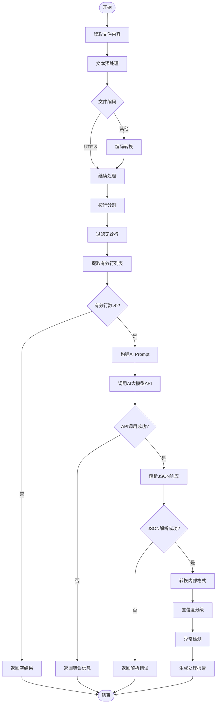
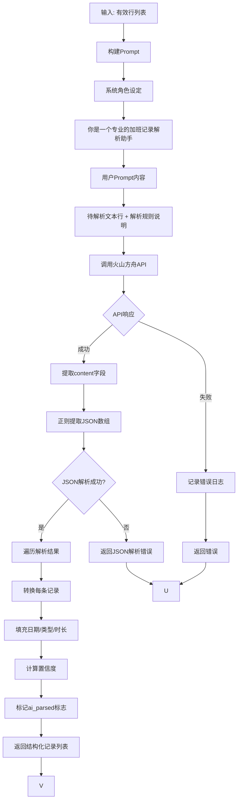
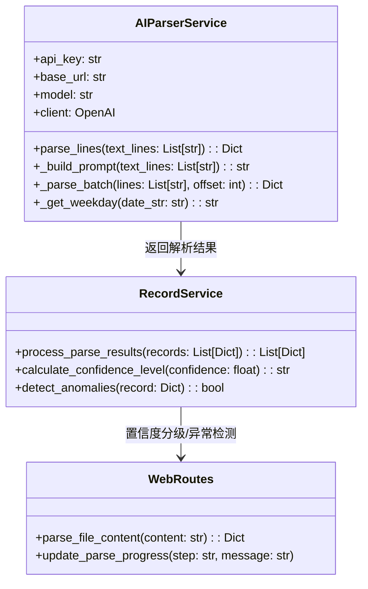
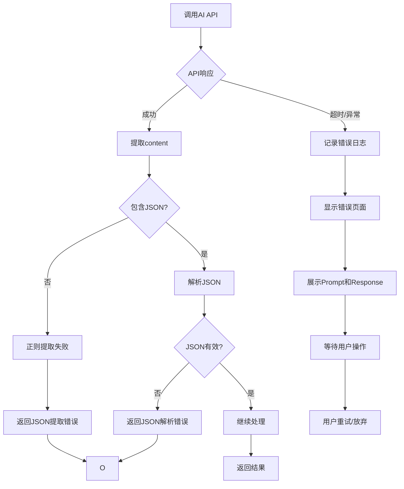

# 加班记录分析系统 - 数据解析策略文档

## 1. 文档信息

| 项目 | 内容 |
|------|------|
| 文档名称 | 数据解析策略文档 |
| 版本 | 2.0 |
| 创建日期 | 2026-04-04 |
| 更新日期 | 2026-04-08 |
| 状态 | 已更新（适配AI大模型解析） |

---

## 2. 解析策略概述

### 2.1 解析目标

将半结构化的 Markdown 加班记录转换为标准化的数据记录，支持：
- 多种日期格式识别
- 多种记录类型分类
- 多种时长描述解析
- 数据验证和清洗

### 2.2 解析策略

系统采用**AI大模型解析优先**策略，完全依赖火山方舟API进行智能文本解析：

```
用户上传文件
    │
    ▼
┌─────────────────┐
│  提取有效行      │  ← 本地预处理：过滤空行、标题行、累计行
└────────┬────────┘
         │
         ▼
┌─────────────────┐
│  AI大模型解析    │  ← 火山方舟API (ep-20260331092634-wfnm8)
│  理解自然语义    │
└────────┬────────┘
         │
         ▼
┌─────────────────┐
│  置信度分级/异常检测 │  ← 本地后处理
└─────────────────┘
```

**核心特点：**
- **AI解析唯一**：不再使用本地关键词/正则规则解析，完全依赖AI大模型
- **自然语言理解**：AI理解语义，不受固定关键词限制
- **透明可审计**：显示完整Prompt和Response，便于调试和审计
- **失败不回退**：AI解析失败直接报错，不回退到本地规则

---

## 3. 解析流程

### 3.1 整体解析流程



### 3.2 AI解析详细流程



---

## 4. AI解析配置

### 4.1 API配置

**硬编码配置（src/services/ai_parser_service.py）：**

```python
# 火山方舟API配置
API_KEY = "39fb2f6b-3062-41f7-8abb-3e879f03270b"
BASE_URL = "https://ark.cn-beijing.volces.com/api/v3"
MODEL = "ep-20260331092634-wfnm8"
```

**模型参数：**
| 参数 | 值 | 说明 |
|------|-----|------|
| model | ep-20260331092634-wfnm8 | 火山方舟端点模型 |
| temperature | 0.1 | 低随机性，保证解析一致性 |
| max_tokens | 4000 | 支持批量解析 |
| timeout | 300秒 | API调用超时时间 |

### 4.2 Prompt设计

**系统角色：**
```
你是一个专业的加班记录解析助手，擅长从非结构化文本中提取时间、类型、时长等信息。请严格返回JSON格式。
```

**用户Prompt结构：**
```
你是一个加班记录解析助手。请解析以下文本中的每一行，提取日期、类型、时长等信息。

待解析的文本行：
1. 2025.01.15 晚上加班2小时
2. 2025.01.16 请假半天
...

请对每一行进行分析，返回JSON数组格式：
[
  {
    "line_num": 1,
    "date": "2025-01-15",
    "type": "overtime|leave|comp_off|unknown",
    "subtype": "weekday_evening|weekday_morning|...",
    "hours": 2.0,
    "description": "描述文本",
    "confidence": 0.95,
    "reasoning": "解析理由"
  }
]

解析规则：
1. type字段：overtime(加班)、leave(请假)、comp_off(调休)、unknown(未知)
2. subtype字段：weekday_morning(早上)、weekday_lunch(午休)、weekday_evening(晚上)、weekend(周末)、holiday(法定节假日)、personal(事假)、sick(病假)、annual(年假)、half_day(半天)、full_day(全天)
3. 特殊处理："下午xx小时"、"晚上xx小时"默认为加班
4. hours字段：提取数字部分，半天=4.0，一天=8.0
5. confidence字段：0.9-1.0非常确定，0.7-0.9比较确定，0.5-0.7不太确定

请只返回JSON数组，不要返回其他内容。
```

### 4.3 分批处理策略

为避免API超时，系统采用分批处理：

```python
# 分批配置
BATCH_SIZE = 1      # 每批处理1行
MAX_LINES = 5       # 最多处理前5行

# 逐行顺序处理
for batch_start in range(0, len(text_lines), BATCH_SIZE):
    batch_lines = text_lines[batch_start:batch_start + BATCH_SIZE]
    result = _parse_batch(batch_lines, batch_start)
```

---

## 5. 解析规则设计

### 5.1 日期解析规则

AI模型支持的日期格式：

| 格式 | 示例 | 解析结果 |
|------|------|----------|
| 标准格式 | 2025.08.15 | 2025-08-15 |
| ISO格式 | 2025-01-15 | 2025-01-15 |
| 中文格式 | 2025年1月15日 | 2025-01-15 |
| 日期范围（同月） | 2025.10.27-29 | 2025-10-27 至 2025-10-29 |
| 日期范围（跨月） | 2025.10.27-11.3 | 2025-10-27 至 2025-11-03 |

### 5.2 类型识别规则

AI模型识别的类型映射：

| 类型 | AI识别关键词/模式 | 示例 | 默认子类型 |
|------|------------------|------|-----------|
| 加班(overtime) | 晚上、下午、早、小时、加班 | "晚上加班2小时"、"下午3小时" | weekday_evening |
| 请假(leave) | 请假、病假、事假、年假 | "请假半天，病假" | personal |
| 调休(comp_off) | 调休、补休 | "调休一天" | half_day/full_day |
| 未知(unknown) | 累计、余额、剩余 | "累计加班100小时" | - |

**特殊规则：**
- **下午xx小时** 或 **晚上xx小时**：如果没有"请假"、"调休"等字样，默认识别为**加班**，子类型为**工作日-晚上**
- **请假半天**：默认为leave，subtype为personal，hours为4
- **请假一天**：默认为leave，subtype为personal，hours为8

### 5.3 时长解析规则

AI模型提取的时长映射：

| 描述 | 解析结果 | 说明 |
|------|----------|------|
| "X小时" | X.0h | 直接数值 |
| "X.5小时" | X.5h | 小数支持 |
| "半天" | 4.0h | 固定映射 |
| "一天/全天" | 8.0h | 固定映射 |
| "X天" | X * 8.0h | 天数转换 |

---

## 6. 解析器组件设计

### 6.1 AI解析服务类

```python
# src/services/ai_parser_service.py

class AIParserService:
    """AI大模型解析服务"""

    def __init__(self):
        # 硬编码火山方舟API配置
        self.api_key = "39fb2f6b-3062-41f7-8abb-3e879f03270b"
        self.base_url = "https://ark.cn-beijing.volces.com/api/v3"
        self.model = "ep-20260331092634-wfnm8"
        self.client = OpenAI(base_url=self.base_url, api_key=self.api_key)

    def parse_lines(self, text_lines: List[str]) -> Dict[str, Any]:
        """
        使用AI解析文本行，分批处理避免超时
        Returns: {
            'records': [...],      # 解析后的记录列表
            'prompt': '',          # 完整Prompt
            'response': '',        # AI原始响应
            'error': None          # 错误信息（如有）
        }
        """

    def _build_prompt(self, text_lines: List[str]) -> str:
        """构建解析Prompt"""

    def _parse_batch(self, text_lines: List[str], line_offset: int) -> Dict[str, Any]:
        """解析一批文本行"""
```

### 6.2 解析流程图



---

## 7. 错误处理策略

### 7.1 错误分类

| 错误级别 | 说明 | 处理方式 |
|----------|------|----------|
| CRITICAL | API调用失败/超时 | 显示错误页面，展示完整Prompt和Response |
| HIGH | JSON解析失败 | 显示错误信息，包含AI原始响应 |
| MEDIUM | 单条记录解析失败 | 跳过该条，继续处理其他 |
| LOW | 置信度较低 | 标记为低置信度，建议人工复核 |

### 7.2 错误处理流程



### 7.3 失败不回退原则

**重要：** AI解析失败时**不再回退到本地规则**解析：

- 直接显示错误信息和完整的AI交互记录
- 便于用户了解失败原因并调整输入
- 透明展示AI解析过程和推理
- 失败时停留在错误页面，等待用户操作

---

## 8. 置信度与异常检测

### 8.1 置信度分级

| 级别 | 分数范围 | 标识 | 说明 |
|------|----------|------|------|
| HIGH | 0.9 - 1.0 | 绿色 | 解析结果可信，建议导入 |
| MEDIUM | 0.7 - 0.89 | 蓝色 | 解析结果基本可信，建议检查 |
| LOW | < 0.7 | 红色 | 解析结果存疑，需要人工确认 |

### 8.2 异常检测规则

| 异常类型 | 检测条件 | 处理方式 |
|----------|----------|----------|
| 加班时长过长 | hours > 12 | 标记警告，建议检查 |
| 未来日期 | date > today | 标记警告，建议检查 |
| 类型不匹配 | 周末但标记为工作日加班 | 标记警告 |
| 缺少子类型 | 请假但未指定leave_type | 标记为需编辑 |

---

## 9. 性能优化策略

### 9.1 分批处理优化

```python
# 配置参数
BATCH_SIZE = 1      # 小批次，避免超时
MAX_LINES = 5       # 限制处理行数
TIMEOUT = 300       # 5分钟超时

# 逐行顺序处理，避免API压力过大
```

### 9.2 缓存策略

- AI解析结果不缓存，确保实时性
- 解析进度存储在Session中，支持前端轮询

---

## 10. 测试策略

### 10.1 AI解析测试用例

| 测试类型 | 测试内容 | 预期结果 |
|----------|----------|----------|
| 简单加班 | "2025.08.15 晚上3小时" | type=overtime, hours=3.0 |
| 请假识别 | "2025.08.15 请假半天" | type=leave, hours=4.0 |
| 调休识别 | "2025.08.15 调休一天" | type=comp_off, hours=8.0 |
| 下午加班 | "2025.08.15 下午2小时" | type=overtime, subtype=weekday_evening |
| 未知类型 | "2025.08.15 累计10小时" | type=unknown |

### 10.2 边界情况测试

```python
# 需要测试的边界情况
edge_cases = [
    "2025.02.29",           # 无效日期
    "晚上-3小时",           # 负时长
    "",                     # 空行
    "累计小时",             # 缺少数字
]
```

---

## 11. 配置管理

### 11.1 API配置

配置位置：`src/services/ai_parser_service.py`（硬编码）

```python
# 如需修改API配置，编辑以下变量：
self.api_key = "your-api-key"
self.base_url = "https://ark.cn-beijing.volces.com/api/v3"
self.model = "your-model-endpoint"
```

### 11.2 分批处理配置

```python
# 在 parse_lines 方法中修改：
BATCH_SIZE = 1      # 每批处理行数
MAX_LINES = 5       # 最大处理行数
```

---

## 12. 修订历史

| 版本 | 日期 | 修订内容 | 修订人 |
|------|------|----------|--------|
| 1.0 | 2026-04-04 | 初始版本，基于本地规则解析 | 系统管理员 |
| 2.0 | 2026-04-08 | **重大重构**：完全改为AI大模型解析策略，删除本地关键词/正则解析相关内容，增加火山方舟API配置说明 | 系统管理员 |

---

## 13. 相关文档

- [20-record-import-feature.md](./20-record-import-feature.md) - 记录导入功能详细设计
- [06-technical-implementation.md](./06-technical-implementation.md) - 技术实现文档（需同步更新）
