# 加班记录分析系统 - 核心流程设计文档

## 1. 文档信息

| 项目 | 内容 |
|------|------|
| 文档名称 | 核心流程设计文档 |
| 版本 | 1.0 |
| 创建日期 | 2026-04-04 |
| 状态 | 初稿 |

---

## 2. 流程概述

本文档描述系统的核心业务流程，包括：
- 批量导入流程
- 单文件解析流程
- 解析决策流程

---


> **重要更新**：本文档描述的流程图中包含的关键词匹配、正则表达式解析等逻辑为原始设计。
>
> **实际实现已改为AI大模型解析**：系统完全依赖火山方舟API进行智能文本解析，不再使用本地关键词/正则规则。
> 实际代码实现请参见 `docs/03-data-parsing-strategy.md` 和 `src/services/ai_parser_service.py`

## 3. 批量导入时序图

### 3.1 批量导入完整流程

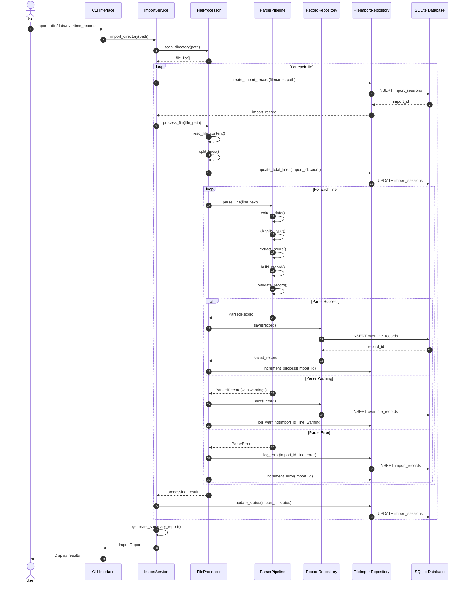

### 3.2 批量导入简化时序图

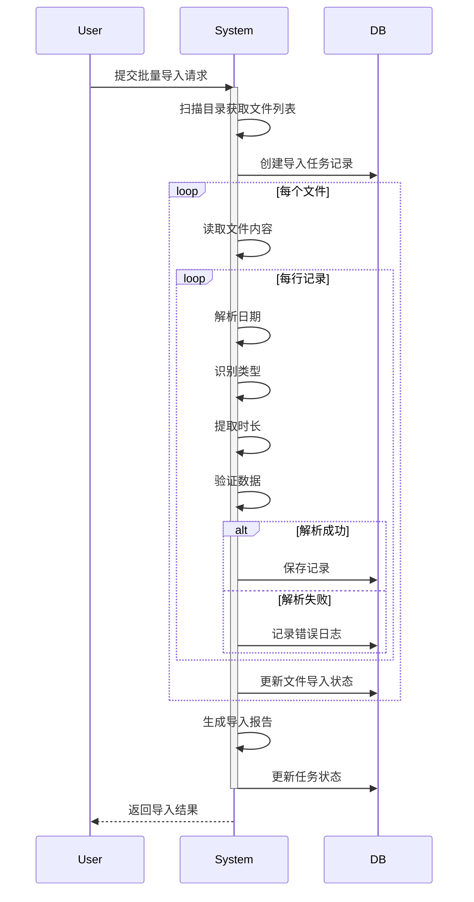

---

## 4. 单文件解析时序图

### 4.1 单文件解析完整流程

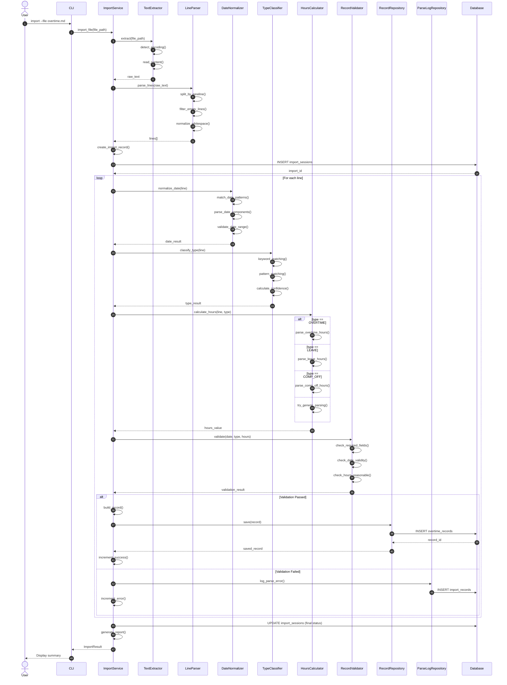

### 4.2 解析器管道内部时序图

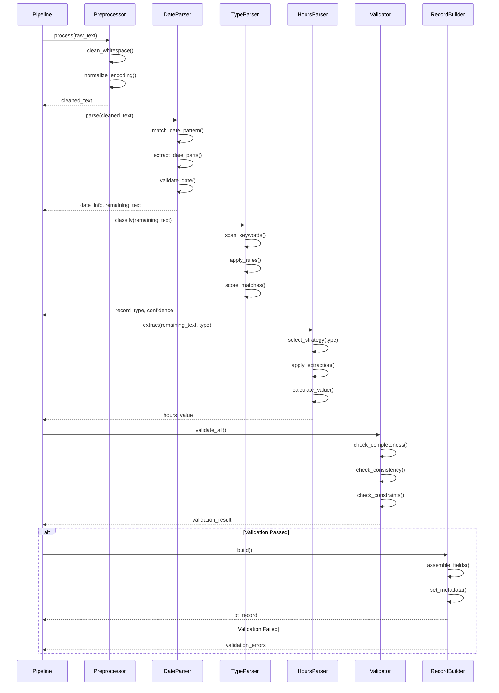

---

## 5. 解析决策活动图

### 5.1 主解析决策流程

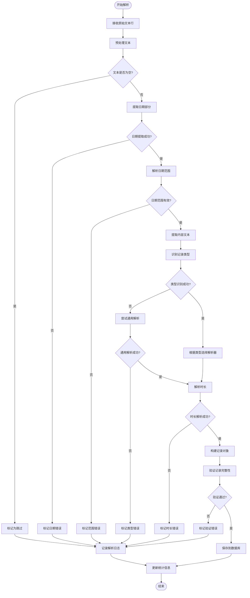

### 5.2 类型识别决策流程

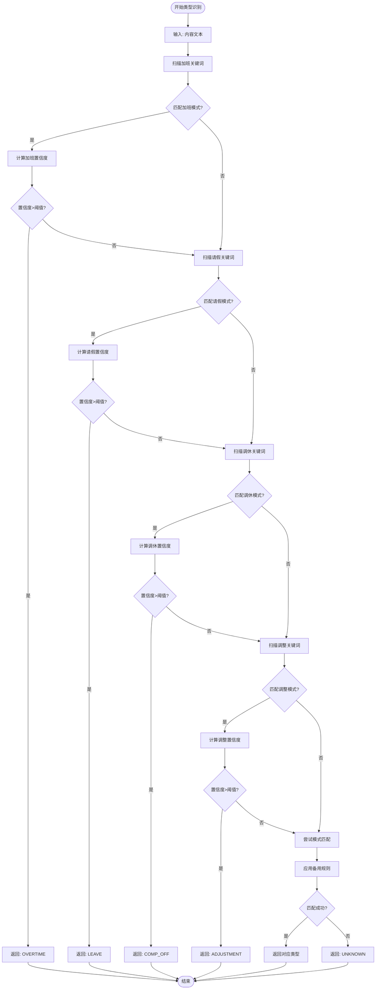

### 5.3 时长解析决策流程

```mermaid
flowchart TD
    Start([开始时长解析]) --> A[输入: 文本, 类型]
    
    A --> B{类型?}
    
    B -->|OVERTIME| C[解析加班时长]
    B -->|LEAVE| D[解析请假时长]
    B -->|COMP_OFF| E[解析调休时长]
    B -->|ADJUSTMENT| F[解析调整时长]
    B -->|UNKNOWN| G[尝试通用解析]
    
    C --> C1[匹配"晚上X小时"]
    C1 --> C2{匹配成功?}
    C2 -->|是| C3[提取数字]
    C2 -->|否| C4[匹配"早X到晚Y"]
    
    C4 --> C5{匹配成功?}
    C5 -->|是| C6[计算时间差]
    C5 -->|否| C7[匹配"X小时"]
    
    C7 --> C8{匹配成功?}
    C8 -->|是| C3
    C8 -->|否| C9[标记解析失败]
    
    D --> D1[匹配"半天"]
    D1 --> D2{匹配成功?}
    D2 -->|是| D3[设置4小时]
    D2 -->|否| D4[匹配"一天/全天"]
    
    D4 --> D5{匹配成功?}
    D5 -->|是| D6[设置8小时]
    D5 -->|否| D7[匹配"X天"]
    
    D7 --> D8{匹配成功?}
    D8 -->|是| D9[计算X*8]
    D8 -->|否| D10[标记解析失败]
    
    E --> E1[同请假解析逻辑]
    E1 --> E2[应用调休系数]
    
    F --> F1[匹配"加/减X小时"]
    F1 --> F2{匹配成功?}
    F2 -->|是| F3[提取数字和符号]
    F2 -->|否| F4[标记解析失败]
    
    G --> G1[扫描所有数字]
    G1 --> G2{找到数字?}
    G2 -->|是| G3[提取第一个数字]
    G2 -->|否| G4[标记解析失败]
    
    C3 --> H[应用符号]
    C6 --> H
    D3 --> H
    D6 --> H
    D9 --> H
    E2 --> H
    F3 --> H
    G3 --> H
    
    H --> I{需要取反?}
    I -->|是| J[乘以-1]
    I -->|否| K[保持正值]
    
    J --> L[验证范围]
    K --> L
    
    L --> M{在有效范围内?}
    M -->|是| N[返回时长值]
    M -->|否| O[标记无效时长]
    
    C9 --> P[返回错误]
    D10 --> P
    F4 --> P
    G4 --> P
    O --> P
    
    N --> End([结束])
    P --> End
```

---

## 6. 错误处理流程

### 6.1 错误处理活动图

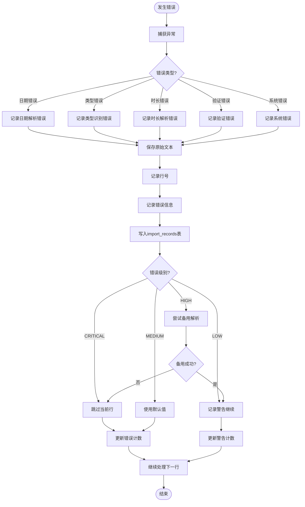

---

## 7. 数据流状态转换

### 7.1 记录状态转换图

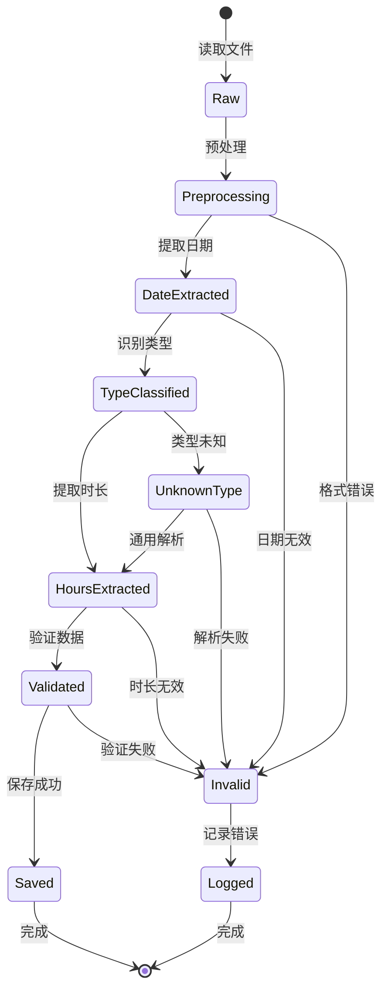

---

## 8. 并发处理流程

### 8.1 批量处理并发流程

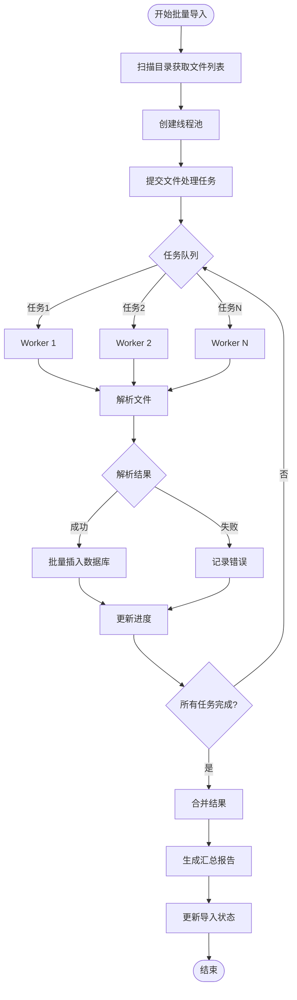

---

## 9. 查询流程

### 9.1 数据查询时序图

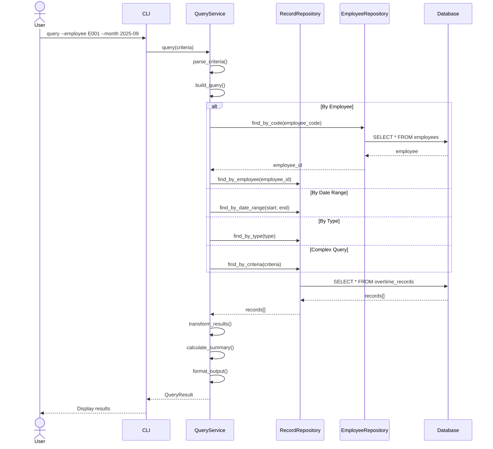

---

## 10. 统计报告流程

### 10.1 月度统计生成流程

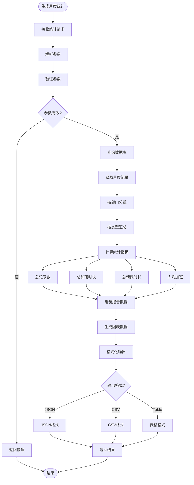

---

## 11. 流程优化建议

### 11.1 性能优化点

| 流程阶段 | 优化策略 | 预期效果 |
|----------|----------|----------|
| 文件读取 | 使用内存映射 | 减少IO开销 |
| 批量插入 | 事务批量提交 | 提升10x写入速度 |
| 并发解析 | 多线程处理 | 提升CPU利用率 |
| 数据库查询 | 添加复合索引 | 减少查询时间 |

### 11.2 可靠性优化点

| 流程阶段 | 优化策略 | 预期效果 |
|----------|----------|----------|
| 错误处理 | 分级处理策略 | 提高容错性 |
| 数据验证 | 多重验证机制 | 提高数据质量 |
| 日志记录 | 详细操作日志 | 便于问题排查 |
| 状态管理 | 事务状态追踪 | 支持断点续传 |

---

## 12. 逐行审批流程

### 12.1 逐行审批时序图

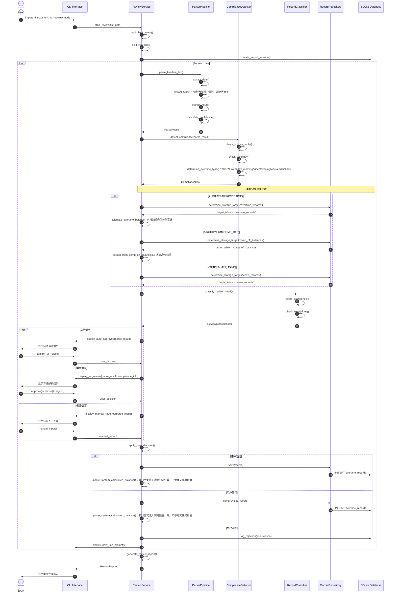

### 12.2 行解析详情展示界面

```
═══════════════════════════════════════════════════════════════════════════════
                         加班记录逐行审批系统
═══════════════════════════════════════════════════════════════════════════════

📄 文件: employee_ot_record/xuchen.md          行号: 29 / 61
👤 员工: 徐晨

┌─────────────────────────────────────────────────────────────────────────────┐
│ 【原始文本】                                                                 │
│                                                                             │
│   2025.10.25，早7到晚10共15小时，累计48.5小时                               │
│                                                                             │
└─────────────────────────────────────────────────────────────────────────────┘

┌─────────────────────────────────────────────────────────────────────────────┐
│ 【系统解析结果】                                                             │
│                                                                             │
│  📅 日期信息                                                                 │
│     • 日期: 2025-10-25                                                      │
│     • 星期: 星期六 (Weekend)                                                │
│     • 是否法定节假日: ❌ 否                                                 │
│     • 是否调休上班日: ❌ 否                                                 │
│                                                                             │
│  📝 记录类型                                                                 │
│     • 原始描述: "早7到晚10共15小时"                                         │
│     • 识别类型: 加班 (Overtime)                                             │
│     • 置信度: 95%                                                           │
│                                                                             │
│  ⏱️  时长计算                                                                │
│     • 工作时段: 07:00 - 22:00                                               │
│     • 总时长: 15小时                                                        │
│     • 系统取值: 15小时 (描述明确指定)                                       │
│                                                                             │
│  ⚖️  合规判定                                                                │
│     • 加班类型: 周末加班 (weekend)                                          │
│     • 工资倍数: 2.0x                                                        │
│     • 可调休: ✅ 是 (15小时全部可调休)                                      │
│     • 调休有效期: 2025-10-25 至 2026-04-25 (6个月)                          │
│                                                                             │
│  🔢 系统独立计算（不参考声明累计）                                          │
│     • 本次记录: +15小时 周末加班                                            │
│     • 系统计算: 15小时可调休（按《劳动法》规则）                            │
│     • 员工声明: "累计48.5小时"（仅供参考，不参与计算）                      │
│                                                                             │
└─────────────────────────────────────────────────────────────────────────────┘

┌─────────────────────────────────────────────────────────────────────────────┐
│ 【处理方案选择】                                                             │
│                                                                             │
│   系统推荐: [✓] 通过 - 确认为周末加班，计入可调休余额                       │
│                                                                             │
│   其他选项:                                                                  │
│     [ ] 修订 - 修改解析结果                                                 │
│         └─ 时长: [15    ] 小时                                              │
│         └─ 类型: [周末加班 ▼]                                               │
│         └─ 可调休: [✓]                                                      │
│                                                                             │
│     [ ] 驳回 - 标记为无效记录                                               │
│         └─ 驳回原因: [                      ]                               │
│                                                                             │
│     [ ] 拆分 - 拆分为多条记录                                               │
│         └─ 07:00-18:00 标准工时 (不计加班)                                  │
│         └─ 18:00-22:00 延时加班 (4小时)                                     │
│                                                                             │
└─────────────────────────────────────────────────────────────────────────────┘

操作: [P]通过 [E]编辑 [R]驳回 [S]拆分 [B]返回上条 [N]下一条 [Q]保存退出
选择: _

═══════════════════════════════════════════════════════════════════════════════
进度: ████████████████████░░░░░░░░░░░░░░░░░░░░  29/61 (47.5%)
═══════════════════════════════════════════════════════════════════════════════
```

### 12.3 工作日延时加班审批界面（区分时段）

```
═══════════════════════════════════════════════════════════════════════════════
                         加班记录逐行审批系统
═══════════════════════════════════════════════════════════════════════════════

📄 文件: employee_ot_record/xuchen.md          行号: 27 / 61
👤 员工: 徐晨

┌─────────────────────────────────────────────────────────────────────────────┐
│ 【原始文本】                                                                 │
│                                                                             │
│   2025.10.24，早晨1.5小时，晚上5.5小时，累计33.5小时                        │
│                                                                             │
└─────────────────────────────────────────────────────────────────────────────┘

┌─────────────────────────────────────────────────────────────────────────────┐
│ 【系统解析结果】                                                             │
│                                                                             │
│  📅 日期信息                                                                 │
│     • 日期: 2025-10-24                                                      │
│     • 星期: 星期五 (Weekday)                                                │
│     • 工作时间: 08:30-12:00, 13:00-17:30                                    │
│                                                                             │
│  📝 记录类型                                                                 │
│     • 识别类型: 加班 (Overtime)                                             │
│     • 置信度: 92%                                                           │
│                                                                             │
│  ⏱️  时段分解（根据公司工作时间）                                           │
│                                                                             │
│     ┌─────────────────────────────────────────────────────────────────┐     │
│     │ 时段1: 早晨加班                                                  │     │
│     │   • 描述: "早晨1.5小时"                                          │     │
│     │   • 时段: 07:00 - 08:30 (1.5小时)                                │     │
│     │   • 类型: weekday_morning                                        │     │
│     │   • 工资倍数: 1.5x                                               │     │
│     │   • 可调休: ❌ 否                                                │     │
│     ├─────────────────────────────────────────────────────────────────┤     │
│     │ 时段2: 晚间加班                                                  │     │
│     │   • 描述: "晚上5.5小时"                                          │     │
│     │   • 时段: 17:30 - 23:00 (5.5小时)                                │     │
│     │   • 类型: weekday_evening                                        │     │
│     │   • 工资倍数: 1.5x                                               │     │
│     │   • 可调休: ❌ 否                                                │     │
│     └─────────────────────────────────────────────────────────────────┘     │
│                                                                             │
│     合计加班时长: 1.5 + 5.5 = 7.0小时                                       │
│                                                                             │
│  💾 存储目标                                                                 │
│     • 加班记录表 (overtime_records): 存储2条记录                                   │
│       - 记录1: weekday_morning, 1.5小时                                     │
│       - 记录2: weekday_evening, 5.5小时                                     │
│     • 调休余额表 (comp_off_balances): 无变化（工作日加班不产生调休）        │
│                                                                             │
└─────────────────────────────────────────────────────────────────────────────┘

┌─────────────────────────────────────────────────────────────────────────────┐
│ 【处理方案选择】                                                             │
│                                                                             │
│   系统推荐: [✓] 通过 - 确认为工作日延时加班                                  │
│                                                                             │
│   其他选项:                                                                  │
│     [ ] 修订 - 修改解析结果                                                 │
│         └─ 早晨时长: [1.5   ] 小时                                          │
│         └─ 晚间时长: [5.5   ] 小时                                          │
│         └─ 时段类型: [工作日延时 ▼]                                         │
│                                                                             │
│     [ ] 驳回 - 标记为无效记录                                               │
│         └─ 驳回原因: [                      ]                               │
│                                                                             │
│     [ ] 合并为一条记录                                                      │
│         └─ 总时长: 7.0小时，类型: weekday_mixed                            │
│                                                                             │
└─────────────────────────────────────────────────────────────────────────────┘

操作: [P]通过 [E]编辑 [R]驳回 [M]合并 [B]返回上条 [N]下一条 [Q]保存退出
选择: _

═══════════════════════════════════════════════════════════════════════════════
进度: ████████████████████░░░░░░░░░░░░░░░░░░░░  27/61 (44.3%)
═══════════════════════════════════════════════════════════════════════════════
```

### 12.4 调休记录审批界面（抵扣逻辑）

```
═══════════════════════════════════════════════════════════════════════════════
                         加班记录逐行审批系统
═══════════════════════════════════════════════════════════════════════════════

📄 文件: employee_ot_record/xuchen.md          行号: 47 / 61
👤 员工: 徐晨

┌─────────────────────────────────────────────────────────────────────────────┐
│ 【原始文本】                                                                 │
│                                                                             │
│   2025.12.29-31，调休三天，累计24.5小时                                     │
│                                                                             │
└─────────────────────────────────────────────────────────────────────────────┘

┌─────────────────────────────────────────────────────────────────────────────┐
│ 【系统解析结果】                                                             │
│                                                                             │
│  📅 日期信息                                                                 │
│     • 日期范围: 2025-12-29 至 2025-12-31 (3天)                              │
│     • 日期类型: 周一、周二、周三（工作日）                                   │
│                                                                             │
│  📝 记录类型                                                                 │
│     • 识别类型: 调休 (Compensatory Leave)                                   │
│     • 时长: -24小时 (3天 × 8小时)                                           │
│                                                                             │
│  💰 抵扣逻辑（FIFO - 先进先出）                                             │
│                                                                             │
│     当前可用调休余额: 48.5小时                                              │
│                                                                             │
│     ┌─────────────────────────────────────────────────────────────────┐     │
│     │ 抵扣明细:                                                        │     │
│     │   1. 从 2025-10-25 获得的调休抵扣 15.0小时 → 剩余 0.0小时       │     │
│     │   2. 从 2025-10-26 获得的调休抵扣 9.0小时  → 剩余 6.0小时       │     │
│     │                                                                  │     │
│     │ 抵扣后余额: 48.5 - 24 = 24.5小时                                │     │
│     └─────────────────────────────────────────────────────────────────┘     │
│                                                                             │
│  💾 存储目标                                                                 │
│     • 调休余额表 (comp_off_balances):                                       │
│       - 更新记录1: remaining_hours = 0, status = 'used'                     │
│       - 更新记录2: remaining_hours = 6, status = 'active'                   │
│     • 调休使用记录表 (comp_off_usage): 插入2条抵扣记录                      │
│                                                                             │
└─────────────────────────────────────────────────────────────────────────────┘

┌─────────────────────────────────────────────────────────────────────────────┐
│ 【处理方案选择】                                                             │
│                                                                             │
│   系统推荐: [✓] 通过 - 确认为调休，按FIFO抵扣周末加班余额                   │
│                                                                             │
│   其他选项:                                                                  │
│     [ ] 部分调休 - 只批准部分天数                                           │
│         └─ 批准天数: [3     ] 天                                            │
│                                                                             │
│     [ ] 转请假 - 工作日调休转为请假（从年假/事假扣除）                      │
│         └─ 请假类型: [年假 ▼]                                               │
│                                                                             │
│     [ ] 驳回 - 调休余额不足或其他原因                                       │
│         └─ 驳回原因: [                      ]                               │
│                                                                             │
└─────────────────────────────────────────────────────────────────────────────┘

操作: [P]通过 [E]编辑 [R]驳回 [C]转换类型 [B]返回上条 [N]下一条 [Q]保存退出
选择: _

═══════════════════════════════════════════════════════════════════════════════
进度: ████████████████████████████████████████░░░  47/61 (77.0%)
═══════════════════════════════════════════════════════════════════════════════
```

### 12.5 复杂案例审批界面

```
═══════════════════════════════════════════════════════════════════════════════
                         加班记录逐行审批系统
═══════════════════════════════════════════════════════════════════════════════

📄 文件: employee_ot_record/lijunjie.md        行号: 3 / 59
👤 员工: 李俊杰

┌─────────────────────────────────────────────────────────────────────────────┐
│ 【原始文本】                                                                 │
│                                                                             │
│   9.10，晚上加班                                                              │
│   抵消了                                                                     │
│                                                                             │
└─────────────────────────────────────────────────────────────────────────────┘

┌─────────────────────────────────────────────────────────────────────────────┐
│ 【系统解析结果】                                                             │
│                                                                             │
│  📅 日期信息                                                                 │
│     • 日期: 2025-09-10 (继承上一条年份)                                     │
│     • 星期: 星期三 (Weekday)                                                │
│     • ⚠️  注意: 工作日18:00后的加班                                         │
│                                                                             │
│  📝 记录类型                                                                 │
│     • 识别类型: ⚠️  模糊 - 可能为加班或调休抵消                             │
│     • 置信度: 40% (低置信度)                                                │
│                                                                             │
│  ⏱️  时长计算                                                                │
│     • 第1行: "晚上加班" - 未指定时长                                        │
│     • 第2行: "抵消了" - 需要关联前文                                        │
│     • 上下文: 上一条为"9.10，上午请假" (请假半天 = 4小时)                   │
│                                                                             │
│  ⚠️  系统推断 (需人工确认)                                                   │
│                                                                             │
│     方案A: 当天请假和加班相互抵消                                           │
│     ├─ 上午请假 4小时 (扣减)                                                │
│     ├─ 晚上加班 4小时 (增加)                                                │
│     └─ 净变化: 0小时                                                        │
│                                                                             │
│     方案B: 晚上加班用于抵消之前的调休                                         │
│     ├─ 晚上加班 X小时 (需指定)                                              │
│     ├─ 用于抵扣之前的调休或请假                                             │
│     └─ 净变化: +X小时加班，-X小时调休余额                                    │
│                                                                             │
│     方案C: 仅作为状态记录，无实际加班时长                                     │
│     ├─ 标记为"抵消记录"                                                     │
│     ├─ 不计算时长                                                           │
│     └─ 可能需要关联其他记录                                                 │
│                                                                             │
└─────────────────────────────────────────────────────────────────────────────┘

┌─────────────────────────────────────────────────────────────────────────────┐
│ 【请选择处理方案】                                                           │
│                                                                             │
│   [1] 方案A - 当天请假加班相互抵消                                          │
│       └─ 请假4小时，加班4小时，净变化0                                       │
│                                                                             │
│   [2] 方案B - 加班用于抵消之前调休                                          │
│       └─ 加班时长: [    ] 小时                                              │
│       └─ 抵扣哪条记录: [从列表选择 ▼]                                       │
│                                                                             │
│   [3] 方案C - 仅作为状态记录                                                │
│       └─ 记录类型: [状态记录/备注 ▼]                                        │
│                                                                             │
│   [4] 自定义处理                                                            │
│       └─ 日期: [2025-09-10]                                                 │
│       └─ 时长: [    ] 小时                                                  │
│       └─ 类型: [请选择 ▼]                                                   │
│       └─ 说明: [                      ]                                     │
│                                                                             │
│   [R] 驳回 - 记录格式不清晰，需要员工重新提交                               │
│                                                                             │
└─────────────────────────────────────────────────────────────────────────────┘

操作提示: 此记录存在歧义，请选择最符合实际情况的处理方案。

═══════════════════════════════════════════════════════════════════════════════
进度: █████░░░░░░░░░░░░░░░░░░░░░░░░░░░░░░░░░░░  3/59 (5.1%)
═══════════════════════════════════════════════════════════════════════════════
```

### 12.6 审批状态流转图

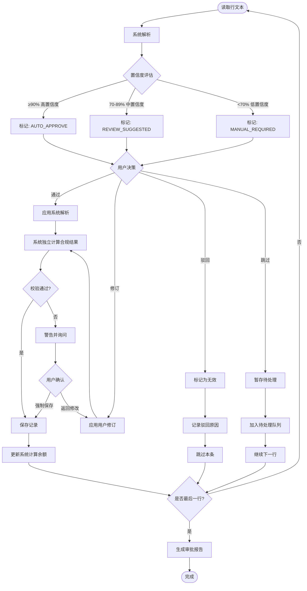

### 12.7 批量审批与逐行审批对比

| 特性 | 批量导入模式 | 逐行审批模式 |
|------|--------------|--------------|
| 适用场景 | 格式规范、高置信度记录 | 格式松散、需要人工确认 |
| 处理速度 | 快 (>100条/秒) | 慢 (人工决定) |
| 准确率 | 依赖自动解析 | 人工保证 |
| 置信度阈值 | ≥90%自动通过 | 所有记录都展示 |
| 纠错能力 | 事后修正 | 实时修正 |
| 合规审查 | 事后检查 | 实时判定 |
| 用户体验 | 等待结果 | 交互式确认 |

### 12.8 审批报告示例

```
═══════════════════════════════════════════════════════════════════════════════
                         审批完成报告
═══════════════════════════════════════════════════════════════════════════════

文件: employee_ot_record/xuchen.md
员工: 徐晨
审批时间: 2026-04-04 14:32:18

┌─────────────────────────────────────────────────────────────────────────────┐
│ 统计摘要                                                                     │
│                                                                             │
│   总记录数:        37                                                       │
│   ├─ 自动通过:     12 (32.4%)                                               │
│   ├─ 人工通过:     20 (54.1%)                                               │
│   ├─ 人工修订:      3 (8.1%)                                                │
│   └─ 驳回:          2 (5.4%)                                                │
│                                                                             │
│ 加班统计:                                                                   │
│   ├─ 工作日延时:   15.5小时 (1.5倍工资，不可调休)                           │
│   ├─ 周末加班:     30.0小时 (可调休30.0小时)                                │
│   └─ 法定假日:      0.0小时                                                 │
│                                                                             │
│ 调休抵扣:                                                                   │
│   ├─ 调休使用:     40.0小时                                                 │
│   └─ 调休余额:      0.0小时 (全部用完)                                      │
│                                                                             │
│ 驳回记录:                                                                   │
│   ├─ 行3: "海军中学晚上半天" - 集体活动，不计入加班                         │
│   └─ 行23: "午餐会1小时" - 公司福利活动，不计入加班                         │
│                                                                             │
│ 修订记录:                                                                   │
│   ├─ 行57: 2025.2.24 → 2026.2.24 (年份修正)                                 │
│   ├─ 行27: 请假 → 调休 (类型修正)                                           │
│   └─ 行31: 时长 15 → 7 (按标准工时计算)                                     │
│                                                                             │
└─────────────────────────────────────────────────────────────────────────────┘

═══════════════════════════════════════════════════════════════════════════════
                              [导出报告] [完成]
═══════════════════════════════════════════════════════════════════════════════
```

