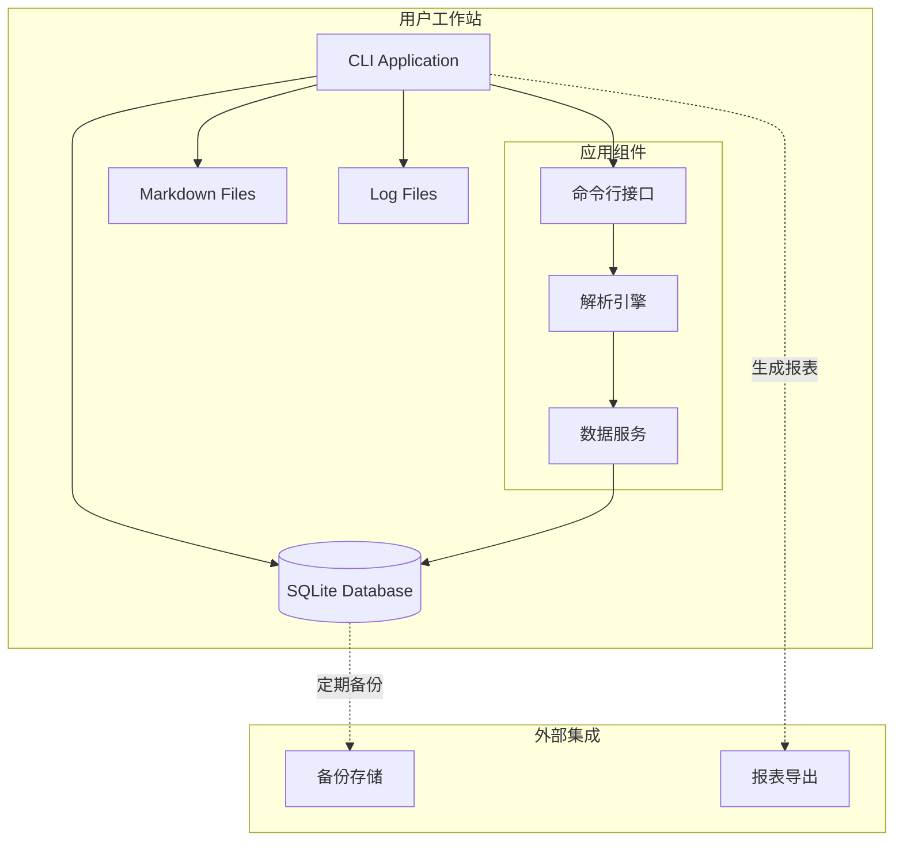
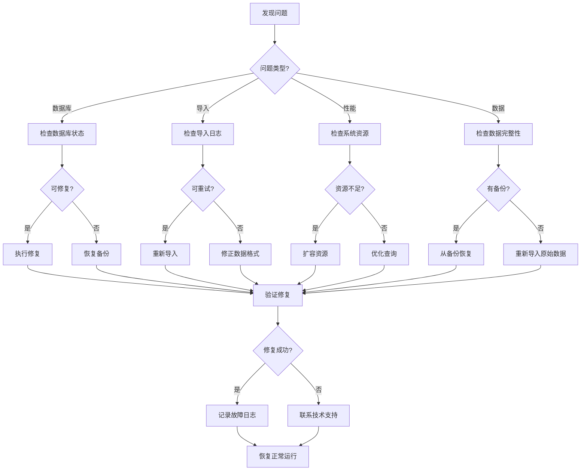
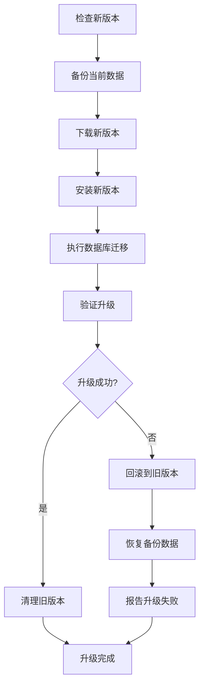

# 加班记录分析系统 - 部署与运维文档

## 1. 文档信息

| 项目 | 内容 |
|------|------|
| 文档名称 | 部署与运维文档 |
| 版本 | 1.0 |
| 创建日期 | 2026-04-04 |
| 状态 | 初稿 |

---

## 2. 部署架构

### 2.1 单机部署架构



### 2.2 部署环境要求

| 组件 | 最低要求 | 推荐配置 |
|------|----------|----------|
| Python | 3.9 | 3.11+ |
| 内存 | 512 MB | 1 GB |
| 磁盘 | 100 MB | 1 GB+ |
| 操作系统 | Windows 10 / macOS 10.15 / Linux | 最新稳定版 |

---

## 3. 安装部署

### 3.1 安装步骤

```bash
# 1. 克隆代码仓库
git clone https://github.com/your-org/ot-calculation.git
cd ot-calculation

# 2. 创建虚拟环境
python -m venv venv

# 3. 激活虚拟环境
# Linux/macOS:
source venv/bin/activate
# Windows:
venv\Scripts\activate

# 4. 安装依赖
pip install -e "."

# 5. 初始化数据库
otcalc init-db

# 6. 验证安装
otcalc --version
```

### 3.2 配置文件

```yaml
# config.yaml

database:
  url: "sqlite:///./data/ot_calculation.db"
  echo: false  # 是否输出SQL日志

logging:
  level: INFO
  format: text  # text 或 json
  file: "./logs/ot_calculation.log"

parsing:
  rules_file: "./config/rules.yaml"
  confidence_threshold: 0.7

import:
  batch_size: 100
  max_workers: 4
  encoding: "utf-8"

backup:
  enabled: true
  directory: "./backups"
  retention_days: 30
```

### 3.3 环境变量

| 变量名 | 说明 | 默认值 |
|--------|------|--------|
| `OTCALC_DATABASE_URL` | 数据库连接URL | `sqlite:///./ot_calculation.db` |
| `OTCALC_LOG_LEVEL` | 日志级别 | `INFO` |
| `OTCALC_CONFIG_PATH` | 配置文件路径 | `./config.yaml` |
| `OTCALC_DATA_DIR` | 数据目录 | `./data` |

---

## 4. 数据库管理

### 4.1 数据库初始化

```python
# scripts/init_db.py

from ot_calculation.repositories.database import init_database
from ot_calculation.core.models import Base

def main():
    """初始化数据库"""
    engine = init_database()
    
    # 创建所有表
    Base.metadata.create_all(engine)
    
    print("数据库初始化完成")

if __name__ == "__main__":
    main()
```

### 4.2 数据库迁移

```bash
# 创建迁移脚本
alembic revision --autogenerate -m "add new table"

# 执行迁移
alembic upgrade head

# 回滚迁移
alembic downgrade -1

# 查看当前版本
alembic current

# 查看历史版本
alembic history
```

### 4.3 数据库备份与恢复

```python
# scripts/backup_db.py

import shutil
from datetime import datetime
from pathlib import Path

from ot_calculation.config.settings import get_settings


def backup_database():
    """备份数据库"""
    settings = get_settings()
    db_path = settings.database_path
    
    if not db_path.exists():
        print(f"数据库文件不存在: {db_path}")
        return
    
    # 创建备份目录
    backup_dir = Path("./backups")
    backup_dir.mkdir(exist_ok=True)
    
    # 生成备份文件名
    timestamp = datetime.now().strftime("%Y%m%d_%H%M%S")
    backup_file = backup_dir / f"ot_calculation_backup_{timestamp}.db"
    
    # 复制数据库文件
    shutil.copy2(db_path, backup_file)
    
    print(f"数据库已备份到: {backup_file}")
    return backup_file


def restore_database(backup_file: Path):
    """恢复数据库"""
    settings = get_settings()
    db_path = settings.database_path
    
    if not backup_file.exists():
        print(f"备份文件不存在: {backup_file}")
        return
    
    # 备份当前数据库
    if db_path.exists():
        timestamp = datetime.now().strftime("%Y%m%d_%H%M%S")
        current_backup = db_path.parent / f"ot_calculation_before_restore_{timestamp}.db"
        shutil.copy2(db_path, current_backup)
        print(f"当前数据库已备份到: {current_backup}")
    
    # 恢复备份
    shutil.copy2(backup_file, db_path)
    print(f"数据库已从 {backup_file} 恢复")


if __name__ == "__main__":
    import sys
    
    if len(sys.argv) < 2:
        print("用法: python backup_db.py [backup|restore] [backup_file]")
        sys.exit(1)
    
    command = sys.argv[1]
    
    if command == "backup":
        backup_database()
    elif command == "restore" and len(sys.argv) >= 3:
        restore_database(Path(sys.argv[2]))
    else:
        print("无效的命令")
        sys.exit(1)
```

---

## 5. 日常运维

### 5.1 常用运维命令

```bash
# 查看帮助
otcalc --help

# 导入数据
otcalc import file --file ./data/records.md --employee E001
otcalc import directory --dir ./data/records/ --employee E001

# 查询数据
otcalc query --employee E001
otcalc query --employee E001 --month 2025-09
otcalc query --start-date 2025-09-01 --end-date 2025-09-30

# 生成统计报表
otcalc stats monthly --month 2025-09
otcalc stats yearly --year 2025
otcalc stats employee --employee E001

# 导出数据
otcalc export --format csv --output ./reports/overtime_records.csv
otcalc export --format json --output ./reports/overtime_records.json

# 数据库维护
otcalc db vacuum
otcalc db analyze
otcalc db backup
```

### 5.2 日志管理

```python
# scripts/rotate_logs.py

import gzip
from datetime import datetime, timedelta
from pathlib import Path


def rotate_logs(log_dir: Path = Path("./logs"), retention_days: int = 30):
    """轮转日志文件"""
    if not log_dir.exists():
        return
    
    cutoff_date = datetime.now() - timedelta(days=retention_days)
    
    for log_file in log_dir.glob("*.log"):
        # 检查文件修改时间
        mtime = datetime.fromtimestamp(log_file.stat().st_mtime)
        
        if mtime < cutoff_date:
            # 压缩旧日志
            archive_file = log_file.with_suffix(".log.gz")
            with open(log_file, "rb") as f_in:
                with gzip.open(archive_file, "wb") as f_out:
                    f_out.write(f_in.read())
            
            # 删除原文件
            log_file.unlink()
            print(f"已归档: {log_file} -> {archive_file}")


if __name__ == "__main__":
    rotate_logs()
```

### 5.3 监控检查清单

| 检查项 | 频率 | 命令/方法 |
|--------|------|-----------|
| 数据库大小 | 每日 | `ls -lh data/*.db` |
| 日志文件大小 | 每日 | `ls -lh logs/*.log` |
| 备份状态 | 每日 | 检查备份目录 |
| 磁盘空间 | 每周 | `df -h` |
| 数据一致性 | 每周 | `otcalc db verify` |

---

## 6. 故障处理

### 6.1 常见问题及解决方案

| 问题 | 症状 | 解决方案 |
|------|------|----------|
| 数据库锁定 | `database is locked` 错误 | 1. 检查是否有其他进程占用<br>2. 重启应用<br>3. 使用 `sqlite3 db.db ".backup backup.db"` 修复 |
| 导入失败 | 解析错误 | 1. 检查文件编码<br>2. 查看 import_records 表<br>3. 手动修正数据格式 |
| 性能下降 | 操作变慢 | 1. 执行 `VACUUM`<br>2. 检查索引<br>3. 优化查询条件 |
| 数据丢失 | 记录缺失 | 1. 检查导入日志<br>2. 从备份恢复<br>3. 重新导入数据 |

### 6.2 故障处理流程



---

## 7. 安全管理

### 7.1 数据安全

```bash
# 设置文件权限
chmod 600 data/ot_calculation.db
chmod 700 data/
chmod 600 config.yaml

# 加密备份（可选）
gpg --symmetric --cipher-algo AES256 backup.db
```

### 7.2 访问控制

```python
# 文件权限检查
import os
from pathlib import Path


def check_file_permissions():
    """检查文件权限"""
    files_to_check = [
        Path("./data/ot_calculation.db"),
        Path("./config.yaml"),
    ]
    
    for file_path in files_to_check:
        if file_path.exists():
            mode = oct(file_path.stat().st_mode)[-3:]
            print(f"{file_path}: {mode}")
            
            if mode != "600":
                print(f"  警告: 建议设置权限为 600")
```

---

## 8. 性能优化

### 8.1 数据库优化

```sql
-- 分析表（更新统计信息）
ANALYZE;

-- 清理碎片
VACUUM;

-- 重建索引
REINDEX;

-- 检查数据库完整性
PRAGMA integrity_check;
```

### 8.2 批量导入优化

```python
# 使用事务批量导入
from sqlalchemy.orm import Session

def batch_import(records: list, batch_size: int = 100):
    """批量导入记录"""
    session = Session()
    
    try:
        for i in range(0, len(records), batch_size):
            batch = records[i:i + batch_size]
            session.bulk_save_objects(batch)
            session.commit()
            print(f"已导入 {i + len(batch)} / {len(records)}")
    except Exception as e:
        session.rollback()
        raise
    finally:
        session.close()
```

---

## 9. 升级维护

### 9.1 版本升级流程



### 9.2 升级检查清单

- [ ] 备份当前数据库
- [ ] 备份配置文件
- [ ] 记录当前版本号
- [ ] 阅读升级说明
- [ ] 执行数据库迁移
- [ ] 验证核心功能
- [ ] 检查数据完整性
- [ ] 更新文档

---

## 10. 灾难恢复

### 10.1 灾难恢复计划

| 灾难场景 | 恢复策略 | RTO | RPO |
|----------|----------|-----|-----|
| 数据库损坏 | 从备份恢复 | 1小时 | 24小时 |
| 数据误删除 | 从事务日志恢复 | 2小时 | 实时 |
| 系统崩溃 | 重新安装 + 恢复数据 | 4小时 | 24小时 |
| 硬件故障 | 迁移到新机器 | 8小时 | 24小时 |

### 10.2 恢复流程

```bash
# 1. 停止应用
pkill -f otcalc

# 2. 备份当前状态（即使已损坏）
cp data/ot_calculation.db data/ot_calculation_corrupted.db

# 3. 从备份恢复
python scripts/backup_db.py restore backups/ot_calculation_backup_20250101_120000.db

# 4. 验证数据完整性
otcalc db verify

# 5. 重启应用
otcalc --version
```

---

## 11. 附录

### 11.1 目录结构规范

```
ot_calculation/
├── data/                    # 数据目录
│   ├── ot_calculation.db   # 主数据库
│   └── archive/            # 归档数据
├── config/                 # 配置目录
│   ├── config.yaml        # 主配置
│   └── rules.yaml         # 解析规则
├── logs/                   # 日志目录
│   └── ot_calculation.log
├── backups/               # 备份目录
│   └── ot_calculation_backup_*.db
├── reports/               # 报表输出
└── imports/               # 导入文件
```

### 11.2 常用 SQL 查询

```sql
-- 查看导入统计
SELECT 
    filename,
    status,
    total_lines,
    success_count,
    error_count,
    imported_at
FROM import_sessions
ORDER BY imported_at DESC;

-- 查看解析错误
SELECT 
    fi.filename,
    pl.line_number,
    pl.raw_text,
    pl.error_message
FROM import_records pl
JOIN import_sessions fi ON pl.file_import_id = fi.id
WHERE pl.parse_status = 'error'
ORDER BY pl.created_at DESC;

-- 员工加班统计
SELECT 
    e.employee_code,
    e.name,
    COUNT(*) as record_count,
    SUM(CASE WHEN r.record_type = 'overtime' THEN r.hours ELSE 0 END) as total_overtime,
    SUM(CASE WHEN r.record_type = 'leave' THEN ABS(r.hours) ELSE 0 END) as total_leave
FROM employees e
LEFT JOIN overtime_records r ON e.id = r.employee_id
GROUP BY e.id, e.employee_code, e.name;
```

### 11.3 联系信息

| 角色 | 联系方式 | 职责 |
|------|----------|------|
| 系统管理员 | admin@company.com | 日常运维、故障处理 |
| 数据库管理员 | dba@company.com | 数据库管理、备份恢复 |
| 开发团队 | dev@company.com | 技术支持、版本升级 |
