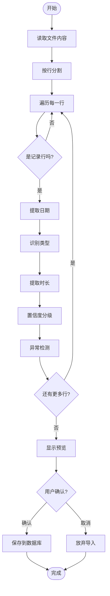

# 记录导入功能文档

> 本文档描述记录导入功能的完整流程，包括文件上传、解析预览、确认导入三步流程。

---

## 文档信息

| 项目 | 内容 |
|------|------|
| 文档名称 | 记录导入功能文档 |
| 版本 | 1.0 |
| 创建日期 | 2026-04-07 |
| 功能类型 | 数据导入功能 |

---

## 1. 功能概述

### 1.1 功能目标

提供用户友好的记录导入界面，支持从 Markdown 文件中批量导入加班、请假、调休记录。采用"上传-预览-确认"三步流程，确保数据准确性。

### 1.2 使用场景

1. **月度记录导入** - 每月导入员工的加班、请假记录
2. **历史数据迁移** - 批量导入历史记录
3. **员工个人导入** - 从员工详情页直接导入该员工记录

### 1.3 导入流程

```
┌─────────────┐    ┌─────────────┐    ┌─────────────┐
│  1.上传文件  │ -> │  2.预览确认  │ -> │  3.保存数据  │
└─────────────┘    └─────────────┘    └─────────────┘
```

---

## 2. 界面流程

### 2.1 第一步：上传文件

**访问路径：**
- 全局导入：`/records/import/`
- 员工专属导入：`/records/import/employee/<employee_id>/`

**界面元素（初始状态）：**

```
═══════════════════════════════════════════════════════════════════════════════
                         记录导入
═══════════════════════════════════════════════════════════════════════════════

┌─────────────────────────────────────────────────────────────────────────────┐
│ 选择员工: [张三 (E001) ▼]                                                   │
│                                                                             │
│ 选择文件:                                                                   │
│ ┌─────────────────────────────────────────────────────────────────────────┐ │
│ │                                                                         │ │
│ │                    [cloud_upload]                                       │ │
│ │                    点击或拖拽文件到此处上传                              │ │
│ │                    支持 .md, .markdown, .txt 格式                       │ │
│ │                                                                         │ │
│ └─────────────────────────────────────────────────────────────────────────┘ │
│                                                                             │
│ 文件格式示例:                                                               │
│ ┌─────────────────────────────────────────────────────────────────────────┐ │
│ │ ## 2024年1月加班记录                                                    │ │
│ │ **2024-01-15** 晚上加班2小时，完成项目文档                              │ │
│ │ **2024-01-20** 周六加班4小时，系统维护                                  │ │
│ │ **2024-01-25** 请假半天，病假                                           │ │
│ └─────────────────────────────────────────────────────────────────────────┘ │
│                                                                             │
│                              [开始导入]                                     │
└─────────────────────────────────────────────────────────────────────────────┘

═══════════════════════════════════════════════════════════════════════════════
```

**解析进度界面（点击"开始导入"后）：**

```
═══════════════════════════════════════════════════════════════════════════════
                         解析进度实时显示
═══════════════════════════════════════════════════════════════════════════════

┌─────────────────────────────────────────────────────────────────────────────┐
│                                                                             │
│                        ┌──────────────┐                                     │
│                        │   [⟳ 动画]   │                                     │
│                        └──────────────┘                                     │
│                                                                             │
│                    正在使用AI解析记录...                                    │
│                                                                             │
│  ┌─────────────────────────────────────────────────────────────────────┐   │
│  │████████████████████████████████░░░░░░░░░░░░░░░░░░░░░░░░░░░░░░░░░░░░│   │
│  └─────────────────────────────────────────────────────────────────────┘   │
│    60%                                          AI解析中...                 │
│                                                                             │
│  ┌─────────────────────────────────────────────────────────────────────┐   │
│  │ 22:15:32  ▶  正在启动...                                            │   │
│  │ 22:15:32  📂 读取文件中（共25行）...                                 │   │
│  │ 22:15:33  🤖 AI解析中（25行）...                                    │   │
│  │ 22:15:35  ✓ AI解析完成，识别24条记录                                │   │
│  │ 22:15:35  📊 分析置信度和异常...                                    │   │
│  └─────────────────────────────────────────────────────────────────────┘   │
│                                                                             │
└─────────────────────────────────────────────────────────────────────────────┘

═══════════════════════════════════════════════════════════════════════════════
```

**进度显示说明：**

| 步骤 | 图标 | 说明 | 预计时间 |
|------|------|------|---------|
| start | ▶ | 初始化解析 | <1秒 |
| extract | 📂 | 提取有效行 | <1秒 |
| ai_start | 🤖 | AI模型解析 | 2-5秒 |
| ai_done | ✓ | AI解析完成 | - |
| local_start | 📋 | 本地规则解析 | 1-3秒 |
| process | 📊 | 置信度分析 | <1秒 |
| complete | 🎉 | 解析完成 | - |

**支持文件格式：**
- `.md` - Markdown 文件
- `.markdown` - Markdown 文件
- `.txt` - 纯文本文件

### 2.2 第二步：预览确认

**访问路径：** `/records/import/preview/`

**界面元素：**

```
═══════════════════════════════════════════════════════════════════════════════
                         导入预览
═══════════════════════════════════════════════════════════════════════════════

解析概览:
┌──────────────┬──────────────┬──────────────┬──────────────┐
│     15       │     10       │      4       │      1       │
│   总记录数    │   高置信度    │   中置信度   │  低置信度/需检查│
└──────────────┴──────────────┴──────────────┴──────────────┘

⚠️ 检测到有异常记录，请仔细检查标记为"警告"的行，点击"编辑"进行修改

待导入记录:                                          15 条
┌─────────────────────────────────────────────────────────────────────────────┐
│ ✓ │ 行号 │    日期    │  类型  │ 子类型  │ 时长 │     内容摘要     │ 操作 │
├─────────────────────────────────────────────────────────────────────────────┤
│ ✓ │  3   │ 2024-01-15│ [加班] │ 晚上   │ 2.0h │ 晚上加班2小时... │ [编辑]│
│ ✓ │  4   │ 2024-01-20│ [加班] │ 周末   │ 4.0h │ 周六加班4小时... │ [编辑]│
│ ✓ │  5   │ 2024-01-25│ [请假] │ 病假   │ 4.0h │ 请假半天，病假   │ [编辑]│
│ ☐ │  6   │ 未识别    │ [未知] │ -      │  -   │ 累计加班100小时  │ [编辑]│
└─────────────────────────────────────────────────────────────────────────────┘

                          [取消导入]    [确认导入]
═══════════════════════════════════════════════════════════════════════════════
```

**列表显示字段：**

| 字段 | 说明 |
|------|------|
| 行号 | MD文件中的行号 |
| 日期 | 解析出的日期（YYYY-MM-DD）|
| 星期 | 根据日期自动计算（周一/周二/.../周日）|
| 类型 | 加班/请假/调休/未知 |
| 子类型 | 具体分类（如工作日-晚上、病假等）|
| 时长 | 小时数（如2.0h）|
| 原始内容（MD）| **100%复现原始MD文件中的该行内容**，方便比对确认 |
| 状态 | 置信度级别（高/中/低）和警告图标 |
| 操作 | 编辑、删除按钮 |

**逐行编辑功能：**

点击"编辑"按钮后，该行展开为可编辑表单：

```
┌─────────────────────────────────────────────────────────────────────────────┐
│ 编辑记录（第6行）                                                            │
├─────────────────────────────────────────────────────────────────────────────┤
│                                                                             │
│  日期 *        类型 *         子类型 *         时长（小时）                   │
│  ┌────────┐   ┌────────┐    ┌────────────┐   ┌────────┐                    │
│  │2024-01-│   │ 加班   ▼│    │ 工作日-晚上 ▼│   │  2.0   │                    │
│  │   25   │   │ 请假   │    │ 工作日-早上  │   └────────┘                    │
│  └────────┘   │ 调休   │    │ 周末       │                                 │
│               └────────┘    └────────────┘                                 │
│                                                                             │
│  描述                                                                        │
│  ┌────────────────────────────────────────────────────────────────────┐    │
│  │晚上加班2小时，完成项目文档                                          │    │
│  └────────────────────────────────────────────────────────────────────┘    │
│                                                                             │
│                                    [取消]  [保存]                           │
└─────────────────────────────────────────────────────────────────────────────┘
```

**删除功能：**

每行右侧都有"删除"按钮，点击后确认删除该行记录。删除后：
- 该行从列表中消失
- 总计数自动更新
- 所有行删除后，确认导入按钮变为不可用

**置信度说明：**

| 级别 | 标识 | 说明 |
|------|------|------|
| HIGH | 绿色"高"标签 | 解析结果可信，建议导入 |
| MEDIUM | 蓝色"中"标签 | 解析结果基本可信，建议检查 |
| LOW | 红色"低"标签 | 解析结果存疑，需要人工确认 |

**异常标记：**

| 异常类型 | 说明 |
|----------|------|
| 加班时长过长 | 超过12小时的加班 |
| 未来日期 | 日期大于今天 |
| 类型不匹配 | 周末但标记为工作日加班 |

### 2.3 第三步：保存结果

导入完成后，系统显示操作结果：

```
✅ 导入完成: 成功 14 条, 失败 1 条
   - 第6行: 日期解析失败
```

---

## 3. 技术实现

### 3.1 解析流程



### 3.2 解析规则 (仅AI大模型解析)

系统**仅使用AI大模型解析**，不再回退到本地规则：

```
用户上传文件
    │
    ▼
┌─────────────────┐
│  提取有效行      │
└────────┬────────┘
         │
         ▼
┌─────────────────┐
│   AI模型解析     │
│  (Claude API)   │
└────────┬────────┘
         │
         ▼
┌─────────────────┐
│  置信度分级/异常检测 │
└─────────────────┘
```

**AI解析特点：**
- 理解自然语言描述，不受固定关键词限制
- 自动识别上下文语义（如"下午2小时"默认识别为加班）
- 支持复杂句式和非标准表达
- 返回置信度分数，便于人工复核
- **显示完整Prompt和Response，透明可审计**

**失败处理：**
- AI解析失败时**不再回退到本地规则**
- 直接显示错误信息和完整的AI交互记录
- 便于用户了解失败原因并调整输入

---

**日期提取：**
```python
# 支持的格式
"2024.01.15"           # 标准格式
"2024-01-15"           # ISO格式
"2024年1月15日"         # 中文格式
"2024.01.15-17"        # 日期范围（同月）
"2024.01.15-02.20"     # 日期范围（跨月）
```

**类型识别：**

| 类型 | 关键词/模式 | 示例 | 默认子类型 |
|------|------------|------|-----------|
| 加班 | 晚上、早、中午、加班、小时 | "晚上加班2小时" | 根据关键词判断 |
| **加班** | **下午xx小时、晚上xx小时** | "**下午2小时**"、"**晚上3小时**" | **工作日-晚上** |
| 请假 | 请假、病假、事假、年假 | "请假半天，病假" | 需选择具体类型 |
| 调休 | 调休、补休 | "调休一天" | 半天/全天 |
| 参考 | 累计、余额、剩余 | "累计加班100小时" | - |

**特殊规则：**

- **下午xx小时** 或 **晚上xx小时**：如果没有"请假"、"调休"、"休假"等字样，默认识别为**加班**，子类型为**工作日-晚上**
- 这样可以简化MD文件的编写，只需要写 `**2024-01-15** 晚上2小时` 即可识别为工作日晚上加班2小时

**时长提取：**

| 描述 | 解析结果 |
|------|----------|
| "2小时" | 2.0h |
| "2.5小时" | 2.5h |
| "30分钟" | 0.5h |
| "半天" | 4.0h |
| "一天" | 8.0h |
| "2天" | 16.0h |

### 3.3 AI解析配置

AI解析服务使用**硬编码配置**（位于 `src/services/ai_parser_service.py`）：

```python
# 火山方舟API配置（硬编码）
API_KEY = "39fb2f6b-3062-41f7-8abb-3e879f03270b"
BASE_URL = "https://ark.cn-beijing.volces.com/api/v3"
MODEL = "ep-20260331092634-wfnm8"
```

**模型参数：**
| 参数 | 值 | 说明 |
|------|-----|------|
| 服务提供商 | 火山引擎（Volces） | 字节跳动旗下云服务 |
| 模型端点 | ep-20260331092634-wfnm8 | 火山方舟大模型端点 |
| temperature | 0.1 | 低随机性，保证解析一致性 |
| max_tokens | 4000 | 支持批量解析 |
| timeout | 300秒 | API调用超时时间 |

**调用方式：**
- 优先使用 OpenAI SDK 调用（如果已安装 `openai` 包）
- 备选使用 `requests` 直接调用 REST API

**解析规则示例：**

AI模型内置的解析规则包括：

| 文本示例 | AI识别结果 | 置信度 |
|---------|-----------|-------|
| "晚上加班2小时，完成项目文档" | type=overtime, subtype=weekday_evening, hours=2.0 | 0.95 |
| "下午3小时，处理紧急bug" | type=overtime, subtype=weekday_evening, hours=3.0 | 0.85 |
| "请假半天，病假" | type=leave, subtype=sick, hours=4.0 | 0.95 |
| "周六加班4小时" | type=overtime, subtype=weekend, hours=4.0 | 0.98 |

---

### 3.4 数据存储

根据记录类型，数据存储到不同的表：

```sql
-- 加班记录 -> overtime_records
INSERT INTO overtime_records
(employee_id, date, hours, overtime_type, description, source, status)
VALUES (?, ?, ?, ?, ?, 'file_import', 'pending');

-- 请假记录 -> leave_records
INSERT INTO leave_records
(employee_id, date, days, leave_type, description, source, status)
VALUES (?, ?, ?, ?, ?, 'file_import', 'pending');

-- 调休记录 -> comp_off_usage_records
INSERT INTO comp_off_usage_records
(employee_id, date, days_used, description, source)
VALUES (?, ?, ?, ?, 'file_import');
```

---

## 4. 接口说明

### 4.1 路由列表

| 路由 | 方法 | 说明 |
|------|------|------|
| `/records/import/` | GET/POST | 通用导入页面 |
| `/records/import/progress/` | GET | **解析进度API（AJAX轮询）** |
| `/records/import/preview/` | GET | 预览页面 |
| `/records/import/confirm/` | POST | 确认导入 |
| `/records/import/cancel/` | GET | 取消导入 |
| `/records/import/employee/<id>/` | GET/POST | 指定员工导入 |

**进度API响应格式：**

```json
{
  "progress": [
    {
      "timestamp": "22:15:32",
      "step": "ai_start",
      "message": "AI解析中（25行）...",
      "progress": 25
    },
    {
      "timestamp": "22:15:35",
      "step": "ai_done",
      "message": "AI解析完成，识别24条记录",
      "progress": 60
    }
  ],
  "latest": {
    "timestamp": "22:15:35",
    "step": "ai_done",
    "message": "AI解析完成，识别24条记录",
    "progress": 60
  },
  "total_steps": 2
}
```

### 4.2 Session 数据结构

预览数据存储在 Session 中：

```python
{
    'employee_id': 'E001',
    'employee_name': '张三',
    'filename': '2024-01-overtime.md',
    'records': [...],  # 解析后的记录列表
    'total_count': 15,
    'high_confidence': 10,
    'medium_confidence': 4,
    'low_confidence': 1,
    'has_anomalies': True
}
```

**如何使用逐行编辑功能：**

1. **发现问题记录**：在预览表格中，标记为"低"置信度或有 ⚠️ 警告图标的行需要关注
2. **点击编辑**：在该行右侧点击"编辑"按钮，展开编辑表单
3. **修改字段**：
   - **日期**：如果原日期未识别，使用日期选择器选择正确日期
   - **类型**：从下拉菜单选择正确的记录类型（加班/请假/调休）
   - **子类型**：选择具体子类型，如加班时段或请假类型
   - **时长**：修改小时数（支持小数如2.5）
   - **描述**：编辑记录描述文本
4. **保存修改**：点击"保存"按钮，该行会更新为"已编辑"状态
5. **确认导入**：所有记录检查无误后，点击"确认导入"

---

## 5. 员工详情页集成

在员工详情页面添加了"导入记录"按钮：

```
┌─────────────────────────────────────────────────────────────────────────────┐
│ [张]                                                                        │
│ 张三                                                                        │
│ E001              [导入记录]    [查看报表]                                  │
└─────────────────────────────────────────────────────────────────────────────┘
```

点击"导入记录"按钮直接跳转到该员工的专属导入页面，无需再次选择员工。

---

## 6. 错误处理

### 6.1 常见错误

| 错误提示 | 原因 | 解决方法 |
|----------|------|----------|
| "原日期未识别，请选择正确日期" | 日期格式无法解析 | 点击编辑，使用日期选择器选择正确日期 |
| "原解析缺少子类型，请选择" | 系统无法判断具体类型 | 点击编辑，从下拉菜单选择子类型 |
| "请假记录缺少leave_type" | 未识别请假类型 | 编辑后选择：事假/病假/年假等 |
| "加班记录缺少overtime_type" | 未识别加班时段 | 编辑后选择：工作日-晚上/周末/法定节假日等 |
| "加班时长过长" | 超过12小时 | 编辑时修改为正确时长 |
| "未来日期" | 日期大于今天 | 检查并修改为正确日期 |
| 类型识别失败 | 描述中无关键词 | 手动选择记录类型 |
| 时长提取失败 | 无时长描述 | 编辑时手动输入时长 |

### 6.2 用户提示

- **文件为空**："未从文件中解析出任何记录，请检查文件格式"
- **解析失败**："文件解析失败: [错误详情]"
- **导入成功**："导入完成: 成功 X 条, 失败 Y 条"
- **全部失败**："导入失败，请检查数据格式"

---

## 7. 修订历史

| 版本 | 日期 | 修订内容 | 修订人 |
|------|------|----------|--------|
| 1.0 | 2026-04-07 | 初始版本，实现三步导入流程（上传-预览-确认） | 系统管理员 |
| 1.1 | 2026-04-07 | 添加逐行编辑功能，支持修改日期、类型、子类型、时长、描述 | 系统管理员 |
| 1.2 | 2026-04-07 | 1) 添加星期几显示列<br>2) "下午/晚上xx小时"默认识别为加班(工作日-晚上)<br>3) 内容描述显示100%原始MD行<br>4) 添加删除行功能<br>5) 修复确认导入无反应问题 | 系统管理员 |
| 1.3 | 2026-04-07 | **重大升级：AI大模型解析**<br>1) 集成Claude API进行智能文本解析<br>2) AI优先+本地规则兜底的双层解析策略<br>3) 支持自然语言理解和复杂句式<br>4) 返回置信度分数指导人工复核 | 系统管理员 |
| 1.4 | 2026-04-07 | **实时进度显示**<br>1) 添加解析进度条和详细步骤日志<br>2) `/records/import/progress/` API支持AJAX轮询<br>3) 优化长耗时操作的反馈体验 | 系统管理员 |
| 1.5 | 2026-04-07 | **仅AI大模型解析**<br>1) 删除本地规则解析回退功能<br>2) AI解析失败直接报错，不回退<br>3) 显示完整的Prompt和Response便于调试<br>4) 透明展示AI解析过程和推理<br>5) 失败时停留在错误页面，等待用户操作 | 系统管理员 |

---

## 8. 相关文档

- [03-data-parsing-strategy.md](./03-data-parsing-strategy.md) - 数据解析策略
- [05-core-process-design.md](./05-core-process-design.md) - 核心流程设计
- [11-operation-sop.md](./11-operation-sop.md) - 操作SOP
