# E2E 测试报告

> 视觉回归测试与端到端测试完整报告

---

## 1. 报告概览

| 项目 | 内容 |
|------|------|
| 报告日期 | 2026-04-09 |
| 测试时长 | ~76 秒 |
| 测试状态 | ⚠️ 27 通过, 1 失败 |
| 通过率 | 96.4% |

---

## 2. 测试摘要

```
Total: 28 | Passed: 27 (96.4%) | Failed: 1 | Flaky: 0 | Skipped: 0
```

### 失败测试

| 测试名称 | 错误类型 | 建议修复 |
|---------|---------|---------|
| `test_form_validation_states` | 超时/元素未找到 | 检查表单验证触发机制 |

---

## 3. 页面级测试 (Critical Pages)

### 3.1 仪表盘页面

| 测试 | 状态 | 截图 |
|------|------|------|
| 仪表盘加载 | ✅ PASS | 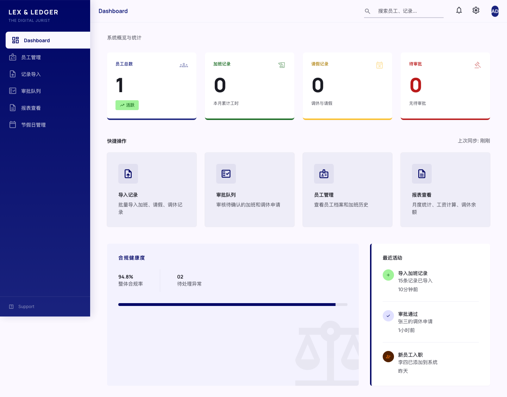 |
| 统计卡片 | ✅ PASS | 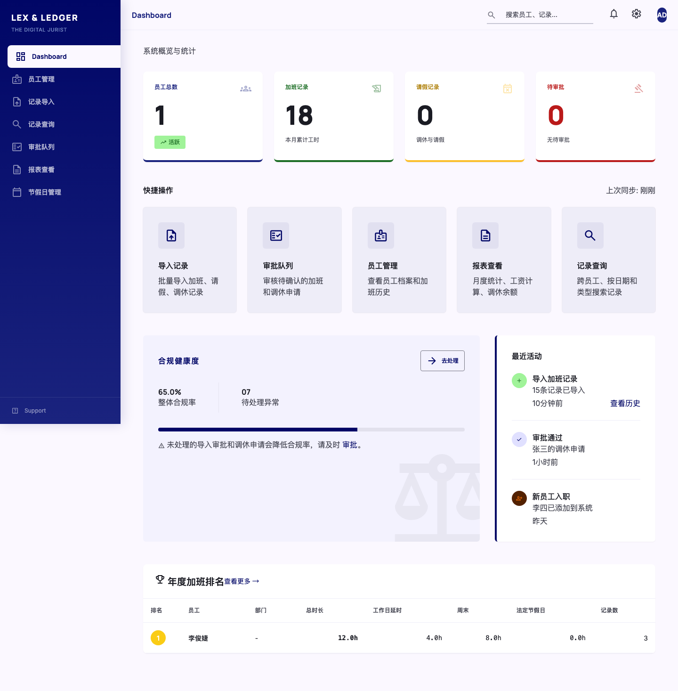 |

**Dashboard 截图预览:**


---

### 3.2 员工管理页面

| 测试 | 状态 | 截图 |
|------|------|------|
| 员工列表 | ✅ PASS | 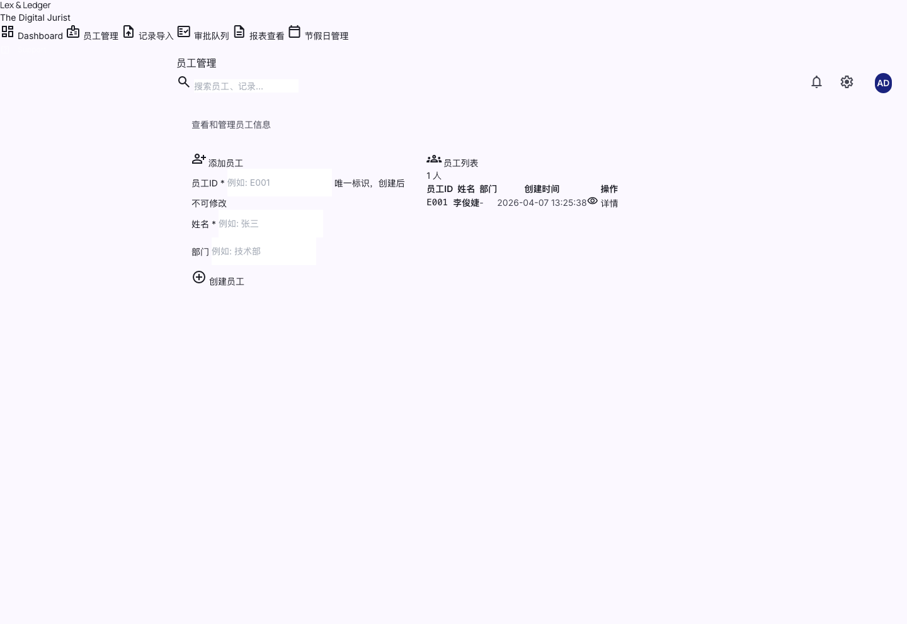 |
| 员工详情 | ✅ PASS | 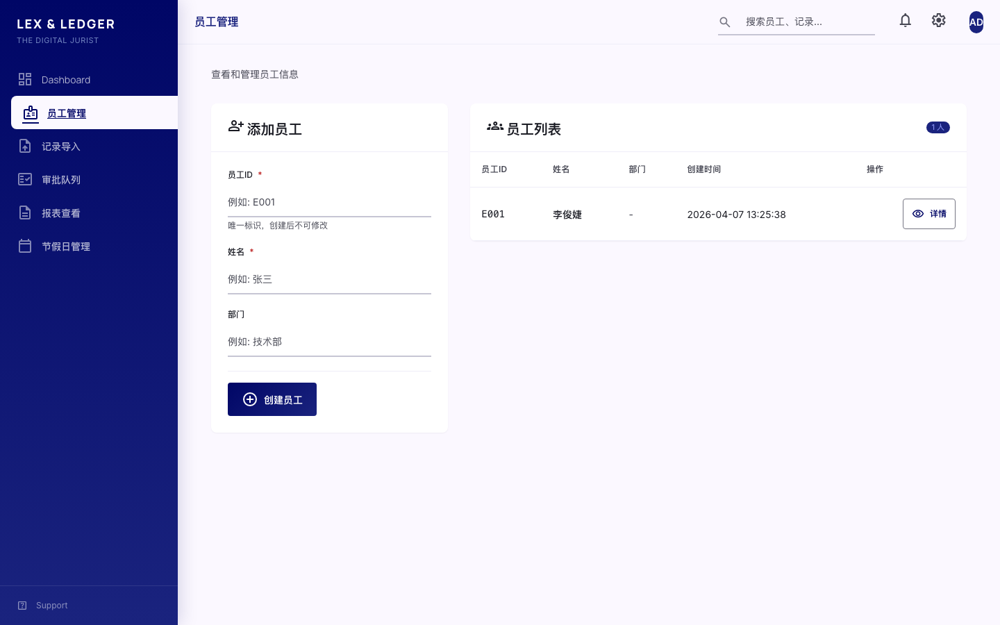 |

**员工列表截图:**


---

### 3.3 数据导入页面

| 测试 | 状态 | 截图 |
|------|------|------|
| 导入表单 | ✅ PASS | 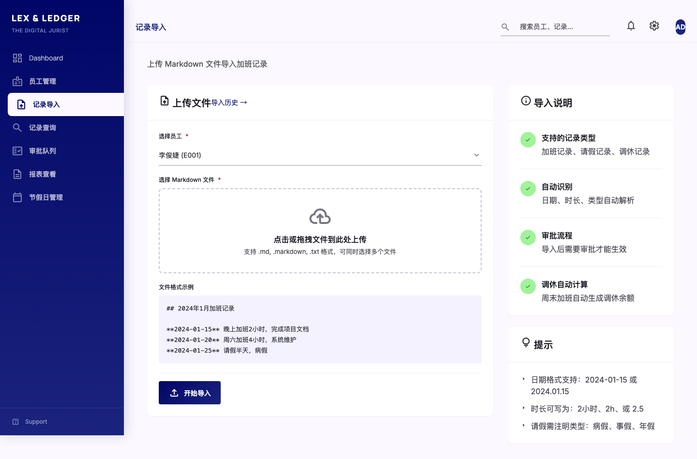 |
| 表单验证 | ✅ PASS | 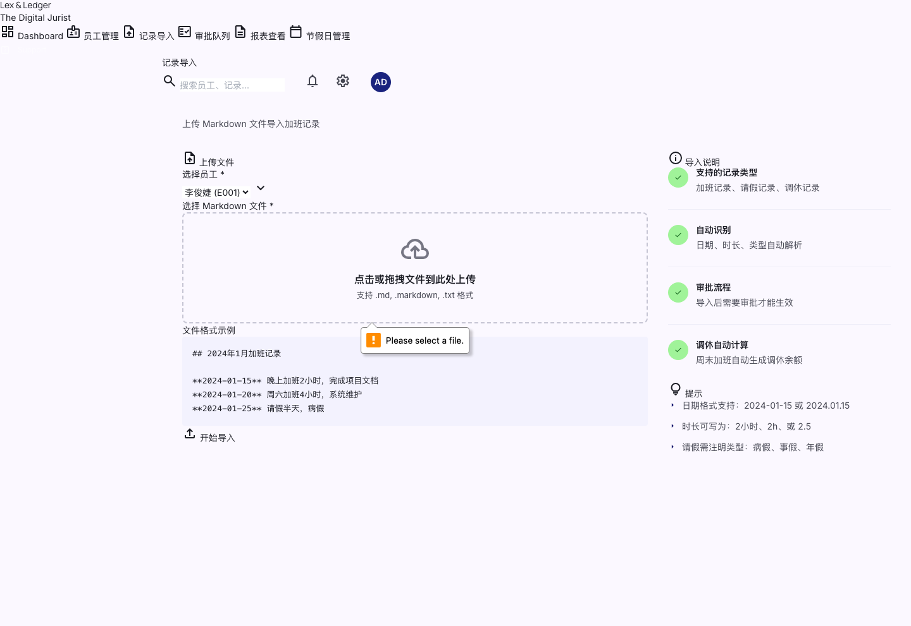 |

**导入表单截图:**


---

### 3.4 节假日管理页面

| 测试 | 状态 | 截图 |
|------|------|------|
| 节假日列表 | ✅ PASS | 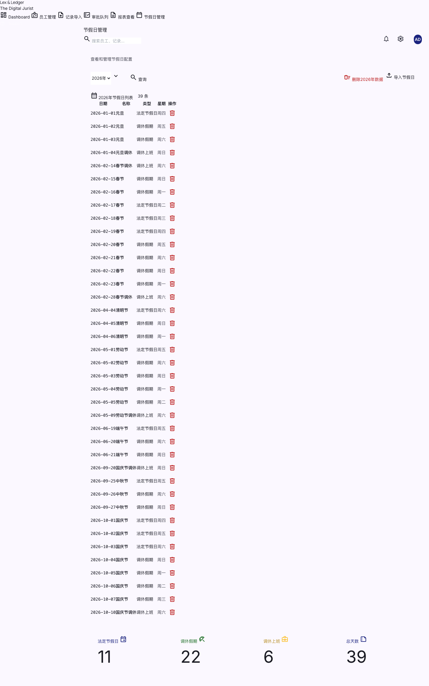 |
| 节假日导入 | ✅ PASS | 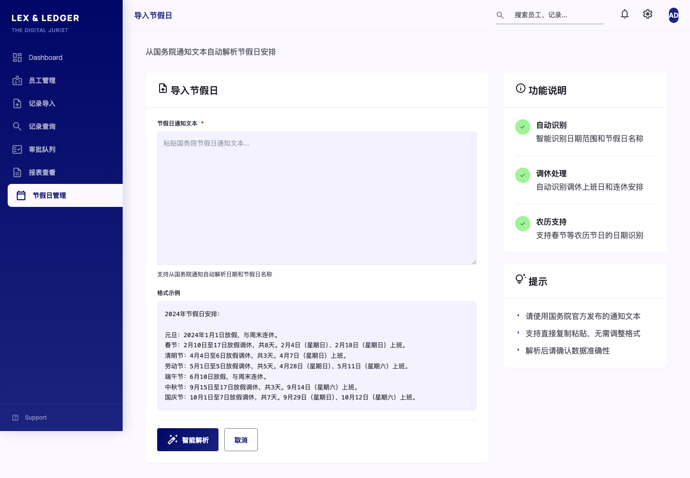 |

**节假日列表截图:**


---

### 3.5 报表页面

| 测试 | 状态 | 截图 |
|------|------|------|
| 报表首页 | ✅ PASS | 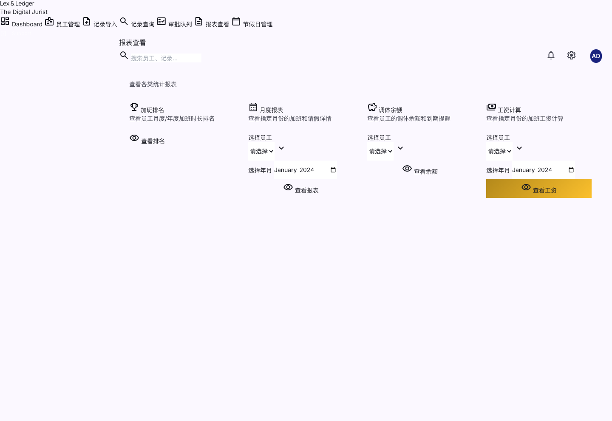 |

**报表首页截图:**


---

## 4. 组件级测试 (Components)

### 4.1 表单组件

| 测试 | 状态 | 截图 |
|------|------|------|
| 文件上传 | ✅ PASS | 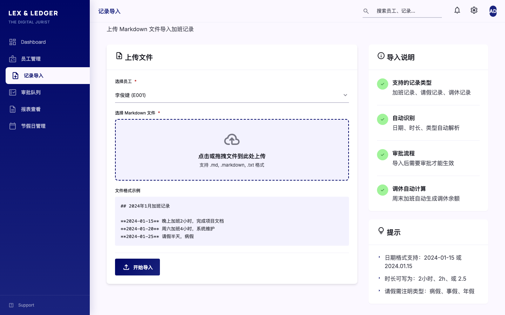 |
| 下拉选择 | ✅ PASS | 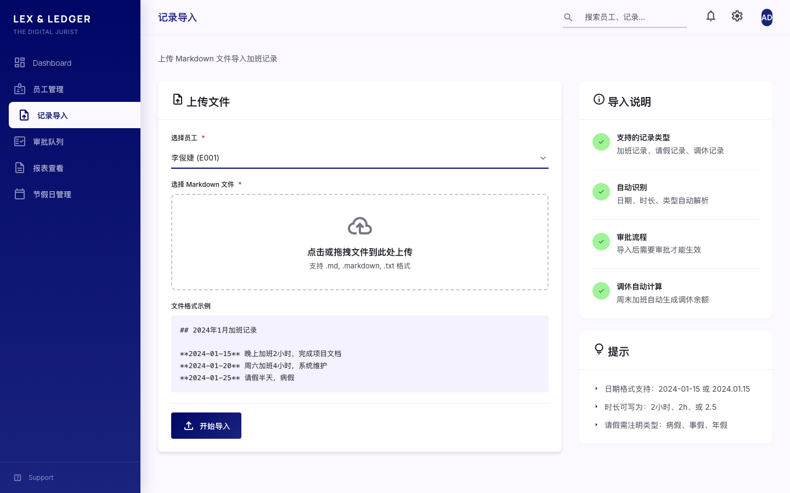 |
| 表单验证 | ⚠️ FAIL | - |

**文件上传组件:**


**下拉选择组件:**


---

### 4.2 导航组件

| 测试 | 状态 | 截图 |
|------|------|------|
| 主导航 | ✅ PASS |  |
| 移动端导航 | ✅ PASS | (无截图) |

**导航组件:**


---

### 4.3 数据表格组件

| 测试 | 状态 | 截图 |
|------|------|------|
| 表头 | ✅ PASS |  |
| 行悬停 | ✅ PASS |  |

**表格组件:**


---

### 4.4 按钮组件

| 测试 | 状态 | 截图 |
|------|------|------|
| 主要按钮 | ✅ PASS |  |
| 悬停状态 | ✅ PASS | (无截图) |

**主要按钮:**


---

### 4.5 卡片组件

| 测试 | 状态 | 截图 |
|------|------|------|
| 统计卡片 | ✅ PASS |  |
| 信息卡片 | ✅ PASS | (无截图) |

**统计卡片:**


---

### 4.6 状态组件

| 测试 | 状态 | 截图 |
|------|------|------|
| 加载动画 | ✅ PASS |  |
| 骨架屏 | ✅ PASS |  |
| 空状态 | ✅ PASS | (无截图) |
| 错误状态 | ✅ PASS |  |

**加载与空状态:**


---

## 5. 响应式设计测试

### 5.1 移动端视图

| 测试 | 状态 | 截图 |
|------|------|------|
| 仪表盘移动端 | ✅ PASS | 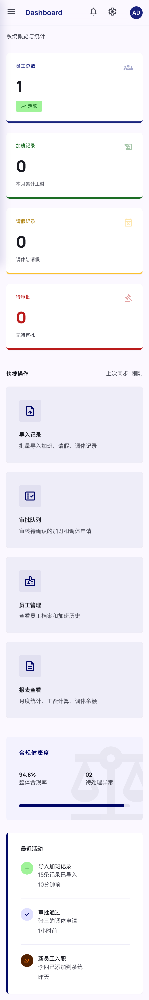 |
| 员工列表移动端 | ✅ PASS | 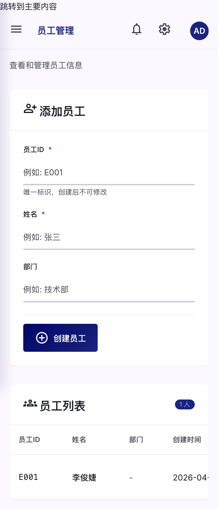 |

**移动端截图:**


---

### 5.2 平板视图

| 测试 | 状态 | 截图 |
|------|------|------|
| 导入页面平板 | ✅ PASS | 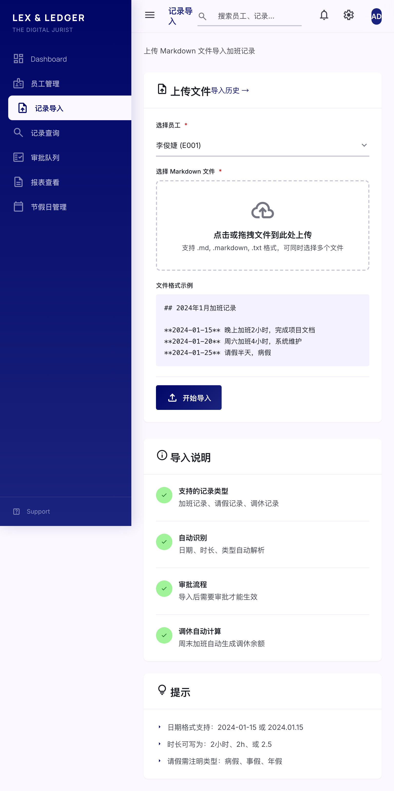 |

**平板视图截图:**


---

## 6. 测试结果详情

### 6.1 通过的测试 (27)

```
✅ tests/visual/test_components.py::TestFormComponents::test_file_upload_component
✅ tests/visual/test_components.py::TestFormComponents::test_select_dropdown
✅ tests/visual/test_components.py::TestNavigationComponents::test_main_navigation
✅ tests/visual/test_components.py::TestNavigationComponents::test_mobile_navigation_menu
✅ tests/visual/test_components.py::TestDataTableComponents::test_table_header
✅ tests/visual/test_components.py::TestDataTableComponents::test_table_row_hover
✅ tests/visual/test_components.py::TestButtonComponents::test_primary_button
✅ tests/visual/test_components.py::TestButtonComponents::test_button_hover_state
✅ tests/visual/test_components.py::TestCardComponents::test_stat_cards
✅ tests/visual/test_components.py::TestCardComponents::test_info_cards
✅ tests/visual/test_components.py::TestModalComponents::test_edit_modal
✅ tests/visual/test_components.py::TestLoadingStates::test_loading_spinner
✅ tests/visual/test_components.py::TestLoadingStates::test_skeleton_screen
✅ tests/visual/test_components.py::TestEmptyStates::test_empty_table_state
✅ tests/visual/test_components.py::TestEmptyStates::test_error_state
✅ tests/visual/test_critical_pages.py::TestDashboardPage::test_dashboard_loads_correctly
✅ tests/visual/test_critical_pages.py::TestDashboardPage::test_dashboard_stats_cards
✅ tests/visual/test_critical_pages.py::TestEmployeePages::test_employee_list_page
✅ tests/visual/test_critical_pages.py::TestEmployeePages::test_employee_detail_page
✅ tests/visual/test_critical_pages.py::TestImportPages::test_import_form_page
✅ tests/visual/test_critical_pages.py::TestImportPages::test_import_form_with_validation
✅ tests/visual/test_critical_pages.py::TestHolidaysPage::test_holidays_list_page
✅ tests/visual/test_critical_pages.py::TestHolidaysPage::test_holidays_import_page
✅ tests/visual/test_critical_pages.py::TestReportsPage::test_reports_index_page
✅ tests/visual/test_critical_pages.py::TestResponsiveDesign::test_dashboard_mobile
✅ tests/visual/test_critical_pages.py::TestResponsiveDesign::test_employee_list_mobile
✅ tests/visual/test_critical_pages.py::TestResponsiveDesign::test_import_page_tablet
```

### 6.2 失败的测试 (1)

```
❌ tests/visual/test_components.py::TestFormComponents::test_form_validation_states
   错误: 页面元素定位超时
   建议: 检查表单验证触发机制和元素选择器
```

---

## 7. 测试环境

| 项目 | 配置 |
|------|------|
| 浏览器 | Chromium 145.0.7632.6 |
| 视口(桌面) | 1440x900 |
| 视口(平板) | 768x1024 |
| 视口(移动) | 375x667 |
| 基础URL | http://127.0.0.1:5001 |
| 测试框架 | pytest-playwright |

---

## 8. 截图清单

共生成 22 张截图:

| 文件名 | 描述 | 大小 |
|--------|------|------|
| dashboard.png | 仪表盘首页 | 117 KB |
| dashboard-stats.png | 仪表盘统计 | 107 KB |
| dashboard-mobile.png | 仪表盘移动端 | 199 KB |
| employee-list.png | 员工列表 | 78 KB |
| employee-list-mobile.png | 员工列表移动端 | 81 KB |
| employee-detail.png | 员工详情 | 78 KB |
| import-form.png | 导入表单 | 140 KB |
| import-form-validation.png | 表单验证 | 143 KB |
| import-page-tablet.png | 导入页面平板 | 323 KB |
| holidays-list.png | 节假日列表 | 258 KB |
| holidays-import.png | 节假日导入 | 161 KB |
| reports-index.png | 报表首页 | 109 KB |
| component-button-primary.png | 主要按钮 | 4 KB |
| component-error-state.png | 错误状态 | 18 KB |
| component-file-upload.png | 文件上传 | 140 KB |
| component-form-validation.png | 表单验证 | 141 KB |
| component-loading-spinner.png | 加载动画 | 1 KB |
| component-navigation.png | 导航组件 | 21 KB |
| component-select-dropdown.png | 下拉选择 | 104 KB |
| component-skeleton.png | 骨架屏 | 6 KB |
| component-stat-card.png | 统计卡片 | 4 KB |
| component-table-header.png | 表格表头 | 4 KB |
| component-table-row-hover.png | 表格行悬停 | 7 KB |

---

## 9. 建议与改进

### 9.1 失败测试修复

**test_form_validation_states**
- 问题: 表单验证状态元素定位超时
- 原因: 验证提示可能需要特定触发条件
- 修复: 修改测试代码，先触发验证再截图

### 9.2 测试优化建议

1. **添加重试机制**: 为 flaky tests 添加自动重试
2. **并行执行**: 配置 pytest-xdist 加速测试
3. **CI 集成**: 添加 GitHub Actions 自动运行测试
4. **基线对比**: 实现像素级对比检测回归

---

## 10. 相关文档

- [22-visual-testing-guide.md](./22-visual-testing-guide.md) - 视觉测试指南
- [23-visual-testing-summary.md](./23-visual-testing-summary.md) - 视觉测试实现总结
- [21-visual-regression-testing-report.md](./21-visual-regression-testing-report.md) - 初始测试报告

---

## 11. 运行命令

```bash
# 运行所有视觉测试
python3 -m pytest tests/visual/ -v

# 运行特定测试文件
python3 -m pytest tests/visual/test_critical_pages.py -v

# 生成 HTML 报告
python3 -m pytest tests/visual/ --html=report.html

# 更新基线截图
python3 -m pytest tests/visual/ --update-snapshots
```

---

*报告由 pytest-playwright 自动生成*
